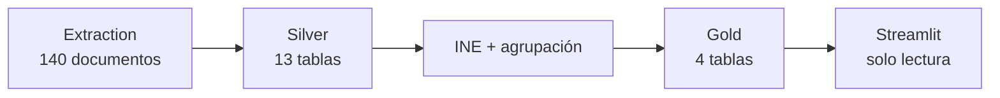

# Application Data Catalog

## 1. Purpose and scope

Este documento es el resultado de **Gate 1 — Data**. Audita el corpus
congelado y las capas que alimentan la aplicación para decidir qué datos
pueden sostener el producto final del TFM sin perder granularidad, linaje o
reproducibilidad.

La auditoría es descriptiva y de diseño. No aprueba una interfaz, no modifica
el core freeze, no crea tablas Gold y no convierte los campos condicionales en
requisitos. Las decisiones usan estas categorías:

- **READY FOR GOLD**: dato contractual, con semántica y granularidad aptas;
- **NEEDS MODELLING**: existe evidencia útil, pero falta un modelo Gold seguro;
- **DO NOT USE FOR TFM**: el riesgo semántico o temporal no cabe en agosto;
- **POST-TFM**: extensión útil, no necesaria para la entrega;
- **EXTERNAL REFERENCE DATA REQUIRED**: falta una referencia externa
  versionada, aunque las claves de unión ya existan.

La decisión humana de Gate 1, registrada el **19 de agosto de 2026**, puede
aprobar para agosto un dato ya listo o un candidato de modelado mínimo, o
clasificarlo como **NO-GO FOR AUGUST / POST-TFM**. Un candidato aprobado no es
todavía un contrato Gold implementado.

Los roles de producto son **KPI**, **DIMENSION**, **FILTER**, **PROJECT
DETAIL**, **MAP**, **CHART**, **AUDIT ONLY** y **NOT RECOMMENDED**. Toda
cobertura se refiere al snapshot indicado en la sección siguiente; no implica
cobertura del BOE completo ni de todos los proyectos españoles.

## 2. Canonical data snapshots

La cadena auditada es una sola cadena de linaje. El Gold territorial es una
extensión downstream v2 del mismo Silver congelado; no representa otro corpus.



| Capa | Path relativo | Identidad | Alcance |
| --- | --- | --- | --- |
| Extraction validado | `runs/canonical-140-freeze-final-candidate-20260813/extraction/` | snapshot `55582e7cc0ce6262fc43fbb5a6cb482a03f794d8d68956e01d4b9e081e0de855`; config `8158661f76a31c87` | 140 documentos, 140 extracciones vigentes, 0 revisión bloqueante |
| Silver congelado | `runs/canonical-140-freeze-final-candidate-20260813/silver/` | `2bebfe3100f21332f29e97868e0fdc518c2fe96ac33bbe3f8926e15d896ae6f6` | 13 tablas; 5 correcciones versionadas aplicadas |
| Downstream core congelado | `runs/canonical-140-freeze-final-candidate-20260813/downstream/` | `2201abf25a45688013a229a6786fd87fb38c024e787259b699ead3d45b7b1a96` | agrupación, `projects` y `project_events` del freeze |
| Gold actual de Streamlit | `runs/canonical-140-streamlit-base-20260814/downstream/gold/` | downstream `7e0c9a84891ecbac66087a7af653ead436e69194653806a3697f3c8607948834` | añade `project_locations` y `project_location_sources` sin cambiar proyectos/eventos |
| Referencia INE | `runs/ine-reference-20260614-25a3bbb28f0c21c5/` | `25a3bbb28f0c21c5` | 8.132 municipios, 52 códigos provinciales y 19 códigos autonómicos |

La declaración contractual del core está en
[`freezes/core_data_freeze_2026-08-13.md`](freezes/core_data_freeze_2026-08-13.md).
Los manifests declaran hashes físicos y semánticos, versiones, inputs y
conteos. Esta auditoría no recalcula ni sustituye esas identidades.

## 3. Data model overview

La granularidad cambia en cada salto:

- extraction conserva una fila vigente por documento y su JSON canónico;
- Silver descompone 75 BOE relevantes en 115 eventos de publicación y sus
  entidades relacionadas;
- `project_grouping` enlaza 119 menciones de plantas con 116 proyectos;
- Gold contiene 116 proyectos, 169 atribuciones de actuaciones y territorio;
- las consultas de la aplicación proyectan una fila por proyecto solo después
  de aplicar la semántica de filtros.

No existe una tabla plana universal. Unir actuaciones, participantes,
componentes y localizaciones por evento multiplicaría filas. Para cualquier
agregación se debe empezar por la clave de la entidad que se quiere contar:

- proyectos: `project_id`;
- publicaciones de proyectos: `boe_id`;
- actuaciones: (`project_id`, `administrative_action_id`);
- territorios: (`project_id`, código INE del nivel);
- fuentes territoriales: (`project_location_id`, `location_mention_id`).

## 4. Current Gold

El contrato que consume Streamlit está centralizado en
[`app_data.py`](../src/renewables_permitting/app_data.py). El loader verifica
manifest, versión, hashes, schema, dtypes, PK, FK y downstream ID antes de
entregar los DataFrames.

| Tabla | Filas | Granularidad y claves | Columnas y dtypes | Nulos observados | Uso actual y límite |
| --- | ---: | --- | --- | --- | --- |
| `projects` | 116 | una fila por proyecto; PK `project_id` | 7 `string`; `first_publication_date`, `last_publication_date`: `datetime64[ns]`; dos conteos `Int64` | `municipality_codes` y `municipalities`: 1 cada una | catálogo, ficha, tecnología, fechas y conteos; la tecnología es solo la raíz y los territorios son strings agregados |
| `project_events` | 169 | atribución `project_id × administrative_action_id`; PK compuesta; FK a `projects` | IDs/códigos/evidence `string`; fecha; dos índices `Int64`; `is_modification:boolean` | 0 | cronología, filtros administrativos y BOE; 165 actuaciones únicas, cuatro atribuidas a dos proyectos |
| `project_locations` | 584 | `project_id × territorio` al nivel más específico de cada fuente; PK `project_location_id`; FK a `projects` | 12 campos territoriales `string`; dos conteos `Int64`; dos fechas | municipio/código: 183; provincia/código: 37, por diseño del nivel | filtro, ficha, mapa y agregación territorial; no son coordenadas ni geometrías legales |
| `project_location_sources` | 602 | `project_location_id × location_mention_id`; PK compuesta; FK territorial y control de procedencia por evento/BOE/fecha | cuatro IDs `string` y `publication_date` | 0 | auditoría de territorio; no debe unirse indiscriminadamente con todas las actuaciones |

Columnas exactas:

- `projects`: `project_id`, `project_name`, `technology`, `province_codes`,
  `provinces`, `municipality_codes`, `municipalities`,
  `first_publication_date`, `last_publication_date`, `n_publications`,
  `n_administrative_actions`;
- `project_events`: `project_id`, `event_id`, `administrative_action_id`,
  `boe_id`, `publication_date`, `event_index`,
  `administrative_action_index`, `action_type`, `decision`,
  `is_modification`, `evidence`;
- las columnas territoriales coinciden con el contrato descrito en
  [`project_locations.py`](../src/renewables_permitting/project_locations.py).

### Derived application views

Estas consultas son vistas en memoria, no tablas Gold adicionales:

| Vista | Granularidad | Fuente |
| --- | --- | --- |
| catálogo / resumen de proyecto | una fila por `project_id` | `build_project_catalog()` y `build_project_summary()` |
| última decisión publicada | una fila por `project_id × action_type` | `build_latest_project_actions()` |
| trámites coincidentes | una fila por proyecto elegible | `build_matching_action_summary()` |
| trazabilidad territorial | una fila por fuente de una asociación territorial | `build_territorial_trace()` |
| tablas/esquema/calidad del explorador | conserva la granularidad de cada tabla | consultas de `app_audit.py` |

En el snapshot actual, la vista de última decisión contiene 169 filas, igual
que las 169 combinaciones observadas `project_id × action_type`. La lógica de
último registro sigue siendo necesaria para futuras publicaciones, aunque hoy
no haya dos decisiones del mismo trámite para un mismo proyecto.

## 5. Silver inventory

Todas las tablas comparten `event_id:string`, `identificador_boe:string` y
`fecha_publicacion:datetime64[ns]`. Salvo los nulos indicados, no se observan
nulos. Los índices son `Int64`; los flags son `boolean`; el resto es `string`.
El contrato completo y su orden están en
[`flat_contract.py`](../src/renewables_permitting/extraction/flat_contract.py).

| Tabla | Filas | Granularidad; PK/FK | Columnas propias y nulabilidad observada | Origen, dominio y uso potencial |
| --- | ---: | --- | --- | --- |
| `publication_events` | 115 | evento de proyecto en un BOE; PK `event_id` | `event_index`, `event_summary`, tres conteos; 0 nulos | evento canónico; alimenta todo Gold y la trazabilidad |
| `generation_asset_mentions` | 119 | planta mencionada; PK mention ID; FK evento | local ref, `generation_type`, `evidence`; 0 nulos | raíz de proyecto; 5 tecnologías observadas; alimenta grouping/Gold |
| `generation_asset_names` | 132 | nombre de planta; PK mention ID + `name_index`; FK evento/planta | `name_raw`; 0 nulos | identidad documental y alias; alimenta grouping/nombre Gold |
| `associated_components` | 128 | componente de evento; PK component ID; FK evento | local ref, `component_type`, `description_raw`, `evidence`; 0 nulos aunque description es nullable | 18 almacenamiento, 110 evacuación; aún no llega a Gold |
| `associated_component_names` | 193 | nombre de componente; PK component ID + `name_index`; FK evento/componente | `name_raw`; 0 nulos | solo 51 de 128 componentes tienen nombre; detalle condicional |
| `associated_component_generation_links` | 134 | vínculo componente-planta; PK component ID + `link_index`; tres FK | ref local y generation mention ID; 0 nulos | 128 componentes enlazados; seis enlazan más de un proyecto |
| `administrative_actions` | 165 | actuación publicada; PK action ID; FK evento | `action_index`, tipo, decisión, modificación, evidencia; 0 nulos | 11 tipos y 11 decisiones; alimenta `project_events` |
| `administrative_action_targets` | 201 | target de actuación; PK action ID + `target_index`; FK acción/evento y relación polimórfica | ref, entity ID, `target_kind`; 0 nulos | 102 event, 69 component, 30 generation asset; determina atribución Gold |
| `participant_mentions` | 307 | participante mencionado en evento; PK mention ID; FK evento | nombre raw, rol, evidencia; 0 nulos | 261 promotor, 38 solicitante, 3 titular, 5 otro; no llega a Gold |
| `location_mentions` | 592 | mención territorial de evento; PK mention ID; FK evento | nombre, nivel, hints, evidencia; province hint 183 nulos, CA hint 374 | entrada de resolución INE y Gold territorial |
| `generation_asset_relations` | 4 | relación planta-planta; PK relation ID; FK evento y dos plantas | refs source/target, tipo, evidencia; 0 nulos | cuatro `hibrida_con`; no llega a Gold actual |
| `technical_mentions` | 725 | atributo de planta o componente; PK mention ID; FK evento y owner polimórfico | owner/ref, dos IDs nullable, tipo, valor raw, evidencia | 293 de plantas, 432 de componentes; fuente de potencia sin normalizar |
| `case_file_references` | 42 | referencia de expediente en evento; PK reference ID; FK evento | `reference_index`, valor raw; 0 nulos | 37 eventos/29 BOE; **AUDIT ONLY** |

Los nulos de `technical_mentions` expresan el owner polimórfico: 432 nulos en
`generation_asset_mention_id` y 293 en `associated_component_id`; no son datos
perdidos. Los dominios observados de atributos técnicos son
`potencia_instalada`, `potencia_pico`, `potencia_almacenamiento`,
`capacidad_almacenamiento`, `potencia_unitaria`, `numero_unidades`, `tension`
y `otra`.

## 6. Master field matrix

| Dato | Capa actual / campo | Granularidad y cobertura | Temporal / multi-valor / aditivo | Linaje y calidad | Uso potencial | Decisión TFM | Impacto | Re-extracción |
| --- | --- | --- | --- | --- | --- | --- | --- | --- |
| identidad de proyecto | Gold `projects.project_id` | proyecto; 116/116 | estable para el mismo match key; no multi; no se suma | UUID5 de nombre, tecnología y ancla territorial; validado | KPI, DIMENSION, FILTER, PROJECT DETAIL | READY FOR GOLD | LOW | NO |
| nombre de proyecto | Gold `project_name`; Silver names | proyecto; 116/116; 114 textos únicos | puede tener alias/cambiar entre BOE; no aditivo | 132 nombres con evidencia de planta | DIMENSION, FILTER, PROJECT DETAIL | READY FOR GOLD | LOW | NO |
| tecnología raíz | Gold `technology` | proyecto; 116/116; una por proyecto | no temporal en Gold; categórica | 5 valores observados; grouping exige una | DIMENSION, FILTER, CHART, PROJECT DETAIL | READY FOR GOLD | LOW | NO |
| publicación inicial/final | Gold `projects` | proyecto; 116/116 | min/max de BOE; no aditivo | derivación desde eventos | FILTER, PROJECT DETAIL | READY FOR GOLD | LOW | NO |
| publicaciones de proyecto | Gold `project_events.boe_id` | BOE relevante; 75 distintos | temporal; multi por proyecto; contar distinct | BOE/fecha trazables a Silver | KPI, CHART, PROJECT DETAIL | READY FOR GOLD | LOW | NO |
| actuación/decisión | Gold `project_events` | proyecto × acción; 169 filas, 165 acciones | temporal; multi; no sumar filas para contar actos únicos | evidencia literal y targets validados | FILTER, CHART, PROJECT DETAIL | READY FOR GOLD | LOW | NO |
| última decisión por trámite | vista derivada | proyecto × tipo de actuación; 169 hoy | temporal por orden publicado; no es estado legal | desempate determinista | FILTER, CHART, PROJECT DETAIL | READY FOR GOLD | LOW | NO |
| territorio | Gold `project_locations` | proyecto × código; 116/116 | multi; temporal en fuentes; contar proyecto distinct | 591 menciones resueltas, una omitida | FILTER, MAP, PROJECT DETAIL | READY FOR GOLD | LOW | NO |
| evidencia administrativa | Gold `project_events.evidence` | actuación atribuida; 169/169 | literal, multi; no aditiva | 100 % no nula; sin hash de evidencia por fila | PROJECT DETAIL, AUDIT ONLY | READY FOR GOLD | LOW | NO |
| participantes | Silver `participant_mentions` | evento; 307 filas, 115/115 eventos | multi y cambiante; no aditivo | literal, sin identidad canónica ni FK a planta | PROJECT DETAIL, FILTER | POST-TFM / NEEDS MODELLING; NO-GO agosto | HIGH | UNKNOWN |
| promotor | Silver rol `promotor` | evento; proxy heredado 95/116 proyectos | multi/cambiante; no aditivo | 261 filas raw; atribución ambigua en eventos multi-planta | PROJECT DETAIL, FILTER | POST-TFM / NEEDS MODELLING; NO-GO agosto | HIGH | UNKNOWN |
| potencia de generación | Silver `technical_mentions` | observación de planta; 105/116 proyectos con `potencia_instalada` | temporal, multi; **no aditiva aún** | raw + evidencia; unidades/semánticas heterogéneas | AUDIT ONLY | POST-TFM / NEEDS MODELLING; NO-GO agosto | HIGH | UNKNOWN |
| almacenamiento | Silver components + technical mentions | componente enlazado; 18 componentes/16 proyectos | multi; MW y MWh separados; no sumar a generación | vínculo explícito a planta, evidencia completa | PROJECT DETAIL | GO WITH MINIMAL MODELLING; dentro de `project_components` | MEDIUM | NO |
| componente asociado | Silver components/links | project × component; 128 componentes | multi; no aditivo | todos enlazados; solo 51 tienen nombre | PROJECT DETAIL | GO WITH MINIMAL MODELLING; candidato aprobado | MEDIUM | NO |
| relación de hibridación | Silver relations | 4 relaciones planta-planta | temporal/positiva; simétrica en significado observado | evidencia literal; cobertura no exhaustiva | PROJECT DETAIL | GO WITH MINIMAL MODELLING; candidato aprobado | MEDIUM | NO |
| `is_hybrid` global | no existe | no puede medirse con ausencia de relación | podría cambiar; booleano incompleto | faltan Angostillos y storage-hybrid como relación de plantas | FILTER, PROJECT DETAIL | NO-GO FOR AUGUST / POST-TFM | HIGH | UNKNOWN |
| título BOE | extraction documents `titulo` | documento; 75/75 BOE relevantes | temporal; uno por BOE | 100 % disponible upstream, no Silver/Gold | PROJECT DETAIL | POST-TFM | MEDIUM | NO |
| URL BOE HTML | derivada de Gold `boe_id` | BOE; 75/75 | estable por ID | constructor validado; upstream también 75/75 | PROJECT DETAIL | READY FOR GOLD | LOW | NO |
| URL XML / texto / source hash | extraction documents | documento; 75/75 relevantes | fuente de auditoría | no propagado a Gold | AUDIT ONLY | POST-TFM | MEDIUM | NO |
| geometría administrativa | no existe | 0 niveles con geometría | no aplica | sí existen códigos INE de join | MAP | EXTERNAL REFERENCE DATA REQUIRED; GO agosto | MEDIUM | NO |

## 7. Project identity and technology

`project_id` se deriva como UUID5 del match key v1: identidad nominal
conservadora, tecnología exacta y provincia resuelta; si no hay provincia usa
comunidad autónoma y, en último término, `unresolved`. Municipio no participa.
Esto hace reproducible el ID para inputs idénticos, pero no promete estabilidad
si cambian el conjunto de alias o la granularidad territorial disponible.

Resultados observados:

- 119 menciones de generación se agrupan en 116 proyectos;
- solo Badulaque, Volateo Solar y La Puebla 1 tienen dos publicaciones;
- 13 proyectos conservan más de un alias y el máximo es tres;
- 114 nombres de presentación son únicos; los duplicados son dos pares
  multi-tecnología: Armus solar y SOLGEST-1;
- ningún `project_id` contiene más de una tecnología; cuatro eventos sí
  contienen dos tecnologías.

| Tecnología raíz | Proyectos |
| --- | ---: |
| fotovoltaica | 83 |
| eólica | 28 |
| otra generación | 3 |
| hidroeléctrica | 1 |
| termosolar | 1 |

Por diseño, `technology` representa una sola tecnología de la planta raíz. No
es correcto presentar ese campo como la lista de tecnologías de un sistema
híbrido. Mostrar “Fotovoltaica + Eólica + Almacenamiento” requiere combinar
raíces relacionadas y componentes mediante un modelo explícito; no puede
inferirse de `projects.technology`.

**Decisión humana:** identidad, nombre de presentación y tecnología raíz están
**GO FOR AUGUST** para KPI, dimensión, filtro y ficha. Una lista exhaustiva de
tecnologías es **NO-GO FOR AUGUST / POST-TFM** y no debe simularse en la UI.
La ficha puede separar “Tecnología principal” de “Componentes publicados” si
se implementa el candidato aprobado `project_components`.

## 8. Participants and promoters

El contrato extrae `participant_name_raw`, `participant_role` y evidencia a
nivel de evento. No existe `generation_asset_mention_id`, `project_id`, razón
social normalizada ni identidad canónica de organización.

| Métrica | Resultado | Interpretación |
| --- | ---: | --- |
| menciones | 307 | no son entidades únicas |
| eventos con algún participante | 115/115 | cobertura documental completa en eventos relevantes |
| proyectos con algún participante por propagación de evento | 116/116 | proxy, no atribución demostrada |
| proyectos con varios nombres por ese proxy | 28 | máximo 12; indica ambigüedad real |
| nombres raw distintos | 96 | no están normalizados como entidades |
| eventos con promotor/copromotor/titular | 95/115 | 20 sin esa señal |
| proyectos con promotor/copromotor/titular por proxy | 96/116 | 20 sin señal; 28 con varios nombres |

Roles observados: `promotor` 261 filas, `solicitante` 38, `titular` 3 y `otro`
5. No se observan `copromotor`, `operador`, `cedente`, `cesionario` ni
`desconocido`.

Ejemplos:

- un BOE con doce plantas solares y doce promotores hace que un join por
  `event_id` asigne los doce nombres a cada proyecto;
- Badulaque cambia de “Enel Green Power S.L.” a “Enel Green Power España,
  SL” entre publicaciones;
- Volateo Solar pasa de dos promotores más cuatro solicitantes a “Volateo
  Solar, SL” como promotor;
- La Puebla 1 conserva “Jinko Greenfield Spain 3, SL” en ambos BOE.

### Options evaluated

`projects.promoter` perdería roles, fechas, multiplicidad y procedencia, y
forzaría una atribución cuando el evento contiene varias plantas. Se rechaza.

Una futura `project_participants` con grano `project_id × participant × role`
sería el modelo relacional adecuado solo si se resuelve primero la atribución
participante-planta, la vigencia temporal y la identidad de organización.
Con los datos actuales, “distinto nombre” tampoco prueba cambio de entidad ni
“mismo nombre” prueba identidad.

**Decisión humana:** **POST-TFM / NEEDS MODELLING**, **NO-GO FOR AUGUST** para
promotor y participantes. No se crearán `projects.promoter` ni
`project_participants`, y el dashboard de agosto no incluirá promotor. La
cobertura aparente no compensa el riesgo de atribución.

## 9. Power and capacity

`technical_mentions` conserva valores literales y evidencia, no números
normalizados. De 725 atributos técnicos, las familias de potencia/capacidad
son:

| Atributo | Menciones / owner | Cobertura observable |
| --- | --- | --- |
| `potencia_instalada` | 112 planta; 4 componente | 108 menciones de planta, 105 proyectos, 67 BOE |
| `potencia_pico` | 57 planta | 53 menciones de planta, 52 proyectos, 39 BOE |
| `potencia_almacenamiento` | 18 componente | 18 componentes, 15 proyectos, 11 BOE |
| `capacidad_almacenamiento` | 13 componente | 10 componentes, 12 proyectos, 9 BOE |
| `potencia_unitaria` | 39 planta; 2 componente | no representa potencia total |

En conjunto hay 245 menciones de potencia/capacidad y 115/116 proyectos con
alguna. Sin embargo, 71 proyectos tienen varias menciones y el máximo es 12.
Las cadenas usan `MW`, `MWn`, `MWp`, `MWdc`, `MWh`, `MVA`, `kW`, `kVA`,
`kWh`, `Wp`, `W` y variantes; cinco no contienen una unidad reconocible. Hay
además errores o ambigüedades literales como `MVW`, puntos usados como
separador y valores compuestos.

### Representative cases

- **Badulaque:** 90 MW en 2023 y 102,4 MW en 2024, además de 4,50 y 6,4 MW
  unitarios. Sumar publicaciones duplicaría el proyecto; elegir el último
  exige interpretar la modificación.
- **PE Angostillos:** la planta fotovoltaica nueva tiene 31,172 MW y el parque
  eólico existente 28.000 MW según el texto compuesto por 14 × 2.000 kW. Son
  dos project IDs, dos eventos y dos activos; no son dos medidas alternativas
  de una sola planta.
- **FV Andévalo:** se observan 42,56 MW para la FV existente y 26,36 MW para
  el BESS. No aparece capacidad MWh ni un componente eólico posterior en el
  snapshot; solo almacenamiento y evacuación. No debe añadirse ese componente
  por inferencia.

### KPI assessment

**¿Puede existir un KPI aditivo seguro de potencia? ONLY AFTER MODELLING.**

Conceptualmente, una medida futura tendría que seleccionar una observación de
potencia total de generación por activo raíz y periodo, normalizar unidad y
semántica, distinguir instalada de pico y unitaria, resolver modificaciones y
evitar sumar almacenamiento, capacidad energética, infraestructura, activos
existentes relacionados y la misma planta en varios BOE. El catálogo no
aprueba una fórmula.

**Decisión humana de agosto:** el KPI “potencia total publicada” y una cifra
canónica `project.power_mw` son **REJECTED FOR AUGUST / POST-TFM — NEEDS
MODELLING**. Los valores raw pueden permanecer solo en auditoría técnica, no
como métrica pública. No se sustituirán por producción, generación energética
ni una suma raw, y MW y MWh nunca se tratarán como intercambiables.

## 10. Hybridization

No existe un flag `is_hybrid`. Silver contiene cuatro relaciones explícitas,
todas `hibrida_con`, con source/target, evidencia y fecha:

| BOE | Source → target | Observación |
| --- | --- | --- |
| `BOE-A-2023-2589` | SOLGEST-1 termosolar → SOLGEST-1 FV | mismo nombre, dos project IDs/tecnologías |
| `BOE-A-2025-18282` | Hibridación Loma Gorda FV → parque eólico Loma Gorda | relación explícita con planta existente |
| `BOE-A-2025-18283` | Hibridación San Gil FV → parque eólico San Gil | relación explícita con planta existente |
| `BOE-A-2026-11838` | Armus solar eólica → Armus solar FV | una instalación híbrida, dos roots Gold |

Los cuatro extremos se resuelven a project IDs distintos, por lo que es
posible construir links positivos y trazables. No puede interpretarse la
ausencia como “no híbrido”: Angostillos está representado como dos proyectos
con evidencia textual de hibridación, pero no tiene fila en
`generation_asset_relations`; FV Andévalo modela la hibridación con BESS como
componente, no como relación planta-planta.

**Decisiones:**

- `is_hybrid`: **NO-GO FOR AUGUST / POST-TFM** como flag exhaustivo; la
  ausencia de relación no permite mostrar “Híbrido: No”;
- `project_relationships`: **GO WITH MINIMAL MODELLING FOR AUGUST** como
  candidato aprobado, únicamente para relaciones positivas explícitas,
  extraídas, resolubles y trazables; su cobertura no es exhaustiva;
- storage hybridisation: modelarla como componente asociado, no como una
  segunda tecnología raíz.

La presentación podrá usar “Relaciones y componentes publicados” o
“Hibridación explícitamente identificada”, pero nunca inferir una relación ni
afirmar que un proyecto no tiene relaciones por ausencia de filas.

## 11. Assets and components

Las 119 menciones de generación son raíces. Los 128 componentes asociados son
18 almacenamientos y 110 sistemas de evacuación; el corpus no observa otros
tipos del enum en esta muestra. Todos tienen vínculo explícito a una planta,
134 links en total; seis componentes se vinculan a más de un proyecto.

Los links alcanzan 111/116 proyectos. Diecinueve proyectos tienen varios
componentes y el máximo es cuatro. Solo 51 componentes tienen un nombre
estructurado; `description_raw` y `evidence` sí están presentes en los 128.
Las localizaciones son de evento, no de componente, de modo que no se puede
atribuir con seguridad cada territorio al BESS o a la evacuación.

Una tabla amplia `project_assets` que mezcle raíces, relaciones y componentes
sería costosa y podría sugerir una topología que el contrato no contiene. Para
agosto, el modelo más pequeño sería `project_components`, limitado a los
vínculos explícitos existentes y sin inferir ubicación ni potencia numérica.

**Decisión humana:** **GO WITH MINIMAL MODELLING FOR AUGUST** como candidato
aprobado para mostrar “Componentes asociados publicados”. Debe usar solo la
información Silver existente, mantener evidencia y linaje, conservar las
plantas de generación como raíces y no inferir ubicación, topología o potencia
total. El contrato Gold mínimo se diseñará después del Product Gate; esta
sección no lo fija.

## 12. Storage

Almacenamiento es un **asset/componente asociado**, no una tecnología del
proyecto raíz ni un proyecto autónomo. Hay 18 componentes de almacenamiento
ligados a 16 proyectos. Se observan 18 menciones de potencia de almacenamiento
en 15 proyectos y 13 menciones de capacidad en 12 proyectos.

`MW`/`MWn` describen potencia; `MWh`/`kWh` describen energía. Algunas filas
clasificadas como capacidad conservan `MVA` o expresiones compuestas, por lo
que ni siquiera dentro de una categoría es seguro convertir y sumar sin
revisión. La fecha es la de publicación, no una fecha de puesta en servicio.

**Decisión humana:** **GO WITH MINIMAL MODELLING FOR AUGUST** exclusivamente
como tipo de componente dentro de `project_components`, no como tabla Gold
separada ni como `technology`. MW y MWh permanecerán separados; no se sumará
al KPI de potencia ni se mostrará capacidad normalizada antes de un contrato
de observaciones.

## 13. Project relationships

La única relación estructurada observada es `hibrida_con`. No hay filas
`sustituye_a`; “infraestructura compartida” o similitud nominal no crean una
relación. Las cuatro relaciones tienen dirección source/target, pero la
presentación de hibridación debería tratar el vínculo como navegable en ambos
sentidos sin borrar su procedencia original.

Una futura `project_relationships` puede derivarse sin reextracción para esos
cuatro positivos, siempre que source y target se resuelvan de forma
determinista a proyectos conocidos y se conserve el linaje Silver.

La tabla sería deliberadamente no exhaustiva. No debe completar Angostillos ni
inferir relaciones por nombres parecidos, territorio, evacuación, tecnología o
proximidad. **Decisión humana: GO WITH MINIMAL MODELLING FOR AUGUST** como
candidato aprobado para una ficha positiva y trazable. No debe mostrarse “No
tiene relaciones” cuando no exista una relación extraída. El contrato Gold
mínimo se diseñará después del Product Gate.

## 14. Territorial data

La dimensión INE contiene 8.132 municipios, 52 provincias/códigos equivalentes
y 19 comunidades/ciudades autónomas. La resolución observada produjo 404
menciones completamente resueltas, 187 parcialmente resueltas y una no
encontrada (`Orense` como provincia sin hint autonómico). Gold omitió esa única
mención y conservó 591; once expansiones multi-proyecto producen 602 fuentes.

Cobertura Gold:

| Métrica | Resultado |
| --- | ---: |
| proyectos con algún territorio | 116/116 |
| proyectos con al menos municipio | 115/116 |
| solo provincia/CA | 1 (Avutarda Solar, provincia de Madrid) |
| solo CA | 0 |
| municipios distintos | 212 |
| provincias distintas | 38 |
| CCAA distintas | 14 |
| pares proyecto-municipio | 401 |
| pares proyecto-provincia | 157 |
| pares proyecto-CCAA | 131 |

### Safe map aggregation

Para cualquier nivel, la métrica es `nunique(project_id)` agrupada por el
código INE de ese nivel:

- CCAA: todas las filas con `ine_autonomous_community_code` no nulo;
- provincia: todas las filas con `ine_province_code` no nulo;
- municipio: filas con `ine_municipality_code` no nulo.

Antes de agregar se deduplica (`project_id`, código). No se cuentan filas de
`project_locations`, menciones ni fuentes. No se debe filtrar únicamente por
`location_level == autonomous_community` para el mapa autonómico, porque se
perderían los municipios y provincias que ya contienen el código padre.

**Decisión:** datos territoriales y métrica están **READY FOR GOLD / READY FOR
PRODUCT**.

## 15. Geographic geometries

No se encontraron GeoJSON, Shapefile, GeoPackage, GeoParquet, WKT, centroides,
latitud/longitud ni límites administrativos en `runs/`, `data/`, `config/`,
`docs/` o `src/`. La referencia INE aporta nombres y códigos, no geometría.

**EXTERNAL REFERENCE DATA REQUIRED** para un coroplético. La referencia debe
ser versionada, reproducible, con fuente/licencia documentadas y códigos
compatibles:

- CCAA: `ine_autonomous_community_code` (2 dígitos);
- provincia: `ine_province_code` (2 dígitos);
- municipio: `ine_municipality_code` (5 dígitos).

Un centroide administrativo no es la ubicación real de una planta y no debe
presentarse como punto de proyecto.

**Decisión humana:** **GO FOR AUGUST** para un mapa administrativo coroplético
a tres niveles —comunidad autónoma, provincia y municipio— unido por códigos
INE y medido con `nunique(project_id)`. La fuente oficial o suficientemente
autoritativa, su licencia, versionado y estrategia de simplificación se
resolverán en Gate 2 y en la implementación del mapa.

## 16. BOE publications

El snapshot documental conserva para los 140 documentos `identificador`,
fecha, `titulo`, `url_html`, `url_xml`, `texto_limpio`, `xml_path`,
`xml_status` y `source_document_sha256`. En los 75 BOE que llegan a proyectos,
todos esos campos tienen 75/75 valores no nulos y distintos. No existe
`url_pdf` en el snapshot.

| Dato | Extraction | Silver | Gold | Decisión |
| --- | --- | --- | --- | --- |
| BOE ID | 140/140 | eventos: 75 BOE | 75 BOE | READY |
| fecha | 140/140 | sí | `publication_date` | READY |
| título | 140/140; relevantes 75/75 | no | no | POST-TFM |
| URL HTML | 140/140 | no | derivable de BOE ID | READY sin tabla nueva |
| URL XML | 140/140 | no | no | AUDIT ONLY |
| URL PDF | no | no | no | no disponible |
| texto | 140/140 | solo evidencia seleccionada | no | AUDIT ONLY |
| source hash | 140/140 | manifest/input identity | no por publicación | AUDIT ONLY |

El KPI de publicaciones debe usar `nunique(project_events.boe_id)`: **75**.
No debe usar los 140 documentos de entrada ni sumar `projects.n_publications`
(119), porque un BOE puede publicar varios proyectos.

La URL HTML ya se reconstruye de forma validada desde `boe_id`. Una tabla
`publications` completa aportaría título y metadatos de fuente, pero exigiría
añadir un input documental al downstream o cambiar el contrato Silver. No es
necesaria para los KPIs/enlaces y se clasifica **POST-TFM**.

## 17. Evidence and lineage

Las 119 plantas, 128 componentes, 165 actuaciones, 307 participantes, 592
localizaciones, cuatro relaciones y 725 atributos técnicos tienen evidencia
literal no nula. Gold conserva evidencia en `project_events`; territorio
conserva el camino `project_location_id → location_mention_id → event_id →
BOE/date`.

No existe un hash de evidencia por cada fila Silver/Gold. Sí existen hashes
documentales, identidades de snapshot, hashes semánticos de tablas y
fingerprints específicos de las correcciones versionadas. No se debe describir
el source hash como hash de una cita concreta.

Criterio de producto:

- **PROJECT DETAIL**: evidencia breve de la actuación y enlace al BOE;
- **AUDIT ONLY**: evidencia de extracción técnica, participantes,
  componentes/localización, source hashes, XML y expediente;
- no repetir citas largas en dashboard, gráficos o filtros.

**Decisión humana:** **GO FOR AUGUST** para ficha y auditoría, mediante una
vista acotada o expander. La UI no analizará el texto para derivar campos
nuevos y no habrá un dashboard general de evidencia.

## 18. Administrative situations

`project_events` es **READY FOR PRODUCT**:

- 169 atribuciones, 165 actuaciones únicas y cuatro multi-proyecto;
- 11 `action_type`, 11 `decision`, 11 filas `is_modification=True`;
- fechas entre 7 de julio de 2021 y 20 de junio de 2026;
- PK/FK, índices, BOE, fecha y evidencia sin nulos.

La semántica aprobada es:

```text
project_id × action_type
→ última decisión publicada según fecha, event_index, action index e ID
```

Sirve para **FILTER**, **CHART** y **PROJECT DETAIL**. No equivale a estado
jurídico consolidado ni a vigencia material fuera de lo publicado.

## 19. Temporal data

Fechas disponibles:

- `publication_date` por atribución administrativa y fuente territorial;
- `first_publication_date` / `last_publication_date` por proyecto;
- primera/última publicación por asociación territorial;
- `fecha_publicacion` en todas las filas Silver.

No hay fecha de efecto jurídico, puesta en servicio, inicio de construcción ni
vigencia de promotor/potencia. La serie segura de BOE es
`nunique(boe_id)` por año: 3 (2021), 3 (2022), 26 (2023), 14 (2024), 15
(2025), 14 (2026) en el corpus.

También puede mostrarse `nunique(project_id)` con **alguna publicación BOE**
en el intervalo. Debe llamarse “proyectos con publicaciones” o “proyectos
publicados”, nunca “proyectos activos”. Contar proyectos por primera
publicación responde a otra pregunta y debe etiquetarse expresamente.

## 20. KPI readiness

| KPI | Definición segura | Fuente autoritativa | Readiness |
| --- | --- | --- | --- |
| número de proyectos | `nunique(project_id)` sobre el conjunto filtrado; **116** sin filtros | `projects` | **APPROVED FOR AUGUST** |
| publicaciones BOE de proyectos | `nunique(boe_id)` sobre las publicaciones asociadas al conjunto filtrado; **75** sin filtros | `project_events` | **APPROVED FOR AUGUST**; Gate 2 precisará la interacción de filtros |
| potencia total publicada | ninguna fórmula aprobada | raw `technical_mentions` | **REJECTED FOR AUGUST**; POST-TFM / NEEDS MODELLING |

## 21. Dashboard requirement readiness

- **READY:** KPI de proyectos y publicaciones, mapa cuando se incorpore la
  geometría aprobada, últimas situaciones publicadas, serie BOE, filtros de
  fecha, tecnología raíz, territorio, situación y trámite, cronología, BOE y
  localizaciones.
- **GO WITH MINIMAL MODELLING:** componentes asociados, storage como
  componente y relaciones explícitas entre proyectos.
- **NO-GO AUGUST:** promotor, participantes, KPI o cifra canónica de potencia,
  `is_hybrid` exhaustivo y multi-tecnología exhaustiva.
- **POST-TFM:** dimensión `publications`, títulos, modelo de participantes,
  modelo canónico de potencia/assets y modelo exhaustivo de hibridación.

| Requisito | Datos disponibles | Readiness | Gap | Acción mínima |
| --- | --- | --- | --- | --- |
| KPI proyectos | `projects.project_id` | APPROVED FOR AUGUST | ninguno | `nunique` sobre el conjunto filtrado |
| KPI BOE | `project_events.boe_id` | APPROVED FOR AUGUST | semántica de interacción de filtros | `nunique` sobre publicaciones asociadas al conjunto filtrado |
| KPI potencia | technical raw | NO-GO AUGUST | unidad, vigencia, owner, aditividad | omitir; POST-TFM |
| mapa CCAA | código + 131 pares | GO FOR AUGUST | geometría externa aprobada, aún no incorporada | referencia versionada + distinct projects |
| mapa provincia | código + 157 pares | GO FOR AUGUST | geometría externa aprobada, aún no incorporada | igual |
| mapa municipio | código + 401 pares | GO FOR AUGUST | geometría externa aprobada; mayor peso visual | fuente/simplificación en Gate 2 |
| barras de situaciones | decision/latest actions | READY | wording | “última decisión publicada” |
| serie temporal | BOE/fecha | READY | definición visual | BOE distintos por periodo |
| filtro fecha | project events | READY | ninguno | conservar same-row |
| filtro tecnología raíz | projects | READY | no representa híbrido | etiqueta exacta |
| filtro territorio | project locations | READY | ninguno | jerarquía existente |
| filtro situación/trámite | project events | READY | no es estado legal | latest/historical existente |
| filtro promotor | participant mentions | NO-GO | atribución/identidad | no implementar |
| ficha: fechas | projects | READY | ninguno | primera/última publicación |
| ficha: situación | project events | READY | wording | última por trámite |
| ficha: cronología | project events | READY | ninguno | cronología completa |
| ficha: BOE | boe_id/date/evidence/URL derivada | READY | título ausente | mantener enlace |
| ficha: híbrido | 4 relations | NO-GO como booleano exhaustivo | cobertura parcial | mostrar solo positivos explícitos aprobados |
| ficha: relaciones | 4 source-target | GO WITH MINIMAL MODELLING | tabla Gold ausente | candidato aprobado; extensión mínima positiva |
| ficha: promotor | event participants | NO-GO | atribución/normalización | omitir |
| ficha: localizaciones | project locations | READY | no exact coords | wording territorial |
| ficha: potencia | technical raw | NO-GO | modelo de observaciones | omitir |
| ficha: tecnologías múltiples | roots/relations/components | NO-GO exhaustivo | no hay project assets | mantener tecnología raíz; no inferir |
| ficha: componentes/storage | components/links | GO WITH MINIMAL MODELLING | tabla Gold ausente | candidato aprobado; componentes publicados |
| reporting de errores | no depende de analytics | NOT A DATA GAP | mecanismo operacional | decidir en Gate 2 |

## 22. Minimal additional Gold model

El dashboard obligatorio puede construirse con el Gold actual salvo la
geometría externa. No hay una nueva tabla Gold indispensable antes de Gate 2.
La revisión humana aprobó dos candidatos acotados de modelado mínimo; aún no
son contratos ni tablas Gold implementadas. Gate 2 definirá la necesidad de
presentación y después se diseñará el contrato Gold mínimo. Este catálogo fija
solo sus límites, no su esquema final:

### Candidate A — `project_components`

- objetivo: mostrar “Componentes asociados publicados” sin que Streamlit lea
  Silver;
- fuente: components, names, links y publication events Silver;
- reextracción: **NO**;
- complejidad: **MEDIUM**; valor: ficha, no KPI.

No incluiría ubicación de componente ni potencia normalizada, porque el
contrato no las atribuye con seguridad.

### Candidate B — `project_relationships`

- objetivo: mostrar un link positivo “Relacionado con → Proyecto X” para
  relaciones explícitas cuyos extremos se resuelvan determinísticamente;
- fuente: generation relations + grouping;
- reextracción: **NO**;
- complejidad: **MEDIUM**; valor: ficha positiva/no exhaustiva.

No se proponen para agosto `project_participants`, un `project_assets` amplio,
un modelo de power ni `publications`: añaden más riesgo/plazo que valor para
los requisitos REQUIRED.

## 23. August risk assessment

| Candidato | Complexity | Data risk | Deadline risk | Re-extraction | Recommended for August |
| --- | --- | --- | --- | --- | --- |
| geometría administrativa externa | MEDIUM | LOW si códigos/licencia son compatibles | HIGH porque bloquea el mapa | NO | YES, REQUIRED |
| `project_components` acotada | MEDIUM | MEDIUM | MEDIUM | NO | GO mínimo aprobado; primera prioridad |
| `project_relationships` positiva | MEDIUM | MEDIUM | MEDIUM | NO | GO mínimo aprobado; segunda prioridad |
| `project_participants` | HIGH | HIGH | HIGH | UNKNOWN | NO |
| modelo de potencia/aditividad | HIGH | HIGH | HIGH | UNKNOWN | NO |
| `publications` completa/títulos | MEDIUM | LOW | MEDIUM | NO | NO; POST-TFM |
| `project_assets` multi-tecnología | HIGH | HIGH | HIGH | UNKNOWN | NO |

Para ambos candidatos aprobados, se aplica **STOP AND DROP FROM AUGUST** si el
diseño o la implementación exige reextracción, cambia `project_id`, reabre el
core freeze, consume más de un bloque significativo fuera del calendario,
requiere topología compleja o deja una ambigüedad no resoluble. El orden es
`project_components` y después `project_relationships`; si hay que recortar,
se elimina primero `project_relationships`.

## 24. GO / NO-GO decisions

### GO FOR AUGUST — current validated data

La revisión humana aprueba `project_id`, `project_name`, la tecnología raíz,
`first_publication_date`, `last_publication_date`, BOE ID, fecha de
publicación, URL HTML canónica derivada de `boe_id`, tipo de actuación,
decisión publicada, `is_modification`, última decisión publicada por trámite,
evidencia y las localizaciones con municipio, provincia, comunidad autónoma y
códigos INE. Pueden alimentar los dos KPI aprobados, filtros, gráficos, mapa,
tabla, ficha y cronología, siempre con las granularidades y límites de este
catálogo.

| Campo/tema | Decisión | Motivo | Siguiente paso |
| --- | --- | --- | --- |
| promoter | NO-GO FOR AUGUST | evento, sin identidad ni atribución a planta | POST-TFM / NEEDS MODELLING; no mostrar |
| participants | NO-GO FOR AUGUST | multi-rol y multi-proyecto | POST-TFM / NEEDS MODELLING; no crear `project_participants` |
| power | NO-GO FOR AUGUST | no normalizada ni aditiva | POST-TFM / NEEDS MODELLING; omitir KPI y cifra canónica |
| tecnología raíz | GO FOR AUGUST | Gold completa y validada | usar con wording de raíz |
| tecnologías múltiples exhaustivas | NO-GO FOR AUGUST | requeriría un modelo de assets completo | mantener raíz; no inferir |
| `is_hybrid` exhaustivo | NO-GO FOR AUGUST | ausencia no significa negativo | no crear flag ni mostrar negativos |
| relaciones explícitas | GO WITH MINIMAL MODELLING | cuatro positivos trazables, cobertura no exhaustiva | candidato aprobado; contrato después de Gate 2 |
| storage | GO WITH MINIMAL MODELLING | componente explícito, no tecnología; MW ≠ MWh | incluir solo dentro del candidato `project_components` |
| `project_components` | GO WITH MINIMAL MODELLING | links explícitos, ficha posible | candidato aprobado; contrato después de Gate 2 |
| publication title | POST-TFM | upstream, no Gold/Silver, no imprescindible | mantener BOE link |
| publication URLs | GO FOR AUGUST | HTML derivable del BOE ID | reutilizar función actual |
| evidence | GO FOR AUGUST | evidencia literal y trazable | ficha/expander y auditoría; no parsing UI |
| publications dimension | NO-GO FOR AUGUST | ID, fecha y URL ya cubren el producto | POST-TFM |
| geographic geometry | EXTERNAL REFERENCE DATA REQUIRED — GO FOR AUGUST | no existe localmente; códigos de unión listos | CCAA, provincia y municipio; fuente/licencia/simplificación en Gate 2 |

### Dashboard possible now

Con Gold actual ya se sostienen los KPI de proyectos y BOE, filtros de fecha,
tecnología raíz, territorio, situación y trámite, barras de última decisión
publicada, evolución de publicaciones y una ficha con nombre, fechas,
territorio, cronología, evidencia y links BOE. El mapa requiere únicamente una
geometría administrativa externa compatible; la métrica territorial ya está
lista.

Las extensiones aprobadas como candidatas solo añadirían componentes/storage y
links entre cuatro pares híbridos. No están implementadas y no son necesarias
para definir el producto en Gate 2.

## 25. Gate 1 decision

```text
DATA GATE PASSED
```

**Human Gate 1 decision date: 2026-08-19.** La auditoría técnica y la revisión
humana están completas y no revelan un defecto que reabra el core freeze.

Aprobado: datos Gold actuales; datos administrativos, territoriales y
temporales; evidencia para ficha/auditoría; geometrías administrativas
externas a tres niveles; y los candidatos mínimos `project_components` y
`project_relationships`.

Rechazado para agosto: promotor/participantes; KPI y cifra canónica de
potencia; flag exhaustivo de hibridación; multi-tecnología exhaustiva; y una
dimensión `publications`.

No se implementa aún Gold ni el mapa. El siguiente gate es:

```text
docs/APP_PRODUCT_SPEC.md
→ Gate 2 — Product
```
