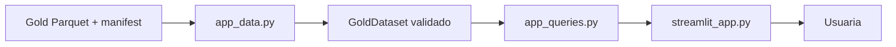

# Guía técnica de la aplicación Streamlit

Esta guía explica cómo está organizada la aplicación local de consulta, cómo
extenderla sin romper sus contratos y qué verificaciones ejecutar antes de
proponer un cambio. Está dirigida a quien vaya a mantener el código, aunque no
haya trabajado antes con Streamlit o pandas.

Para usar la aplicación y operar el pipeline consulta primero la
[guía de usuario](USER_GUIDE.md). Esta guía no sustituye los contratos de datos
ni las reglas de trabajo de [AGENTS.md](../AGENTS.md).

## 1. Objetivo y límites

La aplicación es una vista **read-only** de un snapshot Gold previamente
materializado y validado. Su única entrada de datos son estas cuatro tablas:

- `projects`;
- `project_events`;
- `project_locations`;
- `project_location_sources`.

Streamlit no ejecuta el pipeline, no lee Silver, no corrige extracciones y no
regenera artefactos. La generación y validación de Gold pertenecen al pipeline
separado. Mantener esta frontera evita que una interacción de interfaz cambie
los datos publicados o oculte un snapshot incompatible.

## 2. Arquitectura y dirección de dependencias



La dependencia siempre avanza de izquierda a derecha:

```text
Gold → carga y contrato → consultas puras → presentación → usuaria
```

La interfaz puede llamar a las consultas, y las consultas pueden consumir
`GoldDataset`. El loader no importa Streamlit y las consultas no renderizan
widgets. Ninguna de estas capas escribe datos ni llama de vuelta al pipeline.

## 3. Responsabilidad de cada archivo

### `streamlit_app.py`

Es la capa de presentación. Configura la página, lee la configuración del
operador, cachea el dataset ya validado, crea navegación y widgets, transforma
los resultados de consulta en tablas legibles y muestra errores seguros. No
contiene reglas de agrupación, contratos Gold ni filtros pandas reutilizables.

### `src/renewables_permitting/app_data.py`

Es el límite contractual de datos. Resuelve rutas, lee y valida el manifest,
confina cada filename al directorio Gold, rechaza symlinks inseguros, comprueba
hashes físicos y semánticos, schemas, dtypes, PK y FK, recalcula el downstream
ID y construye `GoldDataset`. Si algo falla, no entrega datos parciales.

### `src/renewables_permitting/app_queries.py`

Contiene consultas pandas puras: catálogo, filtros, jerarquía territorial,
detalle, cronología, localizaciones, linaje territorial y enlaces BOE. También
centraliza las etiquetas de dominio mostradas a la usuaria. No conoce widgets,
variables de entorno ni rutas.

### Tests

- `tests/test_app_data.py` protege manifest, versiones, hashes, rutas,
  schemas, PK/FK, downstream ID e inmutabilidad convencional.
- `tests/test_app_queries.py` protege catálogo, filtros, jerarquía territorial,
  semántica same-row, orden, copias y casos inexistentes.
- `tests/test_streamlit_app.py` protege navegación, widgets, métricas dinámicas,
  estados de error y las tres vistas mediante `AppTest`.

## 4. Flujo de carga contractual

El inicio de la aplicación sigue este orden:

1. `streamlit_app.py` obtiene `RENEWABLES_GOLD_DIR` y
   `RENEWABLES_EXPECTED_DOWNSTREAM_ID`, o usa los valores predeterminados.
2. Resuelve la ruta Gold relativa respecto a la raíz del proyecto.
3. `load_gold_dataset()` verifica que el directorio existe, es un directorio
   real y no es un symlink.
4. Lee `manifest.json` antes de abrir ningún Parquet y valida versiones,
   identidades y declaración exacta de las cuatro tablas.
5. Comprueba que no falta ni sobra ningún Parquet contractual.
6. Para cada tabla, confina el filename al directorio Gold y valida hash físico
   antes de leerla.
7. Tras leerla, valida número de filas, columnas, orden, dtypes, schema y hash
   semántico.
8. Valida PK y FK de las cuatro tablas y el hash semántico conjunto de
   localizaciones y fuentes.
9. Recalcula el downstream ID a partir del linaje y los hashes semánticos. Debe
   coincidir primero con el manifest y después con el ID esperado por el
   operador.
10. Construye `GoldDataset`, congela la estructura JSON del manifest y devuelve
    las tablas verificadas.
11. Streamlit cachea el resultado usando la ruta y el downstream ID como
    argumentos serializables.

Streamlit vuelve a ejecutar el script después de cada interacción. Esta caché
evita repetir la lectura y todas las validaciones mientras sigan configurados
la misma ruta Gold y el mismo downstream ID.

Ningún paso es opcional. Saltarse el manifest impediría conocer el contrato;
omitir hashes permitiría consumir bytes distintos; omitir schemas o PK/FK
permitiría datos estructuralmente inválidos; y omitir el downstream ID podría
mostrar un snapshot válido pero diferente del aprobado.

## 5. `GoldDataset` e inmutabilidad

La estructura pública es, de forma abreviada:

```python
@dataclass(frozen=True)
class GoldDataset:
    projects: pd.DataFrame
    project_events: pd.DataFrame
    project_locations: pd.DataFrame
    project_location_sources: pd.DataFrame
    manifest: Mapping[str, Any]
    gold_dir: Path
    downstream_id: str
```

`frozen=True` impide reasignar atributos, pero pandas mantiene los DataFrames
mutables. Por eso la protección completa es una convención explícita: las
consultas tratan las cuatro tablas como fuentes inmutables y devuelven copias
cuando exponen filas o resultados. No añadas columnas, ordenes filas ni hagas
asignaciones inplace sobre `dataset.*`.

## 6. API pública de consultas

### `build_project_catalog(dataset)`

- **Entrada:** un `GoldDataset` validado.
- **Salida:** copia determinista con una fila por `project_id` y las columnas de
  `CATALOG_COLUMNS`.
- **Responsabilidad:** combinar el resumen de proyecto con un resumen
  territorial corto, sin duplicar proyectos.
- **Tests:** cardinalidad, columnas, orden y resumen territorial.

### `filter_projects(dataset, ...)`

- **Entrada:** dataset y filtros opcionales de texto, tecnología, territorio,
  fechas, actuación y decisión.
- **Salida:** subconjunto copiado del catálogo, todavía con una fila por
  proyecto.
- **Responsabilidad:** aplicar OR dentro de cada categoría, AND entre
  categorías y same-row para los filtros de evento.
- **Tests:** combinaciones, fechas inclusivas, jerarquía, same-row, ausencia de
  duplicados e inmutabilidad.

### `get_project_detail(dataset, project_id)`

- **Entrada:** dataset e ID exacto.
- **Salida:** copia de la fila canónica de `projects` como `Series`.
- **Responsabilidad:** exigir una coincidencia exacta; si no existe, lanza
  `ProjectNotFoundError`.
- **Tests:** detalle completo e ID inexistente.

### `get_project_timeline(dataset, project_id)`

- **Entrada:** dataset e ID exacto.
- **Salida:** copia de todas las actuaciones publicadas del proyecto.
- **Responsabilidad:** conservar el orden contractual por fecha, evento,
  índice de actuación e ID como desempate estable.
- **Tests:** orden, contenido, proyecto inexistente e inmutabilidad.

### `get_project_locations(dataset, project_id)`

- **Entrada:** dataset e ID exacto.
- **Salida:** copia de todos sus territorios contractuales.
- **Responsabilidad:** mantener separados municipio, provincia y comunidad y
  ordenarlos de forma determinista, sin fabricar niveles padre.
- **Tests:** niveles, orden, filas province-only/community-only e inmutabilidad.

### `get_project_location_sources(dataset, project_id)`

- **Entrada:** dataset e ID exacto.
- **Salida:** copia de las filas de procedencia BOE de sus localizaciones.
- **Responsabilidad:** enlazar solo fuentes cuyos `project_location_id`
  pertenecen al proyecto y ordenarlas de forma estable.
- **Tests:** linaje completo, orden y ausencia de mutación.

### `get_filter_options(dataset, ...)`

- **Entrada:** dataset y selección opcional de comunidades y provincias.
- **Salida:** diccionario de tuplas con tecnologías, territorios, actuaciones y
  decisiones disponibles.
- **Responsabilidad:** ofrecer valores únicos y deterministas respetando la
  jerarquía comunidad → provincia → municipio.
- **Tests:** opciones base, restricciones parentales y niveles territoriales.

### `build_boe_url(boe_id)`

- **Entrada:** ID BOE contractual.
- **Salida:** URL pública `https://www.boe.es/txt.php?id=...`.
- **Responsabilidad:** validar el formato antes de construir el enlace.
- **Tests:** URL válida y rechazo de identificadores no contractuales.

Las funciones `label_*` también son públicas para presentación. Los códigos
conocidos usan mappings explícitos; un valor futuro se registra y se humaniza
como fallback para que la interfaz no falle silenciosamente.

## 7. Semántica de filtros

Los valores seleccionados dentro de una misma categoría se combinan con OR.
Por ejemplo, tecnología eólica o fotovoltaica incluye cualquiera de las dos.
Las categorías activas se combinan con AND: tecnología, territorio y evento
deben pertenecer al mismo proyecto candidato.

Fecha, actuación y decisión se aplican primero a las mismas filas de
`project_events`. Así, seleccionar `autorizado` y una autorización no acepta un
proyecto donde una fila sea una autorización pendiente y otra actuación
distinta sea la autorizada.

En territorio, cada selección dentro de comunidad, provincia o municipio es
OR, mientras los niveles activos se intersectan. Una fila municipal conserva
sus columnas de provincia y comunidad y puede satisfacer los filtros padre.
Una fila resuelta solo a provincia o solo a comunidad sigue siendo localizable
en su nivel, pero nunca se presenta como un municipio inventado.

Ejemplo:

```text
(Eólica OR Fotovoltaica)
AND (Andalucía)
AND (Sevilla OR Huelva)
AND (una misma fila de evento con fecha >= 2024-01-01
     AND actuación = autorización previa
     AND decisión = autorizado)
```

El resultado final se proyecta sobre el catálogo maestro, que ya contiene una
fila por `project_id`; por ello los joins conceptuales con eventos o territorio
no duplican proyectos. Mantén siempre esta propiedad y no modifiques las tablas
de entrada.

## 8. Navegación y estado

`st.query_params` es la fuente de verdad de navegación:

- `view=explorar` abre el catálogo;
- `view=ficha&project_id=...` abre el detalle;
- `view=metodologia` abre la metodología.

Los botones actualizan los parámetros y solicitan un rerun. Un `view`
desconocido se normaliza a `explorar`. Una ficha sin proyecto o con ID
inexistente muestra un estado seguro y permite volver al catálogo.

El estado de sesión se usa solo para widgets. Cuando cambia una comunidad o
provincia, las selecciones hijas incompatibles se eliminan antes de crear el
widget, evitando errores de Streamlit. La fila elegida en el DataFrame visual
se traduce por posición al mismo resultado filtrado, cuyo `project_id` se
mantiene fuera de la tabla presentada.

La ficha consulta siempre el `GoldDataset` completo mediante el `project_id`;
no depende de que el proyecto siga visible bajo los filtros del catálogo.

## 9. Recetas de cambios seguros

### Cambiar un texto

Edita solo la llamada de presentación en `streamlit_app.py`. Comprueba que no
altera una definición metodológica aprobada y ejecuta `test_streamlit_app.py`.

### Añadir una columna al catálogo

Primero comprueba que ya existe en Gold con granularidad de proyecto. Amplía
`CATALOG_COLUMNS` y `build_project_catalog()`, después `_catalog_display()` y
los tests de consultas/UI. Si el dato no existe en Gold, no lo leas de Silver.

### Añadir un filtro

Implementa su semántica pura en `app_queries.py`, añade opciones jerárquicas si
corresponde, pruébala en `test_app_queries.py` y solo entonces crea el widget en
`streamlit_app.py`. Define explícitamente OR, AND y granularidad same-row.

### Añadir una vista

Añade un valor de `view`, su renderer y la navegación mediante query params.
La vista debe consumir consultas puras y manejar IDs inexistentes. Amplía
`AppTest` con acceso directo por URL y navegación desde la interfaz.

### Consumir un nuevo dato Gold

Este cambio empieza en el contrato/materializador Gold, no en Streamlit. Tras
materializar y validar un snapshot nuevo, amplía el contrato del loader, sus
hashes, schemas, PK/FK, `GoldDataset`, consultas y tests. Actualiza el
downstream ID esperado de forma trazable; nunca añadas una lectura lateral de
Silver para ahorrar ese trabajo.

## 10. Cambios prohibidos

No hagas desde la aplicación ni durante su mantenimiento:

- editar Parquets o manifests manualmente;
- cambiar un downstream ID o un hash para hacer pasar la carga;
- sobrescribir runs históricos;
- duplicar schemas, PK/FK o reglas de dominio dentro de la UI;
- reparar datos con asignaciones pandas en `streamlit_app.py`;
- leer Silver, notebooks o artefactos intermedios desde la aplicación;
- añadir ejecución del pipeline, modelo, BOE o correcciones a la interfaz
  read-only.

## 11. Tests y comprobaciones

Tests focales:

```bash
UV_OFFLINE=1 PYTHONDONTWRITEBYTECODE=1 \
uv run --with pytest pytest -q -p no:cacheprovider \
  tests/test_app_data.py \
  tests/test_app_queries.py \
  tests/test_streamlit_app.py
```

Al cerrar una fase o cambiar un contrato compartido, ejecuta también:

```bash
UV_OFFLINE=1 PYTHONDONTWRITEBYTECODE=1 \
uv run --with pytest pytest -q -p no:cacheprovider
```

Completa la revisión con `git diff --check`, el diff de los paths permitidos y
`git status --short --untracked-files=all`. No es necesario arrancar el servidor
para un cambio puramente documental o de comentarios si AST y tests siguen
verdes.

## 12. Errores frecuentes

| Problema | Interpretación y respuesta |
| --- | --- |
| Dataset no encontrado | Revisa `RENEWABLES_GOLD_DIR`; no muestres el path interno en la UI. |
| Manifest inválido | El snapshot no declara el contrato esperado; no intentes cargar los Parquets a mano. |
| Downstream ID distinto | Puede ser contenido internamente válido pero otra versión; usa el ID aprobado para ese mismo snapshot. |
| Hash físico distinto | Cambiaron los bytes del Parquet respecto al manifest. Considera el snapshot no íntegro. |
| Hash semántico distinto | Cambió el contenido lógico declarado, aunque el archivo pueda abrirse. |
| Proyecto inexistente | Muestra un estado seguro y vuelve al catálogo; no uses coincidencias parciales de IDs. |
| Widget incompatible | Limpia selecciones hijas antes de instanciar el widget tras cambiar su jerarquía padre. |
| Caché obsoleta | La clave incluye ruta e ID; al publicar otro snapshot usa ambos valores nuevos o limpia la caché de Streamlit durante diagnóstico. |
| Query params desconocidos | Normaliza la vista y elimina parámetros incompatibles. |
| `.agents/` sin versionar | Es un recurso local; no lo edites ni lo incluyas en el commit. |

`GoldIntegrityError` expresa que un artefacto no coincide con lo declarado por
su propio snapshot. `GoldVersionError` expresa que el snapshot puede ser
internamente coherente, pero no es la versión que el operador autorizó. La UI
registra el detalle técnico y muestra mensajes breves que no filtran rutas.

## 13. Checklist antes de commit

- [ ] El cambio tiene un solo objetivo y no abre el pipeline desde la UI.
- [ ] Streamlit sigue consumiendo exclusivamente las cuatro tablas Gold.
- [ ] Las consultas siguen siendo puras y devuelven copias.
- [ ] No se han duplicado contratos ni mappings innecesariamente.
- [ ] Navegación y widgets tienen estados vacíos e incompatibles cubiertos.
- [ ] Los tests focales pasan offline.
- [ ] La suite completa pasa cuando corresponde.
- [ ] AST, `git diff --check`, diff y Git status están revisados.
- [ ] No se modificaron Parquets, manifests, runs, `.agents/` ni el freeze.
- [ ] La documentación afectada coincide con el comportamiento real.

## 14. Referencias

- [Guía de usuario](USER_GUIDE.md)
- [README](../README.md)
- [Reglas activas](../AGENTS.md)
- [Roadmap de cierre](TFM_CLOSEOUT.md)
- [Aplicación Streamlit](../streamlit_app.py)
- [Loader Gold](../src/renewables_permitting/app_data.py)
- [Consultas de aplicación](../src/renewables_permitting/app_queries.py)
- [Tests del loader](../tests/test_app_data.py)
- [Tests de consultas](../tests/test_app_queries.py)
- [Tests de Streamlit](../tests/test_streamlit_app.py)
