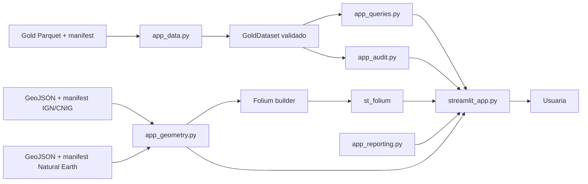

# Guía técnica de la aplicación Streamlit

Esta guía explica cómo está organizada la aplicación local de consulta, cómo
extenderla sin romper sus contratos y qué verificaciones ejecutar antes de
proponer un cambio. Está dirigida a quien vaya a mantener el código, aunque no
haya trabajado antes con Streamlit o pandas.

Para usar la aplicación y operar el pipeline consulta primero la
[guía de usuario](USER_GUIDE.md). Esta guía no sustituye los contratos de datos
ni las reglas de trabajo de [AGENTS.md](../AGENTS.md).

## 1. Objetivo y límites

La aplicación es una vista **read-only** de un snapshot Gold previamente
materializado y validado. Su única entrada de datos son estas cuatro tablas:

- `projects`;
- `project_events`;
- `project_locations`;
- `project_location_sources`.

Streamlit no ejecuta el pipeline, no lee Silver, no corrige extracciones y no
regenera artefactos. La generación y validación de Gold pertenecen al pipeline
separado. Mantener esta frontera evita que una interacción de interfaz cambie
los datos publicados o oculte un snapshot incompatible.

## 2. Arquitectura y dirección de dependencias



La dependencia siempre avanza de izquierda a derecha:

```text
Gold → carga y contrato → consultas puras → presentación → usuaria
```

La interfaz puede llamar a las consultas, y las consultas pueden consumir
`GoldDataset`. El loader no importa Streamlit y las consultas no renderizan
widgets. Ninguna de estas capas escribe datos ni llama de vuelta al pipeline.
La geometría es una referencia de presentación verificada y separada de Gold;
el reporting construye un enlace `mailto:` sin persistencia.

## 3. Responsabilidad de cada archivo

### `streamlit_app.py`

Es la capa de presentación. Configura la página, lee la configuración del
operador, cachea el dataset ya validado, crea navegación y widgets, transforma
los resultados de consulta en tablas legibles y muestra errores seguros. No
contiene reglas de agrupación, contratos Gold ni filtros pandas reutilizables.

### `src/renewables_permitting/app_data.py`

Es el límite contractual de datos. Resuelve rutas, lee y valida el manifest,
confina cada filename al directorio Gold, rechaza symlinks inseguros, comprueba
hashes físicos y semánticos, schemas, dtypes, PK y FK, recalcula el downstream
ID y construye `GoldDataset`. Si algo falla, no entrega datos parciales.

### `src/renewables_permitting/app_queries.py`

Contiene consultas pandas puras: catálogo, filtros, derivación de la última
decisión publicada por trámite, resumen de trámites coincidentes, jerarquía
territorial, selección de dashboard, dos KPIs, conteos de BOE por año,
conteos de proyectos por año, lectura acotada de selecciones Vega de los
gráficos y traducción del año seleccionado a fechas,
agregaciones administrativas/territoriales, proyección territorial del
catálogo, contexto estructurado de interacción por `project_id`, nombres de
display, detalle, publicaciones y cronología agrupada,
localizaciones, linaje territorial y enlaces BOE. También centraliza las
etiquetas de dominio mostradas a la usuaria. No conoce widgets, variables de
entorno ni rutas.

### `src/renewables_permitting/app_geometry.py`

Verifica por separado el manifest y artefacto Natural Earth de contexto y el
manifest y los tres GeoJSON IGN de administración. Valida features, niveles,
códigos y relaciones padre. `attach_project_counts()`
implementa el left join por código: conserva toda la referencia y asigna cero
cuando no hay conteo filtrado; además reporta todo código analítico sin
geometría. `build_folium_choropleth()` crea la capa completa de CCAA/ciudades,
provincias o municipios del corpus con estilo neutro para cero, tooltip,
highlight y viewport estable sobre Natural Earth local, sin `TileLayer`.
`build_folium_project_map()` ajusta el
encuadre al proyecto y puede añadir límites padre discretos sin convertirlos en
territorios del proyecto.
`parse_folium_territory_selection()` acepta únicamente el
`last_active_drawing` del nivel esperado cuyo código, nombre y conteo no
negativo coinciden con el contexto validado del mapa anterior.
`select_geometry_features()` obtiene por código solo el subset municipal de una
ficha. El script reproducible `scripts/build_app_geometry.py` combina las capas
ETRS89 y WGS84 del ZIP oficial IGN/CNIG: genera CCAA/ciudades y provincias
completas, más el subset municipal presente en Gold. Streamlit nunca descarga
el ZIP.
`scripts/build_country_context.py` deriva de forma determinista el GeoJSON de
177 países desde la copia local `naturalearth_lowres` 1:110m; mantiene su
manifest e identidad separados de IGN.

### `src/renewables_permitting/app_reporting.py`

Valida el correo configurado, resuelve la precedencia entorno → secret y
construye un `mailto:` acotado y escapado. Acepta solo contexto funcional de
vista, filtros y ficha; no conoce Streamlit, no persiste mensajes y no recibe
paths, hashes, secrets ni JSON bruto. El `project_id` Gold se incluye en una
ficha como identidad estable para el triage administrativo.

### `src/renewables_permitting/app_audit.py`

Contiene las consultas puras del explorador técnico: resumen de esquema y
calidad, filtros fila a fila y las vistas derivadas de resumen por proyecto y
trazabilidad territorial. Consume el `GoldDataset` ya validado, devuelve copias
y no importa Streamlit ni realiza I/O. La trazabilidad conserva una fila por
fuente territorial y no une `project_events`, evitando multiplicar una fuente
por todas las actuaciones de su evento.

`GOLD_TABLE_SPECS`, definido en `app_data.py`, expone de forma inmutable nombre,
columnas, orden, dtypes, PK, relaciones, granularidad y dominios. El loader y el
explorador reutilizan esta fuente; no mantengas otra lista de columnas en la UI.

### Tests

- `tests/test_app_data.py` protege manifest, versiones, hashes, rutas,
  schemas, PK/FK, downstream ID e inmutabilidad convencional.
- `tests/test_app_queries.py` protege catálogo, filtros, jerarquía territorial,
  nombres de display, series anuales, selección temporal, cronología agrupada,
  semántica same-row, orden, copias y casos inexistentes.
- `tests/test_app_audit.py` protege metadatos, calidad, filtros de las cuatro
  tablas, vistas derivadas, granularidad e inmutabilidad.
- `tests/test_streamlit_app.py` protege navegación, widgets, cards, filtros
  cruzados temporales/administrativos/territoriales/de tabla, montaje del
  componente Folium, catálogo configurable, ficha, mapa, cronología, reporte,
  estados de error y vistas públicas mediante `AppTest`.
- `tests/test_app_geometry.py` y `tests/test_app_reporting.py` protegen la
  referencia cartográfica, builder Folium, identidad de selección y el canal
  público no persistente.

### Dependencias cartográficas en runtime

- Los tres GeoJSON IGN y el GeoJSON Natural Earth, cada uno con su manifest,
  son locales y versionados.
- `folium` construye el mapa y `streamlit-folium` monta el componente
  bidireccional; no se usa `folium_static()`.
- Natural Earth aporta países y costas como una capa vectorial local,
  no interactiva y public-domain. No existe proveedor de tiles, API key ni
  watermark de basemap.
- La distribución actual de Folium declara Leaflet y otros recursos estáticos
  JavaScript/CSS mediante URLs CDN. Esto es distinto de descargar geometría o
  tiles, pero debe permitirse o vendorizarse en un despliegue totalmente
  offline.

## 4. Flujo de carga contractual

El inicio de la aplicación sigue este orden:

1. `streamlit_app.py` obtiene `RENEWABLES_GOLD_DIR` y
   `RENEWABLES_EXPECTED_DOWNSTREAM_ID`, o usa los valores predeterminados.
2. Resuelve la ruta Gold relativa respecto a la raíz del proyecto.
3. `load_gold_dataset()` verifica que el directorio existe, es un directorio
   real y no es un symlink.
4. Lee `manifest.json` antes de abrir ningún Parquet y valida versiones,
   identidades y declaración exacta de las cuatro tablas.
5. Comprueba que no falta ni sobra ningún Parquet contractual.
6. Para cada tabla, confina el filename al directorio Gold y valida hash físico
   antes de leerla.
7. Tras leerla, valida número de filas, columnas, orden, dtypes, schema y hash
   semántico.
8. Valida PK y FK de las cuatro tablas y el hash semántico conjunto de
   localizaciones y fuentes.
9. Recalcula el downstream ID a partir del linaje y los hashes semánticos. Debe
   coincidir primero con el manifest y después con el ID esperado por el
   operador.
10. Construye `GoldDataset`, congela la estructura JSON del manifest y devuelve
    las tablas verificadas.
11. Streamlit cachea el resultado usando la ruta y el downstream ID como
    argumentos serializables.

Streamlit vuelve a ejecutar el script después de cada interacción. Esta caché
evita repetir la lectura y todas las validaciones mientras sigan configurados
la misma ruta Gold y el mismo downstream ID.

La geometría administrativa tiene una caché de recurso separada cuya identidad incluye
`RENEWABLES_GEOMETRY_DIR` y `RENEWABLES_EXPECTED_GEOMETRY_SHA256`; este último
es el hash físico del manifest, que a su vez declara el hash de cada GeoJSON.
El contexto de países usa otra caché e identidad mediante
`RENEWABLES_COUNTRY_CONTEXT_DIR` y
`RENEWABLES_EXPECTED_COUNTRY_CONTEXT_SHA256`. El cambio de ruta o hash fuerza
una validación nueva. `RENEWABLES_REPORT_EMAIL` —o el secret
`report_email`— solo configura el destino del enlace local y nunca entra en las
consultas ni en Gold.

Ningún paso es opcional. Saltarse el manifest impediría conocer el contrato;
omitir hashes permitiría consumir bytes distintos; omitir schemas o PK/FK
permitiría datos estructuralmente inválidos; y omitir el downstream ID podría
mostrar un snapshot válido pero diferente del aprobado.

## 5. `GoldDataset` e inmutabilidad

La estructura pública es, de forma abreviada:

```python
@dataclass(frozen=True)
class GoldDataset:
    projects: pd.DataFrame
    project_events: pd.DataFrame
    project_locations: pd.DataFrame
    project_location_sources: pd.DataFrame
    manifest: Mapping[str, Any]
    gold_dir: Path
    downstream_id: str
```

`frozen=True` impide reasignar atributos, pero pandas mantiene los DataFrames
mutables. Por eso la protección completa es una convención explícita: las
consultas tratan las cuatro tablas como fuentes inmutables y devuelven copias
cuando exponen filas o resultados. No añadas columnas, ordenes filas ni hagas
asignaciones inplace sobre `dataset.*`.

## 6. API pública de consultas

### `build_project_catalog(dataset)`

- **Entrada:** un `GoldDataset` validado.
- **Salida:** copia determinista con una fila por `project_id` y las columnas de
  `CATALOG_COLUMNS`.
- **Responsabilidad:** combinar el resumen de proyecto con columnas compactas
  de comunidad, provincia y municipios y un resumen territorial, sin duplicar
  proyectos.
- **Tests:** cardinalidad, columnas, orden y resumen territorial.

### `filter_projects(dataset, ...)`

- **Entrada:** dataset y filtros opcionales de texto, tecnología, territorio,
  fechas, trámite, situación, interpretación temporal y coincidencia de
  trámites.
- **Salida:** subconjunto copiado del catálogo, todavía con una fila por
  proyecto. Añade `matching_action_types` solo cuando existe un filtro
  administrativo activo.
- **Responsabilidad:** aplicar OR dentro de cada categoría, AND entre
  categorías, same-row para los filtros administrativos y OR/AND entre varios
  trámites según la selección explícita.
- **Tests:** combinaciones, fechas inclusivas, jerarquía, same-row, ausencia de
  duplicados e inmutabilidad.

### `build_latest_project_actions(project_events)`

- **Entrada:** `project_events` con las columnas mínimas de identidad, fecha e
  índices administrativos.
- **Salida:** copia con una fila por `project_id × action_type`.
- **Responsabilidad:** elegir la última publicación por fecha, `event_index`,
  `administrative_action_index` y `administrative_action_id`, en ese orden.
- **Límite:** representa la última publicación conocida por trámite; no deriva
  un estado jurídico consolidado.
- **Tests:** transición histórica/posterior, empates en los cuatro niveles,
  columnas ausentes, orden e inmutabilidad.

### `build_matching_action_summary(project_events, ...)`

- **Entrada:** filas Gold, interpretación temporal y los mismos predicados
  administrativos usados por `filter_projects()`.
- **Salida:** una fila por proyecto elegible con `matching_action_types` como
  tupla canónica ordenada determinísticamente.
- **Responsabilidad:** compartir la selección latest/histórica y el filtrado
  same-row, exigir todos los trámites cuando corresponde y preparar el resumen
  que la UI etiqueta como **Trámites coincidentes**.
- **Tests:** cero, uno o varios trámites; OR/AND; varias situaciones; fechas;
  Coscojar II; ausencia de duplicados e inmutabilidad.

### Consultas del dashboard

- `build_dashboard_selection()` devuelve proyectos y las filas BOE exactas que
  soportan la selección compartida;
- `summarize_dashboard_selection()` cuenta proyectos y BOE distintos;
- `build_yearly_project_counts()` cuenta proyectos distintos con publicación
  observada por año, sin afirmar que sean nuevos o construidos;
- `build_publication_counts()` deduplica `boe_id` antes de agrupar por año;
- `build_administrative_situation_counts()` cuenta proyectos distintos por
  actuación y decisión: en `latest` parte de una fila por
  `project_id × action_type`; en `historical` deduplica
  `project_id × action_type × decision`;
- `build_territory_project_counts()` deduplica `project_id × código` y nunca
  agrega fuentes territoriales como si fueran proyectos.
- `build_chart_year_filter()` traduce un año validado a 1 de enero–31 de
  diciembre y `extract_chart_selected_year()` valida el estado Vega antes de
  usarlo.

`format_project_display_name()` es estrictamente de presentación: normaliza
espacios y nombres íntegramente en mayúsculas, preservando acrónimos, unidades,
números y romanos conocidos. Nunca se aplica a evidencia, IDs, URLs ni títulos
literales citados, y nunca se escribe el resultado en Gold.

### `get_project_detail(dataset, project_id)`

- **Entrada:** dataset e ID exacto.
- **Salida:** copia de la fila canónica de `projects` como `Series`.
- **Responsabilidad:** exigir una coincidencia exacta; si no existe, lanza
  `ProjectNotFoundError`.
- **Tests:** detalle completo e ID inexistente.

### `get_project_timeline(dataset, project_id)`

- **Entrada:** dataset e ID exacto.
- **Salida:** copia de todas las actuaciones publicadas del proyecto.
- **Responsabilidad:** ordenar la fecha de publicación de más reciente a más
  antigua y conservar evento, índice de actuación e ID ascendentes como
  desempates estables dentro de una fecha.
- **Tests:** orden, contenido, proyecto inexistente e inmutabilidad.

`group_project_timeline_by_publication()` convierte esa copia en grupos
inmutables `fecha/BOE → actuaciones` para presentación, conservando ID de
actuación y evidencia literal. `build_project_publication_summary()` une las
publicaciones de actuaciones y linaje territorial, muestra cada BOE una vez y
cuenta actuaciones distintas sin multiplicarlas.

### `get_project_locations(dataset, project_id)`

- **Entrada:** dataset e ID exacto.
- **Salida:** copia de todos sus territorios contractuales.
- **Responsabilidad:** mantener separados municipio, provincia y comunidad y
  ordenarlos de forma determinista, sin fabricar niveles padre.
- **Tests:** niveles, orden, filas province-only/community-only e inmutabilidad.

### `get_project_location_sources(dataset, project_id)`

- **Entrada:** dataset e ID exacto.
- **Salida:** copia de las filas de procedencia BOE de sus localizaciones.
- **Responsabilidad:** enlazar solo fuentes cuyos `project_location_id`
  pertenecen al proyecto y ordenarlas de forma estable.
- **Tests:** linaje completo, orden y ausencia de mutación.

### `get_filter_options(dataset, ...)`

- **Entrada:** dataset y selección opcional de comunidades y provincias.
- **Salida:** diccionario de tuplas con tecnologías, territorios, actuaciones y
  decisiones y años de publicación disponibles.
- **Responsabilidad:** ofrecer valores únicos y deterministas respetando la
  jerarquía comunidad → provincia → municipio.
- **Tests:** opciones base, restricciones parentales y niveles territoriales.

### `build_boe_url(boe_id)`

- **Entrada:** ID BOE contractual.
- **Salida:** URL pública `https://www.boe.es/diario_boe/txt.php?id=...`,
  derivada determinísticamente del ID BOE.
- **Responsabilidad:** validar el formato antes de construir el enlace. Los
  documentos fuente conservan sus URL canónicas, pero Gold no las propaga; una
  futura tabla de publicaciones podría preservarlas sin que sea un requisito
  del MVP actual.
- **Tests:** URL válida y rechazo de identificadores no contractuales.

Las funciones `label_*` también son públicas para presentación. Los códigos
conocidos usan mappings explícitos; un valor futuro se registra y se humaniza
como fallback para que la interfaz no falle silenciosamente.

## 7. Semántica de filtros

Los valores seleccionados dentro de una misma categoría se combinan con OR.
Por ejemplo, tecnología eólica o fotovoltaica incluye cualquiera de las dos, y
dos situaciones publicadas aceptan cualquiera de ellas. Las categorías activas
se combinan con AND: tecnología, territorio y administración deben pertenecer
al mismo proyecto candidato.

La interpretación temporal elige primero la tabla administrativa de trabajo:

- `latest`: `build_latest_project_actions()` conserva la última fila de cada
  `project_id × action_type`;
- `historical`: se usa una copia de todas las filas de `project_events`.

Fecha, trámite y situación se aplican después sobre esa misma tabla. Así, una
fila no puede satisfacer la fecha y otra distinta la situación. Con dos o más
trámites, `any` exige al menos uno y `all` comprueba que cada código seleccionado
permanezca entre las filas elegibles del proyecto. No se exige un BOE común.
El año de publicación se aplica a las mismas filas administrativas y compone
con tecnología y territorio mediante AND.

En territorio, cada selección dentro de comunidad, provincia o municipio es
OR, mientras los niveles activos se intersectan. Una fila municipal conserva
sus columnas de provincia y comunidad y puede satisfacer los filtros padre.
Una fila resuelta solo a provincia o solo a comunidad sigue siendo localizable
en su nivel, pero nunca se presenta como un municipio inventado.

Ejemplo:

```text
(Eólica OR Fotovoltaica)
AND (Andalucía)
AND (Sevilla OR Huelva)
AND (interpretación temporal = latest)
AND (una misma fila administrativa con fecha >= 2024-01-01
     AND trámite = autorización previa
     AND situación = autorizado)
```

El resultado final se proyecta sobre el catálogo maestro, que ya contiene una
fila por `project_id`; por ello los joins conceptuales con eventos o territorio
no duplican proyectos. Mantén siempre esta propiedad y no modifiques las tablas
de entrada.

## 8. Navegación y estado

`st.query_params` es la fuente de verdad de navegación:

- `view=resumen` abre el dashboard predeterminado;
- `view=ficha&project_id=...` abre el detalle;
- `view=metodologia` abre la metodología.
- `view=datos` abre la auditoría solo si
  `RENEWABLES_ENABLE_DATA_EXPLORER` vale `1`, `true`, `yes` u `on`, sin
  distinguir mayúsculas y minúsculas.

Los botones actualizan los parámetros y solicitan un rerun. Un `view`
desconocido se normaliza a `resumen`. Una ficha sin proyecto o con ID
inexistente muestra un estado seguro y permite volver al Resumen. La antigua
ruta `view=explorar` también se normaliza a Resumen, que contiene el catálogo.
El explorador está desactivado por defecto; un acceso directo a `view=datos`
sin habilitación vuelve a **Resumen** sin revelar configuración ni rutas.

El estado de sesión se usa para widgets y selecciones visuales transitorias.
Cuando cambia una comunidad o
provincia, las selecciones hijas incompatibles se eliminan antes de crear el
widget, evitando errores de Streamlit. La fila elegida en el DataFrame visual
se traduce por posición al mismo resultado filtrado, cuyo `project_id` se
mantiene fuera de la tabla presentada. `build_catalog_interaction_context()`
mantiene, en el mismo orden de filas, la tecnología y los conjuntos
territoriales completos derivados directamente de Gold. Así, las celdas de
**Tecnología**, **Comunidad autónoma**, **Provincia** y **Municipio(s)**
alimentan los `filter_*` compartidos sin parsear las cadenas abreviadas de
display. Los valores múltiples conservan OR dentro de su nivel; provincia y
municipio sincronizan sus padres. Una celda filtrable prevalece sobre una
selección simultánea de fila; una fila o celda **Proyecto** abre la ficha.

Los dos gráficos anuales y el gráfico administrativo declaran selecciones Vega
nativas. El mapa de Resumen usa `st_folium()` con una key deliberada por epoch
y devuelve exclusivamente `last_active_drawing`. Al comienzo del rerun,
`_consume_summary_interactions()` valida el estado anterior y lo traduce a los
filtros existentes: año y fechas; actuación y decisión; o jerarquía
territorial. Solo acepta un código territorial del nivel visible que el mapa
anterior declaró, incluso si el conteo filtrado es cero. Si ese territorio no
existe en Gold, la selección se ignora sin error; si existe, puede producir un
resultado vacío válido. Todas las categorías continúan pasando
por `build_dashboard_selection()` y se combinan con AND.

`filter_temporal_interpretation` es la selección canónica compartida. El
`selectbox` lateral y el `st.segmented_control` contextual de la única zona
gráfica administrativa se sincronizan mediante callbacks antes del rerun; la
key del selector gráfico es solo una representación visual de ese valor. El
cambio de cualquiera de los controles libera la selección de marca anterior e
incrementa el epoch, evitando estados latest/historical divergentes o loops.
Una sola especificación Vega compuesta contiene dos selecciones nativas. El
marcador **Todo** por fila declara solo `action_type`; el consumer escribe
`filter_actions` y vacía `filter_decisions`. La barra segmentada declara
`action_type` y `decision`; el consumer valida ambos y escribe conjuntamente
los dos filtros. Ambas selecciones usan el mismo epoch, son mutuamente
reemplazables y sus condiciones de opacidad hacen visible el origen elegido.

Un epoch en las keys de charts y tabla permite consumir o limpiar selecciones
sin escribir estados read-only ni crear loops. Los campos `active_*` solo hacen
visible el origen de cada predicado. **Limpiar filtros** elimina filtros y todos
los `active_*`, incrementa el epoch y devuelve el dashboard al estado inicial.
Editar manualmente el widget equivalente libera únicamente el origen visual
correspondiente. El mapa general ofrece CCAA/ciudades, provincias y municipios.
Los dos primeros niveles usan la referencia completa; Municipios usa los 95
códigos presentes en el corpus final y conserva sus ceros bajo filtros. La ficha usa un builder
separado, solicita cero objetos de retorno, carga solo sus municipios y no
declara selección global.

La ficha consulta siempre el `GoldDataset` completo mediante el `project_id`;
no depende de que el proyecto siga visible bajo los filtros del catálogo. Los
dos KPIs y los dos gráficos temporales usan respectivamente columnas de pesos
`(1, 1)`. El nivel territorial usa un `st.segmented_control` requerido; cambiar
de nivel no borra filtros.

El canal de reporte se renderiza una sola vez dentro de la navegación,
inmediatamente después de **Metodología**, en todas las vistas. Con destino
válido es un `link_button` `mailto:`; sin destino conserva la misma posición
mediante un botón deshabilitado y una leyenda, nunca un enlace roto. El enlace
usa los mismos `filter_*` efectivos y, en ficha, el `project_id`, periodo
observado, último BOE y URL canónica. No aparece en los cuerpos de Metodología o
ficha. El reporte solo inicia el triage humano: un defecto de extracción puede producir
una `manual_review`; la corrección versionada vigente solo soporta excluir la
actuación administrativa histórica definida por
`administrative_action_corrections_v1`; los defectos downstream de resolución
territorial o agrupación sin contrato requieren regla técnica y tests. Todo
cambio aceptado se regenera fuera de Streamlit hasta un nuevo Gold validado.
El inventario temporal W14 que motivó este gate está en
`docs/FINAL_W14_ADMIN_ACTION_TEMPORAL_AUDIT.md`; no constituye aprobación del
CSV ni autoriza una mutación directa de Gold.

## 9. Recetas de cambios seguros

### Cambiar un texto

Edita solo la llamada de presentación en `streamlit_app.py`. Comprueba que no
altera una definición metodológica aprobada y ejecuta `test_streamlit_app.py`.

### Añadir una columna al catálogo

Primero comprueba que ya existe en Gold con granularidad de proyecto. Amplía
`CATALOG_COLUMNS` y `build_project_catalog()`, después `_catalog_display()` y
los tests de consultas/UI. Si el dato no existe en Gold, no lo leas de Silver.
La selección visual de columnas no cambia el DataFrame maestro ni su grano; la
columna **Proyecto** debe permanecer obligatoria.

### Cambiar la normalización visual de nombres

Modifica solo `format_project_display_name()` y sus casos RED. Conserva una
lista explícita y mínima de acrónimos/unidades; no uses `title()` sobre todo el
texto. Verifica que Gold y evidence permanecen byte a byte sin cambios.

### Añadir un filtro

Implementa su semántica pura en `app_queries.py`, añade opciones jerárquicas si
corresponde, pruébala en `test_app_queries.py` y solo entonces crea el widget en
`streamlit_app.py`. Define explícitamente OR, AND y granularidad same-row.

Si el filtro pertenece al explorador técnico, impleméntalo en `app_audit.py`,
prueba OR, AND, fechas, orden e inmutabilidad en `test_app_audit.py`, y añade
después el widget específico en `streamlit_app.py`.

### Añadir una situación publicada

La situación debe existir ya como valor canónico de `project_events.decision`.
Añade o revisa su etiqueta en `DECISION_LABELS`, verifica que
`get_filter_options()` la obtiene del Gold observado y crea un test sintético
que demuestre su interacción con latest/histórico y same-row. No infieras un
estado nuevo en la UI ni añadas un valor solo para presentar una conclusión
jurídica no contenida en Gold.

### Añadir una vista

Añade un valor de `view`, su renderer y la navegación mediante query params.
La vista debe consumir consultas puras y manejar IDs inexistentes. Amplía
`AppTest` con acceso directo por URL y navegación desde la interfaz.

Una vista derivada de auditoría debe declarar su granularidad, reutilizar las
consultas existentes cuando encajen y vivir en `app_audit.py`. No la conviertas
en una tabla Gold ni unas tablas con granularidades incompatibles en un join
global. Para añadir una tabla canónica al explorador, primero debe existir en el
contrato Gold productivo; después amplía una sola vez `GOLD_TABLE_SPECS`, el
loader y sus tests. La UI debe obtener de esa especificación columnas, PK y
relaciones.

### Consumir un nuevo dato Gold

Este cambio empieza en el contrato/materializador Gold, no en Streamlit. Tras
materializar y validar un snapshot nuevo, amplía el contrato del loader, sus
hashes, schemas, PK/FK, `GoldDataset`, consultas y tests. Actualiza el
downstream ID esperado de forma trazable; nunca añadas una lectura lateral de
Silver para ahorrar ese trabajo.

## 10. Cambios prohibidos

No hagas desde la aplicación ni durante su mantenimiento:

- editar Parquets o manifests manualmente;
- cambiar un downstream ID o un hash para hacer pasar la carga;
- sobrescribir runs históricos;
- duplicar schemas, PK/FK o reglas de dominio dentro de la UI;
- reparar datos con asignaciones pandas en `streamlit_app.py`;
- leer Silver, notebooks o artefactos intermedios desde la aplicación;
- añadir ejecución del pipeline, modelo, BOE o correcciones a la interfaz
  read-only.

## 11. Tests y comprobaciones

Tests focales:

```bash
UV_OFFLINE=1 PYTHONDONTWRITEBYTECODE=1 \
uv run --with pytest pytest -q -p no:cacheprovider \
  tests/test_app_data.py \
  tests/test_app_queries.py \
  tests/test_app_audit.py \
  tests/test_streamlit_app.py
```

Al cerrar una fase o cambiar un contrato compartido, ejecuta también:

```bash
UV_OFFLINE=1 PYTHONDONTWRITEBYTECODE=1 \
uv run --with pytest pytest -q -p no:cacheprovider
```

Completa la revisión con `git diff --check`, el diff de los paths permitidos y
`git status --short --untracked-files=all`. No es necesario arrancar el servidor
para un cambio puramente documental o de comentarios si AST y tests siguen
verdes.

## 12. Errores frecuentes

| Problema | Interpretación y respuesta |
| --- | --- |
| Dataset no encontrado | Revisa `RENEWABLES_GOLD_DIR`; no muestres el path interno en la UI. |
| Manifest inválido | El snapshot no declara el contrato esperado; no intentes cargar los Parquets a mano. |
| Downstream ID distinto | Puede ser contenido internamente válido pero otra versión; usa el ID aprobado para ese mismo snapshot. |
| Hash físico distinto | Cambiaron los bytes del Parquet respecto al manifest. Considera el snapshot no íntegro. |
| Hash semántico distinto | Cambió el contenido lógico declarado, aunque el archivo pueda abrirse. |
| Proyecto inexistente | Muestra un estado seguro y vuelve al catálogo; no uses coincidencias parciales de IDs. |
| Widget incompatible | Limpia selecciones hijas antes de instanciar el widget tras cambiar su jerarquía padre. |
| Caché obsoleta | La clave incluye ruta e ID; al publicar otro snapshot usa ambos valores nuevos o limpia la caché de Streamlit durante diagnóstico. |
| Componente Folium vacío | Comprueba los recursos Leaflet JavaScript/CSS declarados por Folium y los hashes de ambos manifests geométricos. Natural Earth e IGN son locales y no deben descargarse en runtime. |
| Query params desconocidos | Normaliza la vista y elimina parámetros incompatibles. |
| `.agents/` sin versionar | Es un recurso local; no lo edites ni lo incluyas en el commit. |

`GoldIntegrityError` expresa que un artefacto no coincide con lo declarado por
su propio snapshot. `GoldVersionError` expresa que el snapshot puede ser
internamente coherente, pero no es la versión que el operador autorizó. La UI
registra el detalle técnico y muestra mensajes breves que no filtran rutas.

## 13. Checklist antes de commit

- [ ] El cambio tiene un solo objetivo y no abre el pipeline desde la UI.
- [ ] Streamlit sigue consumiendo exclusivamente las cuatro tablas Gold.
- [ ] El explorador sigue desactivado por defecto y no ofrece escritura,
      edición ni descargas.
- [ ] Las consultas siguen siendo puras y devuelven copias.
- [ ] No se han duplicado contratos ni mappings innecesariamente.
- [ ] Navegación y widgets tienen estados vacíos e incompatibles cubiertos.
- [ ] Una selección de gráfico compone con los filtros explícitos, se refleja
      en año/fechas y puede limpiarse sin rerun circular.
- [ ] El mapa general conserva todas las CCAA/ciudades, provincias y los
      municipios del corpus mediante left join, muestra los ceros y usa
      Natural Earth local sin tiles; la ficha carga solo su subset territorial
      y el caso sin territorio no crea un componente vacío.
- [ ] La selección administrativa aplica acción y decisión, el mapa valida el
      código y las celdas estructuradas de tecnología/territorio filtran sin
      impedir que una fila o celda Proyecto abra detalle.
- [ ] El reporte aparece justo bajo Metodología, usa configuración externa y no
      aparece en el cuerpo ni muta Gold.
- [ ] **Limpiar filtros** reinicia todos los filtros cruzados y sus epochs.
- [ ] La normalización visual no modifica Gold ni evidencia literal.
- [ ] Los tests incluyen una transición donde histórico y latest divergen y
      no fijan como equivalentes ambas interpretaciones.
- [ ] Los tests focales pasan offline.
- [ ] La suite completa pasa cuando corresponde.
- [ ] AST, `git diff --check`, diff y Git status están revisados.
- [ ] No se modificaron Parquets, manifests de datos, runs, `.agents/` ni el
      freeze; un cambio cartográfico puede actualizar únicamente su manifest y
      assets de presentación autorizados.
- [ ] La documentación afectada coincide con el comportamiento real.

## 14. Referencias

- [Guía de usuario](USER_GUIDE.md)
- [README](../README.md)
- [Reglas activas](../AGENTS.md)
- [Roadmap de cierre](TFM_CLOSEOUT.md)
- [Alineación final del producto](FINAL_STREAMLIT_PRODUCT_ALIGNMENT.md)
- [Aplicación Streamlit](../streamlit_app.py)
- [Loader Gold](../src/renewables_permitting/app_data.py)
- [Consultas de aplicación](../src/renewables_permitting/app_queries.py)
- [Consultas de auditoría](../src/renewables_permitting/app_audit.py)
- [Referencia geométrica](../src/renewables_permitting/app_geometry.py)
- [Reporting seguro](../src/renewables_permitting/app_reporting.py)
- [Generador de geometría](../scripts/build_app_geometry.py)
- [Tests del loader](../tests/test_app_data.py)
- [Tests de consultas](../tests/test_app_queries.py)
- [Tests del explorador](../tests/test_app_audit.py)
- [Tests de Streamlit](../tests/test_streamlit_app.py)
