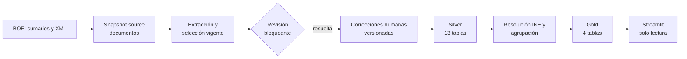
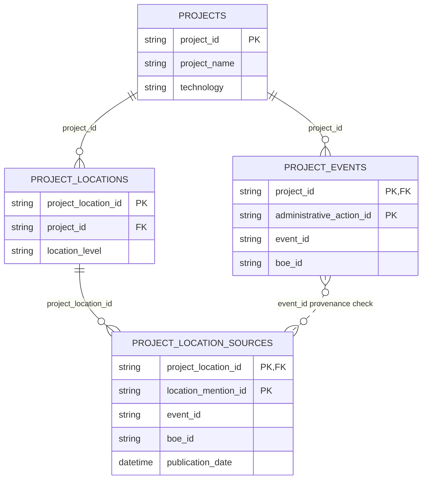

# Manual de usuario y operación

Esta guía explica cómo consultar y operar el proyecto **TFM BOE Energy
Tracker** desde el repositorio local. Está dirigida a una persona que empieza
desde cero: primero presenta el producto y sus datos, después describe el uso
de Streamlit y, por último, los procedimientos técnicos de actualización,
corrección, validación y recuperación.

> [!IMPORTANT]
> Los ejemplos operativos no se ejecutan automáticamente al leer esta guía.
> Antes de una descarga del BOE o una llamada a Gemini, revisa el plan en modo
> `--dry-run`, usa un directorio de run nuevo y confirma expresamente el coste y
> el alcance. Nunca edites un Parquet generado.

## Contenido

1. [Propósito del sistema](#1-propósito-del-sistema)
2. [Vista general de la arquitectura](#2-vista-general-de-la-arquitectura)
3. [Conceptos esenciales](#3-conceptos-esenciales)
4. [Estructura de carpetas](#4-estructura-de-carpetas)
5. [Preparar el entorno](#5-preparar-el-entorno)
6. [Iniciar Streamlit](#6-iniciar-streamlit)
7. [Usar la aplicación](#7-usar-la-aplicación)
8. [Modelo Gold](#8-modelo-gold)
9. [Inspeccionar las tablas](#9-inspeccionar-las-tablas)
10. [Incorporar nuevos BOE](#10-incorporar-nuevos-boe)
11. [CLI administrativa de revisión](#11-cli-administrativa-de-revisión)
12. [Ejemplo práctico de corrección](#12-ejemplo-práctico-de-corrección)
13. [Ejemplo de actualización con nuevos BOE](#13-ejemplo-de-actualización-con-nuevos-boe)
14. [Validación](#14-validación)
15. [Versionado, commits y rollback](#15-versionado-commits-y-rollback)
16. [Estado de las funciones futuras](#16-estado-de-las-funciones-futuras)
17. [Solución de problemas](#17-solución-de-problemas)
18. [Glosario](#18-glosario)
19. [Referencias internas del repositorio](#referencias-internas-del-repositorio)

## Rutas rápidas

- [Quiero abrir la aplicación](#6-iniciar-streamlit).
- [Quiero inspeccionar los datos](#9-inspeccionar-las-tablas).
- [Quiero incorporar nuevos BOE](#10-incorporar-nuevos-boe).
- [Quiero corregir un error](#11-cli-administrativa-de-revisión).
- [Quiero validar un nuevo snapshot](#14-validación).
- [Tengo un problema](#17-solución-de-problemas).

## 1. Propósito del sistema

El sistema reconstruye el ciclo administrativo de proyectos de generación
eléctrica nombrados en publicaciones oficiales del **Boletín Oficial del
Estado (BOE)**. Una planta de generación con nombre es la raíz de un proyecto;
una infraestructura de almacenamiento, evacuación o red no crea por sí sola un
proyecto de generación.

El pipeline:

- descarga y prepara publicaciones del BOE dentro de un rango de fechas;
- extrae de su texto proyectos, actuaciones administrativas y evidencia;
- detiene los casos inciertos o fallidos para revisión humana;
- materializa 13 tablas Silver normalizadas y validadas;
- resuelve territorio contra la referencia municipal del INE;
- agrupa menciones en proyectos canónicos;
- construye cuatro tablas Gold para consulta;
- muestra el resultado en una aplicación Streamlit local y de solo lectura.

Streamlit permite explorar proyectos, publicaciones, actuaciones y territorio.
No llama al BOE, no ejecuta el pipeline, no consulta Gemini y no modifica los
datos.

> [!NOTE]
> El núcleo de datos validado está declarado en
> [`freezes/core_data_freeze_2026-08-13.md`](freezes/core_data_freeze_2026-08-13.md).
> Las tablas Gold territoriales y la aplicación son extensiones aditivas: no
> cambian los identificadores de proyecto ni la semántica congelada de
> `project_events`.

## 2. Vista general de la arquitectura



La flecha de correcciones entra en la **materialización Silver**. El sistema
conserva la extracción original y aplica únicamente correcciones aprobadas
antes de aplanar las 13 tablas. No existe una edición posterior de Silver o
Gold.

| Capa | Naturaleza | Ejemplos |
| --- | --- | --- |
| Fuente (Bronze conceptual) | Copia trazable de la publicación | sumarios, XML, `documents.parquet` |
| Extracción | Resultado de modelo, selección y revisión | attempts, current extractions, review queue |
| Silver | Datos relacionales normalizados | 13 Parquets contractuales |
| Downstream | Derivación determinista | localizaciones resueltas y agrupación |
| Gold | Tablas orientadas a producto | projects, events y territorio |
| Streamlit | Lectura verificada | catálogo, ficha, cronología y metodología |

Los snapshots y manifests son datos derivados regenerables. Las reglas,
correcciones aprobadas, contratos, código, tests y documentación sí se
versionan en Git. La aplicación solo consume Gold.

## 3. Conceptos esenciales

| Término | Explicación sencilla |
| --- | --- |
| **Run** | Una ejecución identificada del pipeline, con sus propios directorios de salida. |
| **Snapshot** | Fotografía inmutable de una fase: archivos más un manifest que permite verificarla. |
| **Manifest** | JSON que declara versiones, inputs, archivos, conteos, hashes e identidad de una materialización. |
| **Materialization ID** | Huella contractual de un snapshot. Cambia cuando cambia un input o contenido que forma parte de su identidad. |
| **Semantic hash** | SHA-256 calculado sobre el contenido lógico normalizado de una tabla; no depende de detalles físicos irrelevantes del Parquet. |
| **Freeze** | Snapshot formalmente validado que se conserva como referencia y no se sobrescribe. |
| **Bronze** | Nombre conceptual para la capa fuente casi sin transformar. En esta CLI el subcomando real se llama `source`. |
| **Silver** | Las 13 tablas normalizadas del contrato de extracción. |
| **Gold** | Las cuatro tablas listas para consulta por el producto. |
| **PK** | Clave primaria: columna o combinación que identifica una fila de forma única. |
| **FK** | Clave foránea: columna que debe apuntar a una fila existente en otra tabla. |
| **Corrección versionada** | Decisión humana aprobada, trazable y validada que se aplica como input, sin editar el resultado generado. |
| **Downstream** | Fases deterministas posteriores a Silver: territorio INE, agrupación de proyectos y Gold. |

Una revisión manual y una corrección no son lo mismo. La revisión resuelve qué
extracción queda vigente para un documento; una corrección aprobada actúa
después sobre una entidad exacta durante la materialización Silver.

Cuando una revisión `manually_validated` define explícitamente componentes,
sus asociaciones con plantas o los targets de una actuación, la
canonicalización posterior conserva esas decisiones válidas. Solo infiere las
relaciones ausentes; una referencia inexistente o un componente sin linaje de
generación se rechaza en lugar de aceptarse como excepción a la validación.
Una revisión humana puede conservar varias plantas independientes en un único
evento solo si representa una única actuación dirigida a un único componente
relacionado explícitamente con todas ellas. Las plantas siguen siendo raíces y
el componente y la actuación compartidos no se duplican por planta.

> [!NOTE]
> Un hash físico verifica bytes concretos de un archivo. Un hash semántico
> verifica el contenido contractual. El manifest puede registrar ambos porque
> responden a preguntas distintas.

## 4. Estructura de carpetas

```text
src/          lógica productiva: pipeline, extracción, Silver, downstream y app
config/       inputs versionados, como correcciones y muestras de evaluación
runs/         snapshots operacionales regenerables; no se versionan
data/gold/    staging local ignorado de artefactos Gold de publicación
docs/         guías, arquitectura, freeze y memoria del TFM
tests/        garantías ejecutables y fixtures en memoria
notebooks/    exploración, auditoría y orquestación legacy; no son producción
```

Reglas prácticas:

- edita código en `src/`, inputs humanos en `config/`, tests en `tests/` y
  documentación en `docs/`;
- no edites manualmente ningún Parquet de `runs/` o `data/`;
- no copies lógica productiva a un notebook;
- no añadas `runs/` a Git: contiene artefactos operacionales regenerables;
- no añadas los artefactos de `data/gold/` a Git: se distribuyen por separado;
- antes de modificar un input versionado, revisa su contrato y crea tests.

El directorio `.agents/` contiene recursos locales de herramientas. No forma
parte del producto ni debe añadirse a un commit del proyecto.

## 5. Preparar el entorno

El proyecto requiere Python 3.10 y usa `uv`; Streamlit es una dependencia del
proyecto, no una instalación global.

### Antes de empezar

- Una **terminal** es la ventana donde se escriben los comandos de esta guía.
- **Git** registra versiones del repositorio, que es la carpeta del proyecto y
  su historial. Una **rama** es una línea de trabajo dentro de ese historial.
- El **working tree** es el estado actual de los archivos. Un archivo
  **untracked** existe localmente, pero Git todavía no lo sigue.
- **Python** ejecuta el código. `uv` instala y ejecuta sus dependencias dentro
  del **entorno virtual** aislado del proyecto.
- **VS Code** es un editor opcional para abrir el repositorio, revisar cambios
  y trabajar con Python; no sustituye a Git ni al entorno virtual.

Abre una terminal y sitúate en la raíz del repositorio, es decir, la carpeta
que contiene `pyproject.toml`, `src/`, `docs/` y `streamlit_app.py`. Todos los
comandos del manual se ejecutan desde esa carpeta salvo que se indique lo
contrario. Estas comprobaciones son seguras y no ejecutan el pipeline:

**Ejecutable en Bash/Linux desde la raíz del repositorio.**

```bash
git --version
uv --version
python --version
git status --short
```

Antes de la primera ejecución, prepara el entorno:

**Ejecutable en Bash/Linux desde la carpeta que contiene el repositorio.**

```bash
cd tfm-renewables-permitting-tracker
uv sync --extra dev
uv run python --version
uv run python -c "import renewables_permitting; print('entorno correcto')"
uv run python -m renewables_permitting.pipeline --help
```

Para ejecutar un test focal cuando `pytest` no está instalado en el entorno
base:

**Ejecutable en Bash/Linux desde la raíz del repositorio.**

```bash
UV_OFFLINE=1 PYTHONDONTWRITEBYTECODE=1 \
uv run --with pytest pytest tests/test_app_queries.py \
-q -p no:cacheprovider
```

Para conocer la interfaz exacta de una fase, usa siempre su ayuda:

**Ejecutable en Bash/Linux desde la raíz del repositorio.**

```bash
uv run python -m renewables_permitting.pipeline source --help
uv run python -m renewables_permitting.pipeline extract --help
uv run python -m renewables_permitting.pipeline extraction-subset --help
uv run python -m renewables_permitting.pipeline corrections-subset --help
uv run python -m renewables_permitting.pipeline extraction-union --help
uv run python -m renewables_permitting.pipeline history --help
uv run python -m renewables_permitting.pipeline recanonicalize --help
uv run python -m renewables_permitting.pipeline silver --help
uv run python -m renewables_permitting.pipeline downstream --help
uv run python -m renewables_permitting.pipeline build-reference-data --help
uv run python -m renewables_permitting.pipeline refresh-reference-data --help
uv run python -m renewables_permitting.pipeline run --help
```

### Resumen de la CLI

| Subcomando | Función | ¿Red o modelo? |
| --- | --- | --- |
| `source` | Descarga sumarios/XML y prepara documentos | BOE, salvo `--dry-run` |
| `extract` | Planifica/reutiliza intentos y extrae documentos pendientes | Gemini solo con `--execute-model` |
| `extraction-subset` | Proyecta el historial reutilizable de un snapshot a un scope menor | No |
| `corrections-subset` | Proyecta el registro de correcciones al universo documental de una extracción | No |
| `extraction-union` | Une historias completas de snapshots compatibles y disjuntos | No |
| `history` | Construye candidatos históricos Tier 1 + Tier 2 strict y un scope BOE deduplicado | No |
| `recanonicalize` | Reaplica reglas deterministas a outputs persistidos compatibles | No |
| `silver` | Verifica selección/revisión, aplica correcciones y crea 13 tablas | No |
| `downstream` | Resuelve territorio, agrupa y construye Gold | No |
| `build-reference-data` | Construye por primera vez la dimensión INE | No |
| `refresh-reference-data` | Compara una referencia INE candidata y, con confirmación, reconstruye downstream | No |
| `run` | Orquesta source opcional, extract, Silver y downstream | BOE/modelo solo con los permisos correspondientes |

`--dry-run` planifica sin publicar outputs. Los destinos de materialización
deben ser nuevos: el pipeline no sobrescribe una salida ya existente.

### Argumentos y salidas de los subcomandos

- `source` exige `--start-date`, `--end-date` y `--output-dir`. Ambas fechas son
  inclusivas. `--dry-run` es la única opción adicional y evita red y escritura.
- `extract` exige `--documents`, `--output-dir` y
  `--expected-extraction-config-id`. `--attempts`, `--manual-reviews` y uno o
  varios `--scope` son opcionales. `--retry-error-boe` también es opcional y
  repetible, pero solo selecciona errores históricos compatibles de forma
  explícita. `--execute-model` está desactivado por defecto; `--dry-run` no
  llama al modelo ni publica.
- `extraction-subset` exige `--input-extraction`, al menos un `--scope`, un
  `--output-dir` nuevo y el config ID esperado. Verifica el snapshot parent y
  publica sin red ni modelo un snapshot nuevo con la historia completa de
  attempts y revisiones de los BOE del scope que ya existan en el parent.
- `corrections-subset` exige `--corrections`, `--extraction-snapshot`, un
  `--output-dir` nuevo y el config ID esperado. Excluye únicamente correcciones
  cuyo BOE no pertenece al corpus y valida de forma fail-closed todos los
  targets in-scope. `--dry-run` no publica.
- `extraction-union` exige repetir `--input-extraction` para al menos dos
  snapshots, además de `--source-snapshot`, un `--output-dir` nuevo y el config
  ID esperado. Los parents deben ser compatibles, disjuntos y estar bajo la
  procedencia determinista vigente. `--dry-run` valida y recomputa selección y
  cola sin publicar.
- `history` exige el source, la extracción y scope anchor, la colección de
  scopes main P2, el snapshot INE, límites de fecha, registro holdout, destino
  nuevo y config ID esperado. Busca offline mediante nombre/alias exacto y
  tokens distintivos corroborados por tecnología o territorio. Tier 3 no forma
  parte del corpus final y el subcomando no dispone de opción de modelo.
- `recanonicalize` exige `--source-extraction-snapshot`, `--documents`,
  `--output-dir`, `--source-expected-extraction-config-id` y
  `--target-expected-extraction-config-id`. `--scope` puede repetirse y
  `--manual-reviews` aporta decisiones versionadas. Admite tanto la migración
  histórica aprobada como un replay acumulativo de la identidad activa con
  errores/revisiones: conserva los attempts originales, añade resultados
  derivados con uso cero y publica siempre en un output nuevo. No llama al
  modelo.
- `silver` exige `--extraction-snapshot`, `--output-dir` y el config ID
  esperado. `--corrections` es opcional y `--dry-run` no materializa.
- `downstream` exige `--silver-snapshot`, `--municipality-reference`,
  `--output-dir` y el config ID esperado. `--dry-run` valida/planifica sin
  publicar.
- `build-reference-data` exige `--codine`, `--dictionary` y `--output-dir`.
  Construye una referencia INE candidata a partir de los dos inputs locales.
- `refresh-reference-data` exige esos dos inputs, `--current-reference`,
  `--candidate-reference-output`, `--silver-snapshot`,
  `--downstream-output` y el config ID. Si la dimensión cambia semánticamente,
  muestra el impacto y pide confirmación; `--yes` la confirma de forma no
  interactiva. Si no hay cambio semántico, no publica ni reconstruye
  downstream. `--dry-run` nunca publica ni pregunta.
- `run` exige una fuente (`--documents` o las dos fechas),
  `--municipality-reference` y el config ID. `--runs-dir` vale `runs` por
  defecto; `--run-id`, attempts, revisiones y scopes son opcionales. Deniega
  llamadas nuevas salvo `--execute-model`.

Los códigos de salida operativos son 0 (éxito), 1 (fallo), 3 (faltaría permiso
explícito para el modelo) y 4 (revisión humana bloqueante). No existe un
subcomando separado llamado `review` o `validation`.

Ejemplos de operaciones menos frecuentes:

**Plantilla:** sustituye todos los valores `<...>` por rutas o identidades
verificadas. Los comandos conservan `--dry-run` deliberadamente.

```bash
# Replay determinista; ambos config IDs deben conocerse y verificarse.
uv run python -m renewables_permitting.pipeline recanonicalize \
  --source-extraction-snapshot <SNAPSHOT_EXTRACCION_ORIGEN> \
  --documents <SNAPSHOT_DOCUMENTAL_VALIDADO> \
  --scope <SCOPE_VERSIONADO> \
  --manual-reviews <REVISIONES_VERSIONADAS> \
  --output-dir runs/<NUEVO_RUN>/extraction \
  --source-expected-extraction-config-id <ID_CONFIG_ORIGEN> \
  --target-expected-extraction-config-id <ID_CONFIG_DESTINO> \
  --dry-run

# Construcción inicial de una referencia INE desde ficheros locales.
uv run python -m renewables_permitting.pipeline build-reference-data \
  --codine <RUTA_CODINE_CSV> \
  --dictionary <RUTA_DICCIONARIO_CSV> \
  --output-dir runs/<NUEVA_REFERENCIA_INE> \
  --dry-run

# Comparación/plan de refresh; omite --yes para conservar confirmación humana.
uv run python -m renewables_permitting.pipeline refresh-reference-data \
  --codine <RUTA_CODINE_CSV> \
  --dictionary <RUTA_DICCIONARIO_CSV> \
  --current-reference <REFERENCIA_INE_ACTUAL> \
  --candidate-reference-output runs/<REFERENCIA_INE_CANDIDATA> \
  --silver-snapshot <SILVER_VALIDADO> \
  --downstream-output runs/<NUEVO_RUN>/downstream \
  --expected-extraction-config-id <ID_CONFIG_ESPERADO> \
  --dry-run

# Orquestación integral desde documentos existentes, sin llamadas al BOE.
uv run python -m renewables_permitting.pipeline run \
  --documents <SNAPSHOT_DOCUMENTAL_VALIDADO> \
  --municipality-reference <REFERENCIA_INE_VALIDADA> \
  --expected-extraction-config-id <ID_CONFIG_ESPERADO> \
  --run-id <NUEVO_RUN> \
  --dry-run
```

No ejecutes una plantilla mientras conserve marcadores `<...>`.

## 6. Iniciar Streamlit

Desde la raíz del repositorio:

```bash
uv run streamlit run streamlit_app.py
```

Streamlit muestra normalmente la URL local `http://localhost:8501`. Para
detenerlo, vuelve al terminal y pulsa `Ctrl+C`.

Sin variables adicionales, la aplicación espera este Gold validado:

```text
runs/final-w14-corpus-20220101-20260820-v2/downstream/gold
```

El downstream ID predeterminado es
`316008e9bfce550c651d4f6377090243a180c6b5192666327fc1ba2ff8eeef86`.
Este default permite validación local, pero un directorio bajo `runs/` nunca se
usa directamente como artefacto de despliegue.

### Artefacto Gold de publicación

Los artefactos locales de publicación viven bajo `data/gold/`, cuyo contenido
está intencionadamente ignorado por Git. Cada directorio es inmutable y su
nombre termina en el `downstream_materialization_id` completo; no se
sobrescribe y no existe un alias mutable `latest`. Para el corpus final, la
ruta local aprobada es:

```text
data/gold/final-w14-corpus-20220101-20260820-v2-316008e9bfce550c651d4f6377090243a180c6b5192666327fc1ba2ff8eeef86
```

Git versiona código, contratos, documentación e identidades, no los Parquet
del producto. El directorio completo se distribuye por separado al entorno de
hosting. El despliegue debe configurar conjuntamente:

```bash
export RENEWABLES_GOLD_DIR="<RUTA_DEL_ARTEFACTO_PUBLICADO>"
export RENEWABLES_EXPECTED_DOWNSTREAM_ID="<DOWNSTREAM_ID_DEL_MISMO_ARTEFACTO>"
```

Ambos valores deben proceder del mismo artefacto validado. Nunca despliegues
directamente desde `runs/`.

Su downstream ID esperado está fijado en la aplicación. Para abrir otro
snapshot validado, configura **las dos** variables antes de iniciar Streamlit:

**Plantilla:** sustituye `<GOLD_VALIDADO>` y `<DOWNSTREAM_ID_VALIDADO>` por los
valores aprobados para el mismo snapshot.

```bash
export RENEWABLES_GOLD_DIR="<GOLD_VALIDADO>"
export RENEWABLES_EXPECTED_DOWNSTREAM_ID="<DOWNSTREAM_ID_VALIDADO>"
uv run streamlit run streamlit_app.py
```

El ID se obtiene de `downstream_materialization_id` en el `manifest.json` de
Gold. No uses un ID recordado ni lo calcules a mano.

El mapa usa por defecto los tres assets de geometría administrativa local
verificada en `app_assets/geometry/ign_bdlje_2026-07-28` y el contexto local
de países en `app_assets/geometry/natural_earth`. Para probar referencias ya
validadas deben configurarse conjuntamente su directorio y hash del manifest:

```bash
export RENEWABLES_GEOMETRY_DIR="<GEOMETRIA_VALIDADA>"
export RENEWABLES_EXPECTED_GEOMETRY_SHA256="<SHA256_MANIFEST>"
export RENEWABLES_COUNTRY_CONTEXT_DIR="<CONTEXTO_NATURAL_EARTH_VALIDADO>"
export RENEWABLES_EXPECTED_COUNTRY_CONTEXT_SHA256="<SHA256_MANIFEST_CONTEXTO>"
```

Los polígonos se representan con Folium/Leaflet sobre **Natural Earth** local:
una capa vectorial public-domain de países y costas, sin tiles remotos, API key
ni watermark de proveedor. La geometría administrativa IGN se mantiene en un
asset y manifest independientes. El componente sí carga los recursos frontend
JavaScript/CSS declarados por Folium; un despliegue totalmente offline debe
permitirlos o servirlos localmente. Esto no implica una descarga de datos del
mapa en runtime.

Para habilitar **Reportar posible error**, configura una dirección funcional
del proyecto; no escribas una dirección personal en el código:

```bash
export RENEWABLES_REPORT_EMAIL="<CORREO_DE_REVISION>"
uv run streamlit run streamlit_app.py
```

Como alternativa de despliegue, usa el secret de Streamlit `report_email`. Si
la variable de entorno está presente tiene precedencia; un valor explícito no
válido falla de forma segura. Si la variable está ausente, se prueba el secret.
Sin un destino válido, la barra lateral conserva **Reportar posible error** como
botón deshabilitado, muestra un aviso discreto y no crea un enlace roto. El
enlace configurado abre el cliente de correo de la usuaria: la aplicación no
envía ni almacena el mensaje.

> [!WARNING]
> La aplicación rechaza un directorio inexistente, symlinks, archivos
> inesperados, versiones incompatibles, columnas o dtypes erróneos, PK/FK
> inválidas, conteos incoherentes, hashes físicos/semánticos distintos o un
> downstream ID diferente del configurado. No “arregles” el Parquet: restaura
> o regenera un snapshot válido.

## 7. Usar la aplicación

### Resumen

La vista inicial presenta exactamente dos indicadores dinámicos: **Proyectos**
y **Publicaciones BOE relevantes**. Ambos aparecen en tarjetas delimitadas y
usan identidades distintas; el segundo cuenta `boe_id`, no filas de eventos.
Incluye además:

- mapa de asociaciones administrativas por comunidad/ciudad autónoma o
  provincia;
- proyectos distintos con publicación observada por año;
- publicaciones BOE distintas por año;
- una zona gráfica administrativa con selector temporal y conteos de proyectos
  distintos por trámite y situación publicada;
- el catálogo completo, con una fila por proyecto.

Los dos gráficos anuales son interactivos. Al seleccionar, por ejemplo, 2022,
la aplicación fija **Año de publicación = 2022** y el intervalo visible
**01/01/2022–31/12/2022**. Esa selección actualiza indicadores, ambos gráficos,
mapa y catálogo, y se combina con tecnología, territorio y administración. La
barra lateral identifica el año procedente del gráfico y ofrece **Quitar año
seleccionado**. En el gráfico administrativo, el punto **Todo** de una fila
aplica solo su **Trámite** y conserva todas las situaciones; un segmento aplica
simultáneamente **Trámite** y **Situación publicada**. Los controles laterales
reflejan siempre el resultado. Un polígono aplica el nivel territorial visible.
Todas estas selecciones se combinan con AND con los filtros existentes.

La zona gráfica administrativa muestra un solo gráfico cada vez. Su selector
segmentado reutiliza exactamente **Última decisión publicada por trámite** y
**Cualquier publicación histórica**. Comparte el mismo estado que
**Interpretación temporal** en la barra lateral: cambiar cualquiera de los dos
controles actualiza el otro. El primer modo conserva la publicación más reciente
por `project_id × action_type`; el segundo cuenta una vez cada combinación
proyecto–trámite–situación observada en cualquier publicación del corpus.

El botón primario **Limpiar filtros** restablece filtros laterales y selecciones
de gráficos, mapa y tabla. Sin filtros, los indicadores vuelven a 86 proyectos
y 80 publicaciones BOE relevantes.

**Evolución de proyectos** cuenta proyectos distintos con al menos una
publicación observada en cada año. No significa proyectos construidos ni
necesariamente proyectos nuevos. **Evolución de publicaciones BOE** cuenta BOE
distintos, aunque una publicación incluya varias actuaciones o proyectos.

El selector segmentado **Nivel territorial** muestra como tres alternativas
visibles **Comunidades y ciudades autónomas**, **Provincias** y **Municipios**.
Cambiar de alternativa no borra los demás filtros. La capa conserva siempre las 19
unidades del primer nivel o las 52 provincias/ciudades equivalentes. En
Municipios conserva los 95 códigos municipales representados por el corpus
final, no los 8.132 municipios españoles. En los tres niveles, un territorio
del universo correspondiente con cero proyectos bajo los filtros aparece en
gris y no desaparece. Los polígonos proceden de IGN/CNIG y se unen mediante
códigos administrativos. Natural Earth local aporta contexto de España,
Portugal, Francia, Marruecos y el norte de África. Ceuta, Melilla y Canarias se
muestran en su posición real, sin recuadros desplazados.

Al pulsar un polígono, la aplicación usa su código —no sus coordenadas ni solo
su nombre— para sincronizar comunidad, provincia y municipio según el nivel. Un proyecto
puede aparecer en varios polígonos; no sumes las celdas como total de proyectos.
El mapa no representa coordenadas, densidad ni la ubicación física exacta de
una planta. Los proyectos sin territorio resuelto siguen apareciendo en los
indicadores y en el catálogo. El municipio sigue disponible también en el
filtro lateral, la tabla y la ficha.

### Filtros y catálogo integrado

**Resumen** contiene los filtros compartidos y el catálogo completo de
proyectos, ordenado por última publicación observada. No existe una página
Explorar duplicada. Los filtros
disponibles son:

- texto libre;
- tecnología;
- jerarquía territorial: comunidad autónoma, provincia y municipio;
- interpretación temporal;
- año de publicación;
- fecha de publicación;
- trámite;
- situación publicada;
- coincidencia de trámites cuando se eligen dos o más.

Los cinco controles de **Seguimiento administrativo** aparecen exactamente en
ese orden. **Fecha publicación** representa un intervalo inclusivo.

Dentro de una categoría, varias opciones se combinan con **OR**: seleccionar
dos tecnologías muestra una u otra. Entre categorías se usa **AND**: una
tecnología y una provincia deben cumplirse simultáneamente.

**Situación publicada** es la decisión registrada en una publicación del BOE,
por ejemplo, «Autorizado» o «Sometido a información pública». Metodología
explica el alcance correcto de esta interpretación.

La **interpretación temporal** predeterminada es **Última decisión publicada
por trámite**. Para cada proyecto y tipo de trámite, selecciona primero la fila
más reciente disponible y aplica después fecha, situación y trámite. La opción
**Cualquier publicación histórica** busca en todas las filas, aunque exista una
publicación posterior para ese mismo trámite. Los resultados de ambos modos
pueden divergir cuando existe una publicación posterior para el mismo trámite.

Varias situaciones se combinan siempre con **OR**. Si se eligen dos o más
trámites aparece **Coincidencia de trámites**:

- **Al menos uno** conserva el proyecto cuando cualquier trámite seleccionado
  cumple fecha y situación;
- **Todos** exige una fila elegible para cada trámite seleccionado, sin exigir
  que procedan del mismo BOE.

Los filtros de fecha, trámite y situación mantienen semántica **same-row**: la
misma fila administrativa debe cumplirlos. No basta que un proyecto tenga la
fecha en una actuación y la situación en otra distinta. Tecnología, territorio
y administración se intersectan con AND y el catálogo conserva una sola fila
por proyecto.

Cuando hay un filtro administrativo activo, la columna **Trámites
coincidentes** indica respecto de qué tipos de trámite ha pasado el proyecto.
Es un resumen de la búsqueda, no sustituye la cronología completa de la ficha.
Por ejemplo, el snapshot actual permite localizar **FV El Coscojar II** bajo
«Sometido a información pública» para evaluación de impacto ambiental,
autorización administrativa previa y autorización administrativa de
construcción.

Selecciona una única fila o la celda **Proyecto** para abrir su ficha. Las
celdas de **Tecnología**, **Comunidad autónoma**, **Provincia** y
**Municipio(s)** pasan sus valores a los filtros globales y actualizan
indicadores, ambos gráficos temporales, mapa, gráfico administrativo y tabla.
Provincia sincroniza su comunidad padre; Municipio(s), su provincia y
comunidad. Cuando una celda contiene varios territorios, la aplicación usa los
valores estructurados completos asociados al proyecto con OR, no interpreta la
cadena abreviada visible. Una celda filtrable prevalece sobre una selección de
fila simultánea. Las fechas primera/última siguen siendo informativas porque
su conversión automática a un filtro anual sería ambigua.

El catálogo mantiene una fila por proyecto aunque existan varios territorios.
Muestra por defecto **Proyecto**, **Tecnología**, **Comunidad autónoma**,
**Provincia**, **Municipio(s)**, primera y última publicación observadas y
**N.º BOE**. El selector **Columnas visibles** permite ocultar o añadir columnas;
**Proyecto** permanece siempre visible. Los valores múltiples se presentan como
listas compactas y deterministas.

Los nombres se normalizan solo para presentación: se corrigen espacios y el
uso íntegro de mayúsculas sin perder siglas, unidades, números o romanos. Por
ejemplo, `HSF ANUBIS` se muestra como **HSF Anubis**. El Gold y la evidencia
literal no se modifican. El glosario se encuentra exclusivamente en
**Metodología** y reúne las siglas controladas o recurrentes respaldadas por las
fuentes de la aplicación: BOE, CNIG, FV, HSF, IGN e INE. Los nombres oficiales,
como **HSF Anubis**, no se expanden automáticamente.

### Ficha de proyecto

La ficha muestra:

- nombre, tecnología y un resumen determinista construido solo con Gold;
- tarjetas compactas, en este orden: **Publicaciones BOE**, **Actuaciones
  publicadas**, **Primera publicación observada** y **Última publicación
  observada**;
- mapa contextual del ámbito territorial asociado al proyecto, limitado al
  nivel resuelto más preciso;
- resumen compacto de publicaciones implicadas;
- cronología de actuaciones agrupada por fecha y publicación BOE;
- enlaces a publicaciones del BOE y evidencia expandible.

Cuando existen municipios resolubles, la ficha carga y resalta únicamente los
municipios de ese proyecto, con provincia, comunidad y países Natural Earth
como contexto; no carga
los miles de municipios españoles. Cada BOE aparece una vez en la cronología,
desde la publicación más reciente hasta la más antigua, y contiene debajo sus
actuaciones en orden estable. La evidencia literal se conserva en expanders por actuación. Si no
consta territorio resoluble, la ficha muestra el mensaje correspondiente en
lugar de reservar un mapa vacío.

Los territorios pueden proceder de la planta o de componentes asociados, como
almacenamiento o evacuación. El texto del BOE no siempre permite atribuir cada
territorio a un componente concreto.

> [!IMPORTANT]
> La cronología es una secuencia de **actos publicados**, no un estado jurídico
> consolidado calculado automáticamente. Una actuación posterior puede
> modificar, sustituir o referirse a otra; interpreta siempre la evidencia y
> la publicación.

El único control **Reportar posible error** aparece inmediatamente debajo de
**Metodología** en la barra lateral, también cuando estás en una ficha; nunca
se duplica dentro del cuerpo. Abre un borrador `mailto:` con la vista, filtros
activos y una plantilla de tipo de incidencia. En ficha añade el nombre,
`project_id` estable, periodo observado, BOE más reciente y enlace público. No
crea un ticket, no persiste datos y no aplica correcciones.

La persona administradora clasifica el correo fuera de Streamlit. Un error de
contenido o estructura de extracción puede resolverse mediante una
`manual_review` versionada. El contrato actual de correcciones solo automatiza
la exclusión aprobada de una actuación histórica mal atribuida; otros defectos
de resolución territorial o agrupación pueden requerir una regla determinista,
tests y revisión técnica. En todos los casos aceptados se recanonicaliza o
materializa de nuevo, se validan Silver y downstream y se publica un Gold nuevo.
La aplicación pública nunca edita Gold. Un backend administrativo persistente
permanece POST-TFM.

### Metodología

La vista **Metodología** explica alcance, fuentes, freeze y limitaciones. Es la
referencia apropiada antes de interpretar ausencias o comparar el producto con
un registro administrativo exhaustivo. Allí se concentra el glosario compacto
—BOE, CNIG, FV, HSF, IGN e INE— y la advertencia de interpretación:

> Interpretación de las situaciones administrativas. La aplicación muestra
> actuaciones y decisiones publicadas en el BOE dentro del periodo analizado.
> Estas publicaciones describen la evolución administrativa observada, pero no
> deben interpretarse por sí solas como una certificación del estado jurídico
> actual y definitivo del proyecto.

### Auditoría de datos Gold

Esta vista técnica está desactivada por defecto. Para habilitarla solo durante
una sesión local de inspección, inicia la aplicación así:

```bash
RENEWABLES_ENABLE_DATA_EXPLORER=true \
uv run streamlit run streamlit_app.py
```

La navegación mostrará entonces **Auditoría de datos**. Sus seis opciones son:

- **Proyectos**, **Eventos de proyecto**, **Territorios de proyectos** y
  **Fuentes territoriales**: las cuatro tablas Gold canónicas;
- **Resumen por proyecto**: vista agregada con una fila por proyecto;
- **Trazabilidad territorial**: vista derivada con una fila por fuente de una
  asociación territorial.

En cada tabla canónica, **Contenido** permite filtrar y consultar las filas,
**Esquema** muestra columnas, dtypes, nulabilidad observada, valores distintos
y roles PK/FK, y **Calidad** resume duplicados de PK, nulos, dominios y rangos
de fecha. Los filtros combinan varias opciones de una categoría con OR y
categorías distintas con AND. Los identificadores técnicos se conservan porque
permiten seguir el linaje.

Gold no tiene una tabla plana universal: eventos, territorios y fuentes tienen
granularidades distintas y un join indiscriminado multiplicaría filas. La
trazabilidad territorial une únicamente proyecto, territorio y fuente
documental; no añade todas las actuaciones. El resumen y la trazabilidad son
consultas en memoria, no nuevas tablas Gold.

El explorador es estrictamente de solo lectura: no edita celdas, no descarga ni
genera archivos y no ejecuta el pipeline. Nunca se debe usar para corregir un
Parquet. Si detectas una anomalía, documenta la evidencia y corrígela en la
fuente versionada o etapa productiva correspondiente, seguida de regeneración
y validación.

## 8. Modelo Gold

Gold no es una tabla gigante: son cuatro tablas con granularidades distintas.
El snapshot final W14 predeterminado contiene 86 proyectos, 251 filas de
eventos de proyecto, 453 asociaciones territoriales y 839 fuentes
territoriales. Representa 80 publicaciones BOE relevantes dentro de 104
documentos analizados; los otros 24 fueron clasificados como no relevantes.
Esos conteos pertenecen a este corpus de cohorte y no constituyen un censo
exhaustivo nacional.

### `projects`

- **Granularidad:** una fila por proyecto canónico de generación.
- **PK:** `project_id`.
- **Finalidad:** catálogo y resumen temporal/administrativo.
- **Columnas:** `project_id`, `project_name`, `technology`, códigos y nombres
  agregados de provincia/municipio, fechas primera/última y conteos de
  publicaciones/actuaciones.

### `project_events`

- **Granularidad:** una actuación administrativa publicada y atribuida a un
  proyecto.
- **PK:** (`project_id`, `administrative_action_id`).
- **FK:** `project_id` → `projects.project_id`.
- **Columnas:** IDs de evento/actuación/BOE, fecha, índices, `action_type`,
  `decision`, `is_modification` y `evidence`.

Cada fila es una atribución `project_id × administrative_action_id`. Un evento
de publicación puede contener varias actuaciones y una misma actuación puede
tener targets pertenecientes a varios proyectos. En ese caso se expande a una
fila por proyecto. En el snapshot final W14, seis actuaciones son
multiproyecto —cinco se atribuyen a dos proyectos y una a tres—; por eso hay
251 filas, pero 244 valores únicos de `administrative_action_id`. Ese
identificador por sí solo no es la PK Gold.

### `project_locations`

- **Granularidad:** un proyecto y una localización resuelta al nivel más
  específico disponible.
- **PK:** `project_location_id`.
- **FK:** `project_id` → `projects.project_id`.
- **Niveles:** `municipality`, `province` o `autonomous_community`.
- **Columnas:** nombres normalizados y códigos INE, conteos de menciones y
  publicaciones fuente, primera y última fecha.

La nulabilidad depende del nivel. Por ejemplo, una fila de provincia no tiene
por qué contener municipio. La tabla registra territorio publicado asociado al
proyecto, no la geometría legal de una instalación.

### `project_location_sources`

- **Granularidad:** una mención territorial Silver que respalda una
  `project_location`.
- **PK:** (`project_location_id`, `location_mention_id`).
- **FK:** `project_location_id` →
  `project_locations.project_location_id`.
- **Procedencia:** `location_mention_id` conserva el vínculo con la mención
  original resuelta desde Silver; `event_id`, `boe_id` y `publication_date`
  preservan su contexto documental.

Una asociación proyecto-territorio puede estar respaldada por varias menciones
o publicaciones. El contrato comprueba que `location_mention_id` existe en las
localizaciones resueltas, que su `event_id` coincide y que ese evento existe en
las publicaciones disponibles. También exige que el trío `event_id`, `boe_id`,
`publication_date` sea coherente. La relación de procedencia por `event_id` con
`project_events` se contrasta como una regla del dataset; no es una FK simple,
porque `event_id` puede repetirse en varias atribuciones de actuaciones.



No se hace un join indiscriminado porque una actuación puede tener varias
localizaciones y cada localización varias fuentes. Unir todo multiplicaría
filas y podría inflar conteos. Relaciona solo las tablas y columnas necesarias
para cada pregunta.

## 9. Inspeccionar las tablas

### Desde Python o Jupyter

Este ejemplo carga primero el manifest y luego usa el mismo cargador validado
que Streamlit. Solo lee memoria; no escribe en `runs/`.

**Ejecutable en Python desde la raíz del repositorio.**

```python
import json
from pathlib import Path

from renewables_permitting.app_data import load_gold_dataset

gold_dir = Path("runs/final-w14-corpus-20220101-20260820-v2/downstream/gold")
manifest = json.loads((gold_dir / "manifest.json").read_text(encoding="utf-8"))
expected_id = manifest["downstream_materialization_id"]

dataset = load_gold_dataset(
    gold_dir,
    expected_downstream_id=expected_id,
)

tables = {
    "projects": dataset.projects,
    "project_events": dataset.project_events,
    "project_locations": dataset.project_locations,
    "project_location_sources": dataset.project_location_sources,
}

for name, frame in tables.items():
    print(f"\n{name}: {len(frame)} filas")
    print(frame.head())
    print(frame.columns.tolist())
    print(frame.dtypes)
    print(frame.isna().sum())
```

Filtra un proyecto y relaciona actuaciones:

```python
project_id = dataset.projects.iloc[0]["project_id"]

project = dataset.projects.loc[
    dataset.projects["project_id"].eq(project_id)
]
events = dataset.project_events.loc[
    dataset.project_events["project_id"].eq(project_id)
]

project_with_events = project[["project_id", "project_name"]].merge(
    events[[
        "project_id",
        "boe_id",
        "publication_date",
        "action_type",
        "decision",
    ]],
    on="project_id",
    how="left",
    validate="one_to_many",
)
print(project_with_events)
```

Relaciona localizaciones con su procedencia:

```python
locations = dataset.project_locations.loc[
    dataset.project_locations["project_id"].eq(project_id)
]
location_sources = locations[[
    "project_location_id",
    "location_level",
    "municipality",
    "province",
    "autonomous_community",
]].merge(
    dataset.project_location_sources,
    on="project_location_id",
    how="left",
    validate="one_to_many",
)
print(location_sources)
```

> [!WARNING]
> Derivar `expected_id` del mismo manifest es útil para inspección local de su
> coherencia interna. Para operar Streamlit se debe fijar el ID previamente
> aprobado, de modo que un cambio de snapshot no pase inadvertido.

### Desde VS Code

1. Abre la raíz del repositorio en VS Code.
2. Selecciona el intérprete de `.venv`.
3. Abre una consola Python o un notebook de trabajo no productivo.
4. Ejecuta las celdas anteriores por bloques y cambia únicamente `gold_dir` o
   `project_id`.
5. Cierra sin guardar outputs derivados en rutas versionadas.

No abras un Parquet para editar celdas. Si detectas un error, corrige el input
versionado o el código y regenera un snapshot nuevo.

## 10. Incorporar nuevos BOE

Hay dos operaciones distintas. Un **run aislado de una cohorte nueva** contiene
solo los documentos obtenidos para la fecha o intervalo indicado. Sirve para
comprobar la descarga, probar la extracción, revisar y auditar documentos
nuevos y detectar problemas antes de incorporarlos al producto; no amplía por
sí mismo el corpus histórico.

> [!WARNING]
> Un run que contiene únicamente los BOE nuevos no amplía automáticamente el
> catálogo existente. Si su Gold se usa como fuente de Streamlit, la aplicación
> mostrará únicamente esa cohorte y dejará fuera el corpus histórico.

Una **actualización acumulativa del producto** necesita un nuevo snapshot
documental que reúna los documentos históricos validados y los nuevos,
deduplicados mediante el identificador documental canónico, con procedencia y
validación del conjunto resultante. La CLI actual no ofrece un subcomando para
combinar automáticamente dos snapshots documentales y esta preparación todavía
no está automatizada. No inventes una unión de Parquets ni sobrescribas el
corpus histórico: hasta disponer de una utilidad específica, es un
procedimiento técnico controlado que debe revisarse y validarse antes de
continuar.

**Ejemplo conceptual — no ejecutar como comando:**

```text
corpus histórico validado
+ nuevos documentos BOE
→ nuevo snapshot documental acumulativo y deduplicado
→ extracción o recanonicalización que corresponda
→ revisión
→ Silver
→ aplicación de correcciones aprobadas
→ downstream
→ validación
→ nuevo snapshot Gold
→ Streamlit
```

Desde un snapshot documental acumulativo ya preparado y validado, `extract`,
`silver` y `downstream` automatizan sus respectivas fases. La unión documental
previa es la limitación pendiente. La CLI admite fases separadas y una
orquestación `run`; usa fases separadas cuando deban aplicarse correcciones,
porque `run` no expone `--corrections`.

Obtén siempre el config ID de la configuración instalada:

**Ejecutable en Bash/Linux desde la raíz del repositorio.**

```bash
EXTRACTION_CONFIG_ID="$(uv run python -c \
'from renewables_permitting.extraction.config import EXTRACTION_CONFIG_ID; print(EXTRACTION_CONFIG_ID)')"
```

### 10.1 Crear un run nuevo y obtener documentos

Primero planifica una cohorte aislada. Las fechas son inclusivas y usan
`YYYY-MM-DD`.

**Plantilla:** la fecha y `runs/ejemplo-20260815/` son valores pedagógicos;
elige una fecha real y un directorio nuevo.

```bash
uv run python -m renewables_permitting.pipeline source \
  --start-date 2026-08-15 \
  --end-date 2026-08-15 \
  --output-dir runs/ejemplo-20260815/source \
  --dry-run
```

Tras revisar el rango y el destino, elimina `--dry-run` para descargar. Esta es
la única fase que llama al BOE. Publica sumarios/XML, `boe_items.parquet`,
`candidates.parquet`, `xml_download_log.parquet`, `documents.parquet` y un
`manifest.json`.

Ante fallos transitorios de red, `source` reintenta automáticamente con una
espera acotada. Si agota los reintentos, detecta otro fallo de sumario/XML o el
destino ya existe, falla de forma cerrada y no publica un snapshot incompleto;
usa otro run o investiga la causa, no borres un snapshot validado para reutilizar
el nombre.

### 10.2 Planificar y ejecutar extracción

Sin permiso explícito, una extracción pendiente se rechaza y no llama al
modelo:

**Plantilla:** usa las rutas del run aislado o del snapshot documental
acumulativo que hayas validado.

```bash
uv run python -m renewables_permitting.pipeline extract \
  --documents runs/ejemplo-20260815/source \
  --output-dir runs/ejemplo-20260815/extraction \
  --expected-extraction-config-id "$EXTRACTION_CONFIG_ID" \
  --dry-run
```

Para reutilizar intentos compatibles, añade `--attempts` con un snapshot de
extracción o un `attempts.parquet`. Para limitar el corpus, `--scope` puede
repetirse y acepta CSV/Parquet con una columna `identificador_boe` o
`identificador`.

Antes de cualquier llamada de IA, el pipeline aplica una clasificación
determinista conservadora que descarta familias institucionales claramente
fuera del alcance y conserva los documentos con lenguaje explícito de
generación eléctrica o hidroeléctrica. La policy forma parte de
`EXTRACTION_CONFIG_ID`: cuando cambia, los intentos de la identidad anterior
no se reutilizan automáticamente.

Después del modelo, la validación admite como no relevantes únicamente
contextos auditados y estrechos en los que el vocabulario de generación
envuelve en realidad infraestructura de red autónoma, como una sustitución
denominada de LAMT o LMT. Esta excepción no preclasifica el BOE ni se aplica a
una planta de generación expresamente nombrada. Si una corrección determinista
de este tipo recupera un output estructurado persistido, recanonicaliza el
scope completo en una ruta nueva y revisa el replay antes de publicarlo; no
edites el intento original ni llames de nuevo al modelo.

Solo después de revisar el número de llamadas nuevas y configurar la
credencial fuera del repositorio, autoriza las llamadas externas.

**Ejecutable en Bash/Linux desde la raíz del repositorio**, después de sustituir
las rutas de ejemplo. La lectura es silenciosa y la clave vive solo en esta
sesión del shell:

```bash
read -rsp "Google API key: " GOOGLE_API_KEY
echo
export GOOGLE_API_KEY
uv run python -m renewables_permitting.pipeline extract \
  --documents runs/ejemplo-20260815/source \
  --output-dir runs/ejemplo-20260815/extraction \
  --expected-extraction-config-id "$EXTRACTION_CONFIG_ID" \
  --execute-model
```

`read -s` evita mostrar el valor y no escribe la clave literalmente en el
historial. Al terminar la extracción, elimínala de la sesión:

```bash
unset GOOGLE_API_KEY
```

No guardes la clave en Git, logs, capturas, prompts ni documentación. Cualquier
archivo local de secretos debe permanecer ignorado; si en el futuro se usa
`.streamlit/secrets.toml`, tampoco debe versionarse. La librería admite
`GEMINI_API_KEY` por compatibilidad, pero no es necesario duplicar secretos.

`--execute-model` únicamente autoriza llamadas externas: no selecciona el
proveedor ni el modelo. Actualmente `MODEL_PROVIDER = "gemini"` y
`AI_MODEL_NAME = "google:gemini-2.5-flash"` se definen en
`src/renewables_permitting/extraction/config.py`; `agent.py` construye el
agente, mientras `instructions.py` y el esquema de `models.py` también forman
parte de la identidad efectiva. Cambiar proveedor, modelo, instrucciones,
contrato o políticas cambia o puede cambiar `EXTRACTION_CONFIG_ID`; requiere
una versión nueva, validación y materialización propias. No cambies el modelo
durante una actualización ordinaria sin una decisión explícita.

La salida contiene documentos, attempts, revisiones manuales consolidadas,
extracciones vigentes, cola de revisión y manifest. Los intentos compatibles se
reutilizan. Los errores o inciertos existentes no se repiten automáticamente:
se envían a revisión.

#### Reutilizar un snapshot acumulativo en un scope menor

`extract` rechaza correctamente un input que contenga attempts ajenos al scope
solicitado. Para preparar una actualización menor desde un snapshot acumulativo,
crea primero una proyección contractual con `extraction-subset`. La operación
preserva todo el historial de attempts y revisiones de los BOE seleccionados,
no llama al modelo y publica un snapshot nuevo; los BOE del scope todavía no
presentes en el parent quedan pendientes cuando ese snapshot se pasa después a
`extract`.

**Plantilla offline:** sustituye las rutas y usa siempre un destino nuevo.

```bash
uv run python -m renewables_permitting.pipeline extraction-subset \
  --input-extraction <SNAPSHOT_EXTRACCION_ACUMULATIVO> \
  --scope <SCOPE_VERSIONADO> \
  --output-dir runs/<NUEVO_RUN>/reuse-input \
  --expected-extraction-config-id "$EXTRACTION_CONFIG_ID"
```

Usa después `runs/<NUEVO_RUN>/reuse-input` como `--attempts` del `extract`
limitado por el mismo scope. No copies Parquets ni elimines historial para
hacer compatible el input: una review huérfana, un hash de source distinto o
una identidad incompatible hacen fallar la proyección antes de publicarla.

#### Unir snapshots de extracción disjuntos

`extraction-union` combina snapshots compatibles contra un único source
contractual. Preserva todos los attempts y revisiones, y vuelve a calcular la
selección vigente y la cola con las funciones productivas. No llama al modelo,
no concatena manualmente `current_extractions` y siempre publica un snapshot
nuevo. Falla de forma cerrada ante BOE solapados, IDs de attempt o review
colisionados, hashes documentales distintos, linaje inválido o procedencia
incompatible.

**Plantilla offline:** repite `--input-extraction` para cada parent y revisa
primero el dry-run.

```bash
uv run python -m renewables_permitting.pipeline extraction-union \
  --input-extraction <SNAPSHOT_EXTRACCION_A> \
  --input-extraction <SNAPSHOT_EXTRACCION_B> \
  --source-snapshot <SNAPSHOT_SOURCE_COMUN> \
  --output-dir runs/<NUEVO_RUN>/extraction \
  --expected-extraction-config-id "$EXTRACTION_CONFIG_ID" \
  --dry-run
```

El orden de parents no cambia la identidad semántica. Un parent válido vacío
aporta linaje pero ninguna fila. Si el gate solicita recanonicalización,
publica primero el parent actualizado offline en otra ruta; nunca edites el
snapshot original ni unas sus Parquets con scripts externos.

#### Construir el scope histórico conservador

`history` parte de roots de generación ya extraídos en un anchor, conserva el
linaje root↔BOE y deduplica por documento el scope que consumirá `extract`. El
holdout se excluye antes de construir el texto de búsqueda. La operación no
llama al BOE ni al modelo y publica Parquet de relaciones, un scope CSV
compatible con `extract` y un manifest verificable.

**Ejemplo W14 offline:** el destino debe ser nuevo.

```bash
uv run python -m renewables_permitting.pipeline history \
  --documents runs/final-corpus-preflight-20220101-20260820-v2/source \
  --anchor-extraction runs/final-w14-anchor-pilot-20260807-20260820-v1/extraction-final \
  --anchor-scope config/evaluation/final_w14_anchor_pilot_v1.csv \
  --p2-main-scopes config/evaluation/final_p2_execution_scopes_v1 \
  --municipality-reference runs/ine-reference-20260614-25a3bbb28f0c21c5 \
  --history-start 2022-01-01 --history-end 2026-08-06 \
  --holdout config/evaluation/final_holdout_p2_v1.csv \
  --output-dir runs/<NUEVO_RUN>/history \
  --expected-extraction-config-id "$EXTRACTION_CONFIG_ID"
```

Para evitar llamadas repetidas, proyecta después un snapshot acumulativo
compatible con `extraction-subset` usando `historical_scope.csv`; pásalo como
`--attempts` al dry-run o a una extracción que haya sido autorizada
separadamente. Generar el scope histórico no autoriza esa extracción.

### 10.2.1 Extracciones largas por scopes y continuación

Una extracción larga debe dividir el trabajo de modelo en scopes pequeños,
deterministas y sin solapamiento. Ejecuta el primer scope en un output nuevo;
para el siguiente, repite también los scopes anteriores y pasa el snapshot
completo previo mediante `--attempts`. De este modo el corpus de cada etapa es
acumulativo, los intentos válidos anteriores se reutilizan y el agente recibe
solo el lote nuevo.

La continuación falla de forma cerrada si el snapshot o sus intentos mezclan
configuración, instrucciones, contrato, modelo, versión de validación, BOE o
hash de source. También rechaza IDs de attempt duplicados y éxitos corruptos.
Un error individual válido permanece en la cola bloqueante: no se convierte en
éxito ni se repite silenciosamente.

Si una etapa se interrumpe, conserva el último snapshot **publicado** y repite
el mismo lote usando ese snapshot como `--attempts`. No uses el Parquet de un
directorio `.staging-*`, no unas Parquets manualmente y no borres intentos para
forzar una nueva llamada. El tamaño del lote determina el máximo trabajo que
puede repetirse.

El procedimiento exacto, fingerprints, scopes y comandos controlados del
corpus final P2 están en
[`FINAL_EXTRACTION_EXECUTION_PLAN_P2.md`](FINAL_EXTRACTION_EXECUTION_PLAN_P2.md).
Gemini requiere además autorización humana explícita; que un comando esté
documentado no constituye esa autorización.

### 10.2.2 Reintentar errores de forma explícita

Los intentos fallidos no se repiten por defecto. Tras investigar el error y
recibir autorización humana para BOEs concretos, planifica cada retry mediante
la opción repetible `--retry-error-boe`. No existe un modo `retry-all`.

**Plantilla:** usa el snapshot documental y el snapshot acumulativo compatibles,
un destino nuevo y los identificadores BOE expresamente autorizados.

```bash
uv run python -m renewables_permitting.pipeline extract \
  --documents <SNAPSHOT_DOCUMENTAL_VALIDADO> \
  --attempts <SNAPSHOT_EXTRACCION_ACUMULATIVO> \
  --retry-error-boe <BOE_ERROR_AUTORIZADO> \
  --output-dir runs/<NUEVO_RUN>/extraction-retry \
  --expected-extraction-config-id "$EXTRACTION_CONFIG_ID" \
  --execute-model \
  --dry-run
```

El plan falla antes de construir el agente si el BOE no pertenece al scope, no
tiene un último intento de error pendiente o su source e identidad de
extracción son incompatibles. Tampoco permite reintentar un éxito ni un caso
ya resuelto manualmente. El intento histórico permanece inmutable y una
ejecución posterior autorizada debe publicar un snapshot acumulativo nuevo con
un único intento adicional por BOE; los errores no seleccionados y los éxitos
existentes no cambian. Revisa primero el dry-run y elimina `--dry-run` solo en
una operación separada que tenga autorización explícita para llamar al modelo.

### 10.3 Revisar antes de Silver

Examina `review_queue.parquet`. Si existe alguna fila bloqueante, la CLI sale
con código 4 y Silver no debe continuar. No hay un subcomando interactivo de
revisión humana: las decisiones se preparan externamente, se validan con las
funciones existentes y se aportan como directorio de ficheros o Parquet mediante
`--manual-reviews` al volver a ejecutar `extract`. Conserva también
`--attempts` para no repetir llamadas y usa un output nuevo:

**Plantilla:** sustituye `<REVISIONES_HUMANAS>` y las rutas de ejemplo.

```bash
uv run python -m renewables_permitting.pipeline extract \
  --documents runs/ejemplo-20260815/source \
  --attempts runs/ejemplo-20260815/extraction \
  --manual-reviews <REVISIONES_HUMANAS> \
  --output-dir runs/ejemplo-20260815/extraction-reviewed \
  --expected-extraction-config-id "$EXTRACTION_CONFIG_ID"
```

Si no hubo bloqueos, no hace falta esta segunda materialización. Localiza el
snapshot final verificando su manifest y que `review_queue.parquet` no tenga
filas bloqueantes. En los comandos siguientes llámalo
`<EXTRACTION_SNAPSHOT_VALIDADO>`; no presupongas que existe un directorio
`extraction-reviewed`.

> [!IMPORTANT]
> No inventes el esquema de revisión ni marques un caso como aprobado solo para
> vaciar la cola. La decisión debe tener linaje al documento y al attempt
> vigente. Si no puede resolverse, el caso sigue bloqueando.

La cola también puede contener
`reason_code=possible_historical_antecedent`. Es un safeguard semántico: exige
una señal temporal/estructural fuerte y otra contextual, pero no decide si la
actuación es `ANTECEDENT` o `CURRENT`. Revisa en
`validation_issues_json` el `administrative_action_id`, evidencia original,
SHA-256, señales, sección, posiciones y pasaje fuente. El JSON de extracción
propuesto sigue conteniendo la actuación; el hallazgo no la elimina, rechaza ni
modifica.

`extract` carga por defecto dos inputs humanos versionados:
`config/corrections/administrative_action_corrections.csv` para decisiones
`ANTECEDENT` y
`config/manual_reviews/historical_antecedent_reviews.csv` para decisiones
`CURRENT`. Una corrección se reconcilia por BOE, action ID, tipo, decisión y
huella de evidencia. Una validación `CURRENT` exige además el hash documental,
el reason code y la versión del detector; deja el JSON de extracción sin
cambios y solo resuelve ese finding. No uses una corrección vacía o `exclude`
ficticia para aceptar un falso positivo.
Tampoco uses una `manual_review` genérica: aunque valide la extracción, no
resuelve warnings históricos por acción. Un rechazo documental sí los elimina
de la cola porque ese BOE no aporta ninguna actuación a Silver.

El snapshot copia ambos inputs como
`historical_antecedent_corrections.csv` y
`historical_antecedent_reviews.csv` y registra sus identidades en el manifest,
de modo que el loader reproduce la misma cola aunque los masters cambien
después. La reconciliación ocurre por actuación: si un BOE tiene A resuelta y B
pendiente, su única fila de cola conserva B en `validation_issues_json` y sigue
bloqueando. `extraction-subset`, `extraction-union` y `recanonicalize` propagan
el contrato; union y recanonicalización fallan si su input objetivo pierde una
decisión relevante ya presente en el parent.

Para un caso nuevo, inspecciona la fuente y obtén una decisión humana:

- `ANTECEDENT`: registra la exclusión aprobada en el master de correcciones con
  el subcomando `antecedent` de la sección 11. La copia incluida en el snapshot
  resuelve la cola; para excluir la acción de Silver sigue siendo obligatorio
  derivar el `corrections-subset` contractual descrito en 10.4.
- `CURRENT`: registra la decisión con el subcomando `current` de la sección 11;
  la CLI deriva el documento, action ID, fingerprint, motivo y versión del
  detector, y conserva la razón y procedencia humanas exactas. No cambies
  `corrected_extraction` ni crees una corrección de datos.
- `AMBIGUOUS`: no registres una resolución; el finding continúa bloqueando.

En los dos resultados cerrados, vuelve a ejecutar `extract` con los mismos
attempts y un destino nuevo; no hace falta repetir Gemini.

### 10.4 Materializar Silver y aplicar correcciones

Cuando la cola bloqueante sea cero, decide si el corpus contiene los targets
del registro de correcciones. Cada corrección aprobada exige exactamente una
coincidencia por entidad y fingerprint. Aplicar el registro completo a una
cohorte aislada que no contiene esos BOE falla con cero targets.

Deriva primero un registro limitado al corpus y revisa sus conteos e identidad:

```bash
uv run python -m renewables_permitting.pipeline corrections-subset \
  --corrections config/corrections/administrative_action_corrections.csv \
  --extraction-snapshot <EXTRACTION_SNAPSHOT_VALIDADO> \
  --output-dir runs/<NUEVO_RUN>/corrections-subset \
  --expected-extraction-config-id "$EXTRACTION_CONFIG_ID" \
  --dry-run
```

Repite sin `--dry-run` para publicar el subset atómico. Si su manifest declara
cero filas seleccionadas, omite `--corrections` al materializar Silver. Si
declara una o más, pasa exactamente el CSV derivado:

```bash
--corrections runs/<NUEVO_RUN>/corrections-subset/administrative_action_corrections.csv
```

Después ejecuta el dry-run de Silver:

**Plantilla:** sustituye `<EXTRACTION_SNAPSHOT_VALIDADO>` y `<NUEVO_RUN>`.

```bash
uv run python -m renewables_permitting.pipeline silver \
  --extraction-snapshot <EXTRACTION_SNAPSHOT_VALIDADO> \
  --output-dir runs/<NUEVO_RUN>/silver \
  --expected-extraction-config-id "$EXTRACTION_CONFIG_ID" \
  --dry-run
```

No fabriques un subconjunto improvisado del CSV para hacer pasar una cohorte.
La operación contractual conserva el schema y las filas seleccionadas sin
reescribir IDs, decisiones, evidencia o procedencia. Un BOE fuera del universo
se excluye; un BOE in-scope cuyo target no coincide exactamente una vez aborta.

`--corrections` pertenece al subcomando `silver`, no a `run`. Toda corrección
requiere evidencia y aprobación humana. No edites Parquets, manifests o Gold,
ni rellenes manualmente IDs o hashes calculables.

Revisa el plan y repite sin `--dry-run`. Silver vuelve a verificar selección,
linaje y cola; después aplica las correcciones, valida las 13 tablas, escribe y
relee los Parquets. Si hubo correcciones, publica además
`applied_corrections.parquet`.

Las tablas Silver son:

```text
publication_events
generation_asset_mentions
generation_asset_names
associated_components
associated_component_names
associated_component_generation_links
administrative_actions
administrative_action_targets
participant_mentions
location_mentions
generation_asset_relations
technical_mentions
case_file_references
```

### 10.5 Generar downstream y Gold

Usa una referencia INE ya materializada y validada:

**Plantilla:** sustituye las rutas por el nuevo Silver y la referencia INE
validados.

```bash
uv run python -m renewables_permitting.pipeline downstream \
  --silver-snapshot runs/ejemplo-20260815/silver \
  --municipality-reference runs/ine-reference-20260614-25a3bbb28f0c21c5 \
  --output-dir runs/ejemplo-20260815/downstream \
  --expected-extraction-config-id "$EXTRACTION_CONFIG_ID" \
  --dry-run
```

Después de revisar inputs e identidades, repite sin `--dry-run`. La fase
verifica Silver y la referencia INE, resuelve localizaciones, agrupa proyectos
y materializa Gold de forma atómica.

### 10.6 Validar y apuntar Streamlit

Comprueba manifests, conteos, IDs y tests antes de considerar válido el run.
Solo si se trata del nuevo snapshot **acumulativo** validado, úsalo para la
validación local y crea después el artefacto inmutable de publicación descrito
en la sección 6. El despliegue configura `RENEWABLES_GOLD_DIR` y el
`RENEWABLES_EXPECTED_DOWNSTREAM_ID` exacto de ese artefacto, nunca una ruta de
`runs/`. El Gold de una cohorte aislada se conserva para prueba y auditoría; no
sustituye al catálogo acumulativo.

### 10.7 Ejecución integral sin correcciones

`run` acepta documentos ya existentes o un rango de fechas, una referencia INE
y un run ID nuevo. Orquesta las fases y se detiene ante trabajo de modelo no
autorizado o revisión humana. Consulta `run --help` antes de usarlo.

> [!WARNING]
> `run` no acepta `--corrections`. No lo uses como sustituto del flujo por fases
> cuando deban aplicarse correcciones versionadas. `recanonicalize` tampoco es
> una actualización ordinaria: sirve para el replay determinista homogéneo de
> snapshots compatibles, sin llamadas al modelo. En modo acumulativo conserva
> toda la historia, deriva todos los outputs estructurados elegibles, aplica
> revisiones trazables y mantiene como pendientes los errores sin output; no
> edites ni reemplaces el snapshot de origen.

La recanonicalización acumulativa es idempotente: si una derivación estable ya
existe y coincide en linaje, configuración, procedencia y contenido semántico,
reutiliza íntegramente esa fila y conserva sus timestamps. Una colisión del
mismo `attempt_id` con cualquier campo estable distinto aborta la operación;
nunca se deduplica silenciosamente. El loader y el gate de publicación exigen
IDs únicos, y el destino debe seguir siendo una ruta nueva inexistente.

## 11. CLI administrativa de revisión

La CLI administrativa registra decisiones humanas mediante los contratos
versionados existentes. No edita campos arbitrarios, no modifica snapshots y
no ejecuta extracción, Silver, downstream, modelo, BOE ni despliegue.

Consulta la interfaz exacta:

```bash
uv run python -m renewables_permitting.admin --help
uv run python -m renewables_permitting.admin list --help
uv run python -m renewables_permitting.admin show --help
uv run python -m renewables_permitting.admin current --help
uv run python -m renewables_permitting.admin antecedent --help
uv run python -m renewables_permitting.admin validate-extraction --help
uv run python -m renewables_permitting.admin reject-extraction --help
uv run python -m renewables_permitting.admin list-decisions --help
```

### 11.1 Inspeccionar casos

`list` carga y vuelve a validar el snapshot completo; no trata
`review_queue.parquet` de forma aislada. Los warnings históricos se muestran
por actuación aunque la cola contenga una fila agregada por BOE.

```bash
uv run python -m renewables_permitting.admin list \
  --extraction-snapshot <EXTRACTION_VALIDADA>

uv run python -m renewables_permitting.admin show \
  --extraction-snapshot <EXTRACTION_VALIDADA> \
  --boe-id <BOE-ID> \
  --index <N>
```

Si un BOE contiene un único caso, `--index` puede omitirse. Nunca se selecciona
silenciosamente entre varios findings. `show` presenta evidencia literal,
sección, pasaje fuente y señales del detector; en una revisión genérica
presenta un resumen estructurado de la propuesta sin permitir editarla.

### 11.2 Decidir CURRENT o ANTECEDENT

La persona introduce únicamente selección, razón, reviewer y referencia de la
decisión. BOE, action ID, tipo, decisión, hashes, versiones, policy, fecha e
identificadores técnicos se derivan del snapshot y de los contratos.

```bash
uv run python -m renewables_permitting.admin current \
  --extraction-snapshot <EXTRACTION_VALIDADA> \
  --boe-id <BOE-ID> --index <N> \
  --reason "<MOTIVO>" \
  --reviewer "<REVIEWER>" \
  --decision-source "<REFERENCIA>" \
  --dry-run

uv run python -m renewables_permitting.admin antecedent \
  --extraction-snapshot <EXTRACTION_VALIDADA> \
  --boe-id <BOE-ID> --index <N> \
  --reason "<MOTIVO>" \
  --reviewer "<REVIEWER>" \
  --decision-source "<REFERENCIA>" \
  --dry-run
```

`CURRENT` registra un falso positivo en
`config/manual_reviews/historical_antecedent_reviews.csv` y no cambia la
extracción. `ANTECEDENT` añade una exclusión exacta a
`config/corrections/administrative_action_corrections.csv`; la extracción
fuente permanece intacta y Silver aplicará la exclusión más tarde.

Tras revisar el preview, repite sin `--dry-run`. La CLI solicita confirmación;
`--yes` sólo omite esa pregunta, nunca las validaciones. Un duplicado, conflicto
CURRENT/ANTECEDENT, finding resuelto o fingerprint stale aborta sin escribir.

### 11.3 Validar o rechazar una extracción completa

Estas operaciones utilizan el contrato genérico de un JSON por BOE:

```bash
uv run python -m renewables_permitting.admin validate-extraction \
  --extraction-snapshot <EXTRACTION_VALIDADA> \
  --boe-id <BOE-ID> \
  --reviewer "<REVIEWER>" \
  --notes "<NOTAS>" \
  --dry-run

uv run python -m renewables_permitting.admin reject-extraction \
  --extraction-snapshot <EXTRACTION_VALIDADA> \
  --boe-id <BOE-ID> \
  --reviewer "<REVIEWER>" \
  --notes "<NOTAS>" \
  --dry-run
```

`validate-extraction` aprueba exclusivamente la propuesta exacta que ya está
en la cola y vuelve a ejecutar Pydantic, canonicalización y validación
documental. No acepta JSON del operador. `reject-extraction` rechaza el BOE
completo. Ambas rechazan `source_not_attempted` y warnings históricos, que
requieren primero un intento o una decisión CURRENT/ANTECEDENT respectivamente.

`list-decisions` valida y muestra por separado CURRENT, ANTECEDENT y, cuando se
aporta el snapshot, las revisiones genéricas aplicables:

```bash
uv run python -m renewables_permitting.admin list-decisions \
  --extraction-snapshot <EXTRACTION_VALIDADA> \
  --boe-id <BOE-ID>
```

### 11.4 Persistencia y límites

Los CSV se validan completos, se serializan determinísticamente en staging, se
comprueba que el original no cambió, se reemplazan atómicamente y se recargan.
Los JSON preservan un fichero por BOE y sólo permiten crear o promover una
decisión pending; nunca sobrescriben silenciosamente una decisión decisiva.
Git sigue siendo el rollback y no se crean backups persistentes.

La CLI **no soporta** corregir tipo/decisión/evidencia, añadir actuaciones,
editar nombres, tecnología, potencia, participantes, relaciones, territorios o
códigos INE, ni hacer merge/split de proyectos. Una corrección estructural
completa sigue siendo developer-only y exige preparar un
`corrected_extraction` completo fuera de esta interfaz. La app Streamlit sigue
siendo pública y read-only; no importa ni llama a esta CLI.

Después de guardar una decisión la CLI sólo imprime plantillas de los pasos
posteriores. El operador debe revisar Git y materializar **outputs nuevos** con
`extract`, `corrections-subset`, `silver --corrections` y `downstream`; nada de
ello se ejecuta automáticamente.

### 11.5 Contrato de exclusión histórica

El registro vigente es
`config/corrections/administrative_action_corrections.csv`. Su contrato v1 es
cerrado: solo permite excluir una `administrative_action` aprobada cuando se
demuestra que es un antecedente histórico atribuido erróneamente a la
publicación actual.

La única combinación soportada actualmente es:

**Registro real:** procede del contrato vigente; no lo edites para inventar
otra operación.

```text
correction_version = 1
status             = approved
entity_type        = administrative_action
operation          = exclude
reason_code        = historical_antecedent_misattributed
```

El orden exacto de columnas es:

```text
correction_id, correction_version, status, boe_id, entity_type, operation,
administrative_action_id, expected_action_type, expected_decision,
expected_evidence_sha256, reason_code, reason, decision_source, reviewed_on,
reviewer
```

Procedimiento:

1. Ejecuta `list` y `show` sobre la extracción validada.
2. Confirma humanamente si el finding es CURRENT o ANTECEDENT.
3. Ejecuta primero el subcomando elegido con `--dry-run`; no introduzcas IDs ni
   hashes manualmente.
4. Decide si es un caso aislado o un defecto sistemático. Un defecto
   sistemático puede exigir código y tests, no una lista creciente de
   exclusiones.
5. Revisa el preview técnico derivado: BOE, action ID, tipo, decisión,
   fingerprint, razón, fuente, fecha, reviewer y versión.
6. Confirma interactivamente o repite con `--yes` sólo después de esa revisión.
7. Ejecuta los tests focales de CLI, correcciones y pipeline.
8. Revisa `git diff --check`, el diff exacto y `git status --short`.
9. Tras aprobación humana, añade explícitamente el registro y sus tests al commit;
    no incluyas `runs/` ni `.agents/`.
10. Regenera una extracción reconciliada, el corrections subset, Silver y
    downstream en destinos nuevos.
11. Verifica el manifest, `applied_corrections.parquet`, IDs, hashes, conteos y
    regresiones; finalmente apunta Streamlit al nuevo Gold.

`correction_id` se deriva como
`historical-action-exclusion-v1-<sha256(identity)[:24]>`. El action ID, tipo,
decisión y hash de evidencia también se recuperan del finding validado. La
persona aprueba únicamente el juicio sustantivo, la razón y su referencia.

La aplicación es deliberadamente read-only: no permite proponer ni aprobar
correcciones desde Streamlit.

La auditoría W14 de atribución temporal y las once decisiones humanas aplicadas
se documentan en
[`FINAL_W14_ADMIN_ACTION_TEMPORAL_AUDIT.md`](FINAL_W14_ADMIN_ACTION_TEMPORAL_AUDIT.md).
El gate previo obligatorio se describe en
[`FINAL_W14_CORRECTIONS_SUBSET_TOOLING.md`](FINAL_W14_CORRECTIONS_SUBSET_TOOLING.md).
El resultado corregido está en
`runs/final-w14-corpus-20220101-20260820-v2` y se documenta en
[`FINAL_W14_ADMIN_ACTION_CORRECTIONS.md`](FINAL_W14_ADMIN_ACTION_CORRECTIONS.md).
El default activo de la sección 6 ya apunta a este Gold v2 corregido. Un
despliegue que sobrescriba la configuración debe actualizar conjuntamente
`RENEWABLES_GOLD_DIR` y `RENEWABLES_EXPECTED_DOWNSTREAM_ID`.

## 12. Ejemplo práctico de corrección

Este ejemplo ya existe en el registro versionado; no es una corrección nueva.

| Campo | Valor real |
| --- | --- |
| BOE | `BOE-A-2024-16662` |
| Entidad | `BOE-A-2024-16662_event_1_action_2` |
| Problema | una DIA histórica fue atribuida como acto de la publicación actual |
| Tipo/decisión esperados | `declaracion_impacto_ambiental` / `desfavorable` |
| Operación | `exclude` |
| Razón | `historical_antecedent_misattributed` |

Evidencia literal usada para verificar la huella (una sola línea, sin introducir
saltos internos):

> La Dirección General de Calidad y Evaluación Ambiental emite, con fecha 7 de marzo de 2024, resolución por la que formula declaración de impacto ambiental desfavorable para el parque solar fotovoltaico El Refugio y su infraestructura de evacuación asociada

El registro aprobado es:

**Registro real:** esta fila procede del CSV versionado y no debe editarse en
un artefacto derivado.

```csv
historical-action-exclusion-v1-16662-dia,1,approved,BOE-A-2024-16662,administrative_action,exclude,BOE-A-2024-16662_event_1_action_2,declaracion_impacto_ambiental,desfavorable,573f1fe53e8d0f556158c0bcf3e2d71b78568d11760affea6fd8e31483e27a25,historical_antecedent_misattributed,Es un antecedente histórico del procedimiento y no un acto adoptado por esta publicación.,human_decisions_consolidated:v1:canonical-140-freeze-candidate-20260813#BOE-A-2024-16662,2026-08-13,human_tfm_review
```

Para un caso nuevo equivalente, usa `list`, `show` y `antecedent --dry-run`
como describe la sección 11: la CLI localiza el target y deriva el registro y
la huella sin introducir identificadores técnicos manualmente. La usuaria debe
leer el pasaje en su contexto, confirmar que es antecedente histórico, aprobar
la exclusión, persistirla con la CLI y autorizar el commit. Al materializar
Silver, el código exige que exista exactamente una
actuación coincidente y que tipo, decisión y hash de evidencia sean idénticos;
elimina una copia de la actuación, conserva la extracción original y rechaza
dejar un evento sin ninguna actuación.

Los tests de `tests/extraction/test_corrections.py` fijan el registro conocido,
el contrato, la huella, el matching exacto, la inmutabilidad y los casos de
fallo. El resultado esperado es que la actuación no aparezca en el Silver/Gold
regenerado y que su aplicación quede registrada en
`applied_corrections.parquet` y el manifest.

## 13. Ejemplo de actualización con nuevos BOE

**Ejemplo conceptual:** evaluar una cohorte BOE nueva y, solo después de
aprobarla, preparar una actualización acumulativa.

Checklist de la cohorte aislada:

1. Crear un run nuevo y ejecutar `source` para el rango deseado.
2. Autorizar modelo y credencial solo tras aprobar el plan de `extract`.
3. Resolver cualquier `review_queue` bloqueante reutilizando los attempts.
4. Omitir el registro completo si la cohorte no contiene sus targets.
5. Validar downstream para auditoría sin publicar ese Gold parcial.

**Inputs:** rango BOE, config ID, referencia INE y, si procede, attempts o
revisiones trazables. **Outputs:** snapshots separados de source, extracción,
Silver y downstream con manifest. Consulta los comandos y gates en
[Incorporar nuevos BOE](#10-incorporar-nuevos-boe).

La actualización del producto combina, mediante el procedimiento técnico
controlado aún sin subcomando, el corpus histórico y los documentos nuevos en
un snapshot acumulativo deduplicado y validado. Después repite
extracción/revisión, Silver con el registro completo, downstream y validación.
Solo el nuevo Gold acumulativo validado puede conectarse a Streamlit.

> [!WARNING]
> Cohorte aislada y actualización acumulativa no son intercambiables: nunca
> sobrescribas el histórico ni publiques Gold parcial como catálogo ampliado.

### Inventario de archivos generados

`find` solo enumera archivos: no valida contenido, schemas, hashes, PK/FK,
downstream ID ni aptitud para Streamlit. La validación real usa manifests,
cargadores validados, tests, IDs, hashes y validadores productivos descritos en
la sección 14; no existe un subcomando genérico `validate`.

## 14. Validación

La validación combina varias evidencias:

- tests focales para el cambio realizado;
- suite del subsistema y, al cerrar una fase, suite completa;
- manifest con versiones, linaje, archivos, conteos e identidades;
- hashes físicos y semánticos;
- PK, FK, dominios, nullabilidad y esquemas;
- lectura de vuelta de los Parquets;
- comparación de conteos y regresiones conocidas;
- revisión humana de los casos sustantivos.

### Tests focales de Streamlit

```bash
UV_OFFLINE=1 PYTHONDONTWRITEBYTECODE=1 \
uv run --with pytest pytest \
  tests/test_app_data.py \
  tests/test_app_queries.py \
  tests/test_streamlit_app.py \
  -q -p no:cacheprovider
```

### Pipeline, downstream y correcciones

```bash
UV_OFFLINE=1 PYTHONDONTWRITEBYTECODE=1 \
uv run --with pytest pytest \
  tests/test_admin.py \
  tests/test_pipeline.py \
  tests/test_downstream.py \
  tests/extraction/test_historical_antecedents.py \
  tests/extraction/test_corrections.py \
  -q -p no:cacheprovider
```

### Suite completa al cerrar una fase

```bash
UV_OFFLINE=1 PYTHONDONTWRITEBYTECODE=1 \
uv run --with pytest pytest -q -p no:cacheprovider
```

Completa los tests con:

```bash
git diff --check
git status --short --untracked-files=all
```

Un test verde no sustituye la inspección del manifest ni la decisión humana.
No declares validado un nuevo Gold hasta reconstruirlo desde Silver compatible,
verificarlo contra sus contratos y registrar la evidencia de aceptación.

### Evaluación final del holdout

El contrato V1 permanece preservado bajo `evaluation/final_holdout_v1/`. La
anotación final activa usa el contrato reducido
`final_holdout_evaluation_contract_v2` bajo
`evaluation/final_holdout_v2/`. El sistema evaluado sigue siendo exactamente
`tfm-final` en `282de815bea4e248bdcba2c655e3ee078cb58a49`.

La fase V2-A implementa contrato, migración no destructiva, anotación ciega y
exportación para QA. **Todavía no implementa evaluator, matching, métricas ni
freeze V2**; esas funciones pertenecen a V2-B y deben cerrarse antes de
ejecutar el sistema evaluado.

#### Interfaz local de anotación humana ciega

Con el workspace ya inicializado y el seal formalmente abierto, lanza la
interfaz local desde la raíz del repositorio:

```bash
UV_OFFLINE=1 uv run streamlit run \
  evaluation/final_holdout_v2/annotation_app.py
```

La pantalla muestra las rutas efectivas. Por defecto usa el nuevo destino
`runs/final_holdout_p2_v1_truth_v2_working` y el snapshot canónico de
documentos; un operador puede sustituirlas con
`FINAL_HOLDOUT_V2_ANNOTATION_TRUTH_DIR` y
`FINAL_HOLDOUT_V2_ANNOTATION_SOURCE_DIR`. La aplicación solo lee esos dos inputs
y el contrato versionado. No tiene rutas a predicciones, attempts,
`current_extractions`, review queue, P0 ni servicios de modelo o red.

El orden recomendado de anotación primaria es **Documento → Eventos → Activos
de generación → Actuaciones → Evidencias de actuaciones → Localizaciones →
Validación**. La interfaz muestra cada actuación junto a sus pasajes para que
pueda completarse antes de pasar a la siguiente.

**Evidencias de actuaciones administrativas** es un requisito PRIMARY V2 y
contiene exclusivamente pasajes cuyo owner es una `administrative_action`.
Las evidencias de activos, componentes, participantes, localizaciones o
menciones técnicas son secundarias/diagnósticas. Componentes, targets exactos,
potencia principal, promotor y esas otras evidencias aparecen solo bajo
**Opcional / diagnóstico** y no bloquean `complete`. La interfaz genera claves
locales, serializa alias y usa multiselect para los activos afectados: nunca
solicita JSON, hashes o IDs de producción. Cada etiqueta española muestra al
lado su ruta canónica, por ejemplo
`administrative_action/action_1.expected_decision`.

Cada evidencia primaria debe pegarse como pasaje continuo literal de la fuente
y cada escritura se valida antes del reemplazo atómico del CSV afectado.
El BOE actual también puede abrirse en la web oficial mediante un enlace que
solo actúa tras el clic humano; la aplicación no descarga ni valida esa página.
El flujo de QA posterior es:

1. anotar el documento a ciegas;
2. validar la anotación;
3. marcar el documento como `complete`;
4. descargar **Descargar paquete para revisión IA**;
5. abrir un chat de IA independiente y adjuntar el paquete Markdown;
6. obtener una lista de discrepancias materiales con evidencia literal;
7. adjudicar humanamente cada propuesta;
8. aplicar solamente los cambios aceptados por la persona revisora.

El paquete incluye exclusivamente el texto BOE local y la anotación humana del
documento actual; no contiene predicciones del sistema evaluado. Presenta
primero la verdad primaria y separa cualquier fila existente como **Datos
secundarios / diagnósticos — no bloqueantes**. La columna `Entidad/campo` usa
las mismas rutas canónicas que la UI. La descarga se construye en memoria y no
modifica la verdad.

Las plantillas V2 vacías se validan así:

```bash
UV_OFFLINE=1 PYTHONDONTWRITEBYTECODE=1 \
uv run python -m evaluation.final_holdout_v2.cli validate-truth \
  --truth evaluation/final_holdout_v2/templates
```

La migración V1→V2 es no destructiva, rechaza un destino existente, conserva
identidades y filas humanas compatibles y obliga a revalidar como `draft` todo
documento project-specific. Usa siempre dos rutas distintas:

```bash
UV_OFFLINE=1 PYTHONDONTWRITEBYTECODE=1 \
uv run python -m evaluation.final_holdout_v2.cli migrate-v1-truth \
  --source <V1_TRUTH_WORKSPACE> \
  --output <NEW_V2_TRUTH_WORKSPACE>
```

No ejecutes la migración sobre el workspace real hasta que exista autorización
humana posterior al review/commit de V2-A. Tampoco existe todavía un comando
V2 de evaluación o freeze. El alcance, completitud, terminología y frontera
V2-B están en
[`evaluation/FINAL_HOLDOUT_EVALUATION_CONTRACT_V2.md`](evaluation/FINAL_HOLDOUT_EVALUATION_CONTRACT_V2.md).

## 15. Versionado, commits y rollback

### Crear y versionar con seguridad

1. Usa un run ID/directorio nuevo; nunca sobrescribas el snapshot anterior.
2. Comprueba `git status --short --untracked-files=all` antes y después.
3. Revisa `git diff --check` y el diff por paths.
4. Añade solo inputs, código, tests o documentación explícitos, por ejemplo:

   ```bash
   git add config/corrections/administrative_action_corrections.csv \
     tests/extraction/test_corrections.py
   git diff --cached --check
   git diff --cached --stat
   ```

5. Haz commit y push solo después de revisión humana:

   ```bash
   git commit -m "fix: apply approved administrative action correction"
   git push origin tfm-final
   ```

No uses `git add .` cuando existan `runs/`, `.agents/` u otros untracked. No
edites, muevas ni reutilices tags de freeze existentes.

### Volver temporalmente a un Gold anterior

No hay que restaurar ni sobrescribir archivos. Apunta Streamlit al snapshot
anterior validado. En despliegue debe ser un artefacto de publicación ya
validado y distribuido, no su directorio fuente bajo `runs/`:

**Plantilla:** sustituye ambos marcadores por valores del mismo snapshot
validado.

```bash
export RENEWABLES_GOLD_DIR="<GOLD_VALIDADO_ANTERIOR>"
export RENEWABLES_EXPECTED_DOWNSTREAM_ID="<DOWNSTREAM_ID_VALIDADO_ANTERIOR>"
uv run streamlit run streamlit_app.py
```

Comprueba que la ruta y el ID proceden del mismo manifest y de la evidencia de
validación de ese artefacto. El rollback siempre cambia ambos valores. Para
regresar al valor predeterminado local, cierra Streamlit, elimina esas variables
de la sesión y vuelve a iniciarlo:

```bash
unset RENEWABLES_GOLD_DIR RENEWABLES_EXPECTED_DOWNSTREAM_ID
```

## 16. Estado de las funciones futuras

**Disponible:** aplicación Streamlit read-only sobre las cuatro tablas Gold,
con Resumen como página principal, dos KPIs, mapa administrativo, dos gráficos
temporales en paralelo y un gráfico administrativo, todos los visuales
aplicables como filtros, catálogo territorial completo y configurable, ficha
con mapa y cronología agrupada, evidencia, reporte lateral `mailto:`,
metodología y auditoría Gold local. La
[guía técnica de Streamlit](STREAMLIT_CODE_GUIDE.md) documenta su arquitectura,
extensiones seguras y tests. El seguimiento administrativo está implementado y
pendiente de revisión humana.

**REQUIRED pendiente:** revisión visual prioritaria y despliegue web read-only
reproducible.
Que la aplicación funcione localmente no significa que exista ya un despliegue
público.

**CONDITIONAL:** promotor, participantes, potencia, componentes y títulos. Solo
se añadirán tras auditar calidad, granularidad y linaje; no se simulan leyendo
Silver directamente.

**POST-TFM:** reportes persistentes, aplicación administrativa, autenticación y
autorización, correcciones asistidas, ejecución del pipeline desde Streamlit y
actualización automática, scheduling o monitorización. La combinación
automática de snapshots documentales tampoco está disponible actualmente.

## 17. Solución de problemas

| Problema | Causa probable y acción segura |
| --- | --- |
| Gold no encontrado | Revisa `RENEWABLES_GOLD_DIR` y que el directorio contenga el `manifest.json` y los cuatro Parquet declarados. En despliegue usa el artefacto distribuido, no una ruta de `runs/`. No crees archivos vacíos. |
| Downstream ID incorrecto | La variable esperada no coincide con `downstream_materialization_id`. Usa el ID previamente validado para ese snapshot. |
| Manifest incompatible | Las versiones o el esquema no corresponden al loader actual. Usa un snapshot compatible o regenera con código/configuración aprobados. |
| Hash incorrecto | El archivo no coincide con el manifest. Considera el snapshot corrupto; no edites el hash ni el Parquet. |
| Mapa no disponible | Verifica `RENEWABLES_GEOMETRY_DIR`, `RENEWABLES_COUNTRY_CONTEXT_DIR`, ambos hashes de manifest y sus GeoJSON. Si el componente queda vacío, comprueba los recursos frontend Leaflet JavaScript/CSS. No existe un tile provider que configurar y no debes descargar geometría en runtime. |
| Reporte no configurado | Define `RENEWABLES_REPORT_EMAIL` o el secret `report_email`; no hardcodees una dirección personal. |
| `pytest` no disponible | Ejecuta uno de los comandos completos con `uv run --with pytest` de la sección 14; `pytest` no está declarado como dependencia base. |
| Streamlit ya está activo | Vuelve al terminal que lo ejecuta y pulsa `Ctrl+C` antes de iniciar otra instancia. |
| El run/output ya existe | El pipeline protege contra overwrite. Elige un run ID y directorios nuevos; no borres el anterior para forzar la operación. |
| Falta permiso de modelo (salida 3) | Hay documentos sin intento compatible. Revisa el plan y añade `--execute-model` solo con autorización y credencial configurada. |
| Revisión humana bloqueante (salida 4) | Inspecciona `review_queue.parquet`, prepara decisiones trazables y reanuda con los mismos attempts; no continúes a Silver. |
| Working tree con untracked | Inspecciona cada path con `git status --short --untracked-files=all` y añade solo archivos explícitos. |
| `.agents/` aparece sin versionar | Es un recurso local ajeno al producto. Déjalo intacto y no lo incluyas en `git add`. |
| Falla source/BOE | `source` reintenta automáticamente los fallos transitorios. Si aun así falla, conserva el diagnóstico de sumario/XML y detente. No publiques documentos parciales ni sustituyas el texto por datos manuales. |
| La clave del modelo no está disponible | Configura `GOOGLE_API_KEY` fuera del repositorio. No pegues secretos en ficheros ni logs. |

## 18. Glosario

| Término | Definición |
| --- | --- |
| **Actuación administrativa** | Acto o trámite publicado: autorización, información pública, decisión ambiental, etc. |
| **Attempt (intento)** | Registro de una ejecución de extracción para un documento, con resultado, configuración y linaje. |
| **BOE ID** | Identificador oficial de una publicación, por ejemplo `BOE-A-2024-16662`. |
| **Canonicalización** | Reglas deterministas que normalizan y ajustan una extracción sin volver a llamar al modelo. |
| **Config ID** | Identidad corta de contrato, prompt, modelo y políticas de extracción compatibles. |
| **Corrección** | Override humano versionado y aprobado que se verifica contra la entidad fuente. |
| **Downstream ID** | Identidad contractual del resultado determinista construido desde Silver y la referencia INE. |
| **dtype** | Tipo de datos de una columna, por ejemplo texto, entero nullable o fecha. |
| **Evidencia** | Pasaje literal del BOE que respalda una entidad o decisión. |
| **Evento** | Conjunto de entidades y actuaciones de un proyecto dentro de una publicación. |
| **Extracción vigente** | Mejor resultado seleccionado para un BOE, respetando precedencia manual y linaje. |
| **Hash SHA-256** | Huella de 64 caracteres hexadecimales usada para detectar cambios. |
| **INE reference ID** | Identidad de la dimensión municipal oficial empleada para resolver territorios. |
| **Linaje** | Datos que permiten seguir una fila hasta documento, intento, configuración y decisiones fuente. |
| **Loader o cargador validado** | Función que abre un dataset y verifica contrato, identidad e integridad antes de entregarlo a la aplicación. |
| **Materialización** | Escritura validada y reproducible de un conjunto de tablas más su manifest. |
| **Parquet** | Formato columnar usado para las tablas derivadas. |
| **Project ID** | Identificador determinista de un proyecto canónico agrupado. |
| **Review queue** | Cola de documentos que no pueden pasar silenciosamente a Silver. |
| **Same-row** | Condición en la que varios filtros deben cumplirse en la misma fila de evento. |
| **Symlink** | Enlace del sistema de archivos que apunta a otra ruta; debe tratarse con cautela al validar o borrar. |
| **Untracked** | Archivo presente en el working tree que Git todavía no sigue. |
| **Working tree** | Estado local actual de los archivos versionados y sin seguimiento del repositorio. |

## Referencias internas del repositorio

- [README](../README.md): inicio rápido y estado del producto.
- [Reglas de trabajo](../AGENTS.md): contratos, freeze y salvaguardas.
- [Roadmap de cierre](TFM_CLOSEOUT.md): prioridades y gates hasta la entrega.
- [Alineación final del producto](FINAL_STREAMLIT_PRODUCT_ALIGNMENT.md):
  alcance, métricas, mapa, procedencia, tests y brechas residuales.
- [Guía técnica de Streamlit](STREAMLIT_CODE_GUIDE.md): arquitectura del MVP,
  extensiones seguras y tests para modificar su código.
- [Declaración del core freeze](freezes/core_data_freeze_2026-08-13.md).
- [CLI del pipeline](../src/renewables_permitting/pipeline.py).
- [Configuración de extracción](../src/renewables_permitting/extraction/config.py).
- [Contrato reducido activo de anotación V2](evaluation/FINAL_HOLDOUT_EVALUATION_CONTRACT_V2.md).
- [Contrato histórico de evaluación V1](evaluation/FINAL_HOLDOUT_EVALUATION_CONTRACT_V1.md).
- [Revisión y selección](../src/renewables_permitting/extraction/review.py).
- [Contrato y aplicación de correcciones](../src/renewables_permitting/extraction/corrections.py).
- [Contrato de las 13 tablas Silver](../src/renewables_permitting/extraction/flat_contract.py).
- [Materialización downstream](../src/renewables_permitting/downstream.py).
- [Contrato Gold de proyectos/eventos](../src/renewables_permitting/gold.py).
- [Contrato Gold territorial](../src/renewables_permitting/project_locations.py).
- [Loader contractual de Streamlit](../src/renewables_permitting/app_data.py).
- [Consultas de Streamlit](../src/renewables_permitting/app_queries.py).
- [Aplicación Streamlit](../streamlit_app.py).
- [Registro de correcciones](../config/corrections/administrative_action_corrections.csv).
- [Tests del pipeline](../tests/test_pipeline.py), [downstream](../tests/test_downstream.py),
  [loader](../tests/test_app_data.py), [consultas](../tests/test_app_queries.py),
  [Streamlit](../tests/test_streamlit_app.py) y
  [correcciones](../tests/extraction/test_corrections.py).
