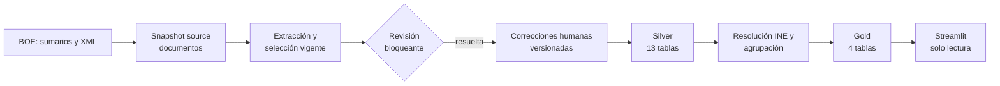
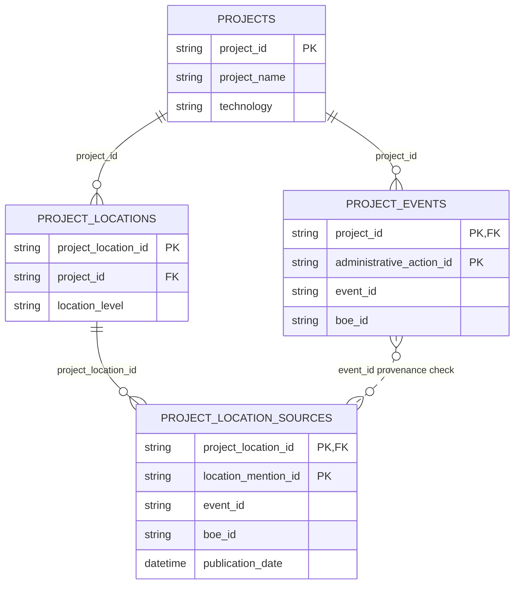

# Manual de usuario y operación

Esta guía explica cómo consultar y operar el proyecto **TFM BOE Energy
Tracker** desde el repositorio local. Está dirigida a una persona que empieza
desde cero: primero presenta el producto y sus datos, después describe el uso
de Streamlit y, por último, los procedimientos técnicos de actualización,
corrección, validación y recuperación.

> [!IMPORTANT]
> Los ejemplos operativos no se ejecutan automáticamente al leer esta guía.
> Antes de una descarga del BOE o una llamada a Gemini, revisa el plan en modo
> `--dry-run`, usa un directorio de run nuevo y confirma expresamente el coste y
> el alcance. Nunca edites un Parquet generado.

## Contenido

1. [Propósito del sistema](#1-propósito-del-sistema)
2. [Vista general de la arquitectura](#2-vista-general-de-la-arquitectura)
3. [Conceptos esenciales](#3-conceptos-esenciales)
4. [Estructura de carpetas](#4-estructura-de-carpetas)
5. [Preparar el entorno](#5-preparar-el-entorno)
6. [Iniciar Streamlit](#6-iniciar-streamlit)
7. [Usar la aplicación](#7-usar-la-aplicación)
8. [Modelo Gold](#8-modelo-gold)
9. [Inspeccionar las tablas](#9-inspeccionar-las-tablas)
10. [Incorporar nuevos BOE](#10-incorporar-nuevos-boe)
11. [Correcciones desde VS Code](#11-correcciones-desde-vs-code)
12. [Ejemplo práctico de corrección](#12-ejemplo-práctico-de-corrección)
13. [Ejemplo de actualización con nuevos BOE](#13-ejemplo-de-actualización-con-nuevos-boe)
14. [Validación](#14-validación)
15. [Versionado, commits y rollback](#15-versionado-commits-y-rollback)
16. [Estado de las funciones futuras](#16-estado-de-las-funciones-futuras)
17. [Solución de problemas](#17-solución-de-problemas)
18. [Glosario](#18-glosario)
19. [Referencias internas del repositorio](#referencias-internas-del-repositorio)

## Rutas rápidas

- [Quiero abrir la aplicación](#6-iniciar-streamlit).
- [Quiero inspeccionar los datos](#9-inspeccionar-las-tablas).
- [Quiero incorporar nuevos BOE](#10-incorporar-nuevos-boe).
- [Quiero corregir un error](#11-correcciones-desde-vs-code).
- [Quiero validar un nuevo snapshot](#14-validación).
- [Tengo un problema](#17-solución-de-problemas).

## 1. Propósito del sistema

El sistema reconstruye el ciclo administrativo de proyectos de generación
eléctrica nombrados en publicaciones oficiales del **Boletín Oficial del
Estado (BOE)**. Una planta de generación con nombre es la raíz de un proyecto;
una infraestructura de almacenamiento, evacuación o red no crea por sí sola un
proyecto de generación.

El pipeline:

- descarga y prepara publicaciones del BOE dentro de un rango de fechas;
- extrae de su texto proyectos, actuaciones administrativas y evidencia;
- detiene los casos inciertos o fallidos para revisión humana;
- materializa 13 tablas Silver normalizadas y validadas;
- resuelve territorio contra la referencia municipal del INE;
- agrupa menciones en proyectos canónicos;
- construye cuatro tablas Gold para consulta;
- muestra el resultado en una aplicación Streamlit local y de solo lectura.

Streamlit permite explorar proyectos, publicaciones, actuaciones y territorio.
No llama al BOE, no ejecuta el pipeline, no consulta Gemini y no modifica los
datos.

> [!NOTE]
> El núcleo de datos validado está declarado en
> [`freezes/core_data_freeze_2026-08-13.md`](freezes/core_data_freeze_2026-08-13.md).
> Las tablas Gold territoriales y la aplicación son extensiones aditivas: no
> cambian los identificadores de proyecto ni la semántica congelada de
> `project_events`.

## 2. Vista general de la arquitectura



La flecha de correcciones entra en la **materialización Silver**. El sistema
conserva la extracción original y aplica únicamente correcciones aprobadas
antes de aplanar las 13 tablas. No existe una edición posterior de Silver o
Gold.

| Capa | Naturaleza | Ejemplos |
| --- | --- | --- |
| Fuente (Bronze conceptual) | Copia trazable de la publicación | sumarios, XML, `documents.parquet` |
| Extracción | Resultado de modelo, selección y revisión | attempts, current extractions, review queue |
| Silver | Datos relacionales normalizados | 13 Parquets contractuales |
| Downstream | Derivación determinista | localizaciones resueltas y agrupación |
| Gold | Tablas orientadas a producto | projects, events y territorio |
| Streamlit | Lectura verificada | catálogo, ficha, cronología y metodología |

Los snapshots y manifests son datos derivados regenerables. Las reglas,
correcciones aprobadas, contratos, código, tests y documentación sí se
versionan en Git. La aplicación solo consume Gold.

## 3. Conceptos esenciales

| Término | Explicación sencilla |
| --- | --- |
| **Run** | Una ejecución identificada del pipeline, con sus propios directorios de salida. |
| **Snapshot** | Fotografía inmutable de una fase: archivos más un manifest que permite verificarla. |
| **Manifest** | JSON que declara versiones, inputs, archivos, conteos, hashes e identidad de una materialización. |
| **Materialization ID** | Huella contractual de un snapshot. Cambia cuando cambia un input o contenido que forma parte de su identidad. |
| **Semantic hash** | SHA-256 calculado sobre el contenido lógico normalizado de una tabla; no depende de detalles físicos irrelevantes del Parquet. |
| **Freeze** | Snapshot formalmente validado que se conserva como referencia y no se sobrescribe. |
| **Bronze** | Nombre conceptual para la capa fuente casi sin transformar. En esta CLI el subcomando real se llama `source`. |
| **Silver** | Las 13 tablas normalizadas del contrato de extracción. |
| **Gold** | Las cuatro tablas listas para consulta por el producto. |
| **PK** | Clave primaria: columna o combinación que identifica una fila de forma única. |
| **FK** | Clave foránea: columna que debe apuntar a una fila existente en otra tabla. |
| **Corrección versionada** | Decisión humana aprobada, trazable y validada que se aplica como input, sin editar el resultado generado. |
| **Downstream** | Fases deterministas posteriores a Silver: territorio INE, agrupación de proyectos y Gold. |

Una revisión manual y una corrección no son lo mismo. La revisión resuelve qué
extracción queda vigente para un documento; una corrección aprobada actúa
después sobre una entidad exacta durante la materialización Silver.

> [!NOTE]
> Un hash físico verifica bytes concretos de un archivo. Un hash semántico
> verifica el contenido contractual. El manifest puede registrar ambos porque
> responden a preguntas distintas.

## 4. Estructura de carpetas

```text
src/          lógica productiva: pipeline, extracción, Silver, downstream y app
config/       inputs versionados, como correcciones y muestras de evaluación
runs/         snapshots operacionales regenerables; no se versionan
docs/         guías, arquitectura, freeze y memoria del TFM
tests/        garantías ejecutables y fixtures en memoria
notebooks/    exploración, auditoría y orquestación legacy; no son producción
```

Reglas prácticas:

- edita código en `src/`, inputs humanos en `config/`, tests en `tests/` y
  documentación en `docs/`;
- no edites manualmente ningún Parquet de `runs/` o `data/`;
- no copies lógica productiva a un notebook;
- no añadas `runs/` a Git: contiene artefactos operacionales regenerables;
- antes de modificar un input versionado, revisa su contrato y crea tests.

El directorio `.agents/` contiene recursos locales de herramientas. No forma
parte del producto ni debe añadirse a un commit del proyecto.

## 5. Preparar el entorno

El proyecto requiere Python 3.10 y usa `uv`; Streamlit es una dependencia del
proyecto, no una instalación global.

### Antes de empezar

- Una **terminal** es la ventana donde se escriben los comandos de esta guía.
- **Git** registra versiones del repositorio, que es la carpeta del proyecto y
  su historial. Una **rama** es una línea de trabajo dentro de ese historial.
- El **working tree** es el estado actual de los archivos. Un archivo
  **untracked** existe localmente, pero Git todavía no lo sigue.
- **Python** ejecuta el código. `uv` instala y ejecuta sus dependencias dentro
  del **entorno virtual** aislado del proyecto.
- **VS Code** es un editor opcional para abrir el repositorio, revisar cambios
  y trabajar con Python; no sustituye a Git ni al entorno virtual.

Abre una terminal y sitúate en la raíz del repositorio, es decir, la carpeta
que contiene `pyproject.toml`, `src/`, `docs/` y `streamlit_app.py`. Todos los
comandos del manual se ejecutan desde esa carpeta salvo que se indique lo
contrario. Estas comprobaciones son seguras y no ejecutan el pipeline:

**Ejecutable en Bash/Linux desde la raíz del repositorio.**

```bash
git --version
uv --version
python --version
git status --short
```

Antes de la primera ejecución, prepara el entorno:

**Ejecutable en Bash/Linux desde la carpeta que contiene el repositorio.**

```bash
cd tfm-renewables-permitting-tracker
uv sync --extra dev
uv run python --version
uv run python -c "import renewables_permitting; print('entorno correcto')"
uv run python -m renewables_permitting.pipeline --help
```

Para ejecutar un test focal cuando `pytest` no está instalado en el entorno
base:

**Ejecutable en Bash/Linux desde la raíz del repositorio.**

```bash
UV_OFFLINE=1 PYTHONDONTWRITEBYTECODE=1 \
uv run --with pytest pytest tests/test_app_queries.py \
-q -p no:cacheprovider
```

Para conocer la interfaz exacta de una fase, usa siempre su ayuda:

**Ejecutable en Bash/Linux desde la raíz del repositorio.**

```bash
uv run python -m renewables_permitting.pipeline source --help
uv run python -m renewables_permitting.pipeline extract --help
uv run python -m renewables_permitting.pipeline recanonicalize --help
uv run python -m renewables_permitting.pipeline silver --help
uv run python -m renewables_permitting.pipeline downstream --help
uv run python -m renewables_permitting.pipeline build-reference-data --help
uv run python -m renewables_permitting.pipeline refresh-reference-data --help
uv run python -m renewables_permitting.pipeline run --help
```

### Resumen de la CLI

| Subcomando | Función | ¿Red o modelo? |
| --- | --- | --- |
| `source` | Descarga sumarios/XML y prepara documentos | BOE, salvo `--dry-run` |
| `extract` | Planifica/reutiliza intentos y extrae documentos pendientes | Gemini solo con `--execute-model` |
| `recanonicalize` | Reaplica reglas deterministas a un snapshot histórico compatible | No |
| `silver` | Verifica selección/revisión, aplica correcciones y crea 13 tablas | No |
| `downstream` | Resuelve territorio, agrupa y construye Gold | No |
| `build-reference-data` | Construye por primera vez la dimensión INE | No |
| `refresh-reference-data` | Compara una referencia INE candidata y, con confirmación, reconstruye downstream | No |
| `run` | Orquesta source opcional, extract, Silver y downstream | BOE/modelo solo con los permisos correspondientes |

`--dry-run` planifica sin publicar outputs. Los destinos de materialización
deben ser nuevos: el pipeline no sobrescribe una salida ya existente.

### Argumentos y salidas de los subcomandos

- `source` exige `--start-date`, `--end-date` y `--output-dir`. Ambas fechas son
  inclusivas. `--dry-run` es la única opción adicional y evita red y escritura.
- `extract` exige `--documents`, `--output-dir` y
  `--expected-extraction-config-id`. `--attempts`, `--manual-reviews` y uno o
  varios `--scope` son opcionales. `--execute-model` está desactivado por
  defecto; `--dry-run` no llama al modelo ni publica.
- `recanonicalize` exige `--source-extraction-snapshot`, `--documents`,
  `--output-dir`, `--source-expected-extraction-config-id` y
  `--target-expected-extraction-config-id`. Solo reevalúa determinísticamente
  un snapshot compatible; no llama al modelo.
- `silver` exige `--extraction-snapshot`, `--output-dir` y el config ID
  esperado. `--corrections` es opcional y `--dry-run` no materializa.
- `downstream` exige `--silver-snapshot`, `--municipality-reference`,
  `--output-dir` y el config ID esperado. `--dry-run` valida/planifica sin
  publicar.
- `build-reference-data` exige `--codine`, `--dictionary` y `--output-dir`.
  Construye una referencia INE candidata a partir de los dos inputs locales.
- `refresh-reference-data` exige esos dos inputs, `--current-reference`,
  `--candidate-reference-output`, `--silver-snapshot`,
  `--downstream-output` y el config ID. Si la dimensión cambia semánticamente,
  muestra el impacto y pide confirmación; `--yes` la confirma de forma no
  interactiva. Si no hay cambio semántico, no publica ni reconstruye
  downstream. `--dry-run` nunca publica ni pregunta.
- `run` exige una fuente (`--documents` o las dos fechas),
  `--municipality-reference` y el config ID. `--runs-dir` vale `runs` por
  defecto; `--run-id`, attempts, revisiones y scopes son opcionales. Deniega
  llamadas nuevas salvo `--execute-model`.

Los códigos de salida operativos son 0 (éxito), 1 (fallo), 3 (faltaría permiso
explícito para el modelo) y 4 (revisión humana bloqueante). No existe un
subcomando separado llamado `review` o `validation`.

Ejemplos de operaciones menos frecuentes:

**Plantilla:** sustituye todos los valores `<...>` por rutas o identidades
verificadas. Los comandos conservan `--dry-run` deliberadamente.

```bash
# Replay determinista histórico; ambos config IDs deben conocerse y verificarse.
uv run python -m renewables_permitting.pipeline recanonicalize \
  --source-extraction-snapshot <SNAPSHOT_EXTRACCION_ORIGEN> \
  --documents <SNAPSHOT_DOCUMENTAL_VALIDADO> \
  --output-dir runs/<NUEVO_RUN>/extraction \
  --source-expected-extraction-config-id <ID_CONFIG_ORIGEN> \
  --target-expected-extraction-config-id <ID_CONFIG_DESTINO> \
  --dry-run

# Construcción inicial de una referencia INE desde ficheros locales.
uv run python -m renewables_permitting.pipeline build-reference-data \
  --codine <RUTA_CODINE_CSV> \
  --dictionary <RUTA_DICCIONARIO_CSV> \
  --output-dir runs/<NUEVA_REFERENCIA_INE> \
  --dry-run

# Comparación/plan de refresh; omite --yes para conservar confirmación humana.
uv run python -m renewables_permitting.pipeline refresh-reference-data \
  --codine <RUTA_CODINE_CSV> \
  --dictionary <RUTA_DICCIONARIO_CSV> \
  --current-reference <REFERENCIA_INE_ACTUAL> \
  --candidate-reference-output runs/<REFERENCIA_INE_CANDIDATA> \
  --silver-snapshot <SILVER_VALIDADO> \
  --downstream-output runs/<NUEVO_RUN>/downstream \
  --expected-extraction-config-id <ID_CONFIG_ESPERADO> \
  --dry-run

# Orquestación integral desde documentos existentes, sin llamadas al BOE.
uv run python -m renewables_permitting.pipeline run \
  --documents <SNAPSHOT_DOCUMENTAL_VALIDADO> \
  --municipality-reference <REFERENCIA_INE_VALIDADA> \
  --expected-extraction-config-id <ID_CONFIG_ESPERADO> \
  --run-id <NUEVO_RUN> \
  --dry-run
```

No ejecutes una plantilla mientras conserve marcadores `<...>`.

## 6. Iniciar Streamlit

Desde la raíz del repositorio:

```bash
uv run streamlit run streamlit_app.py
```

Streamlit muestra normalmente la URL local `http://localhost:8501`. Para
detenerlo, vuelve al terminal y pulsa `Ctrl+C`.

Sin variables adicionales, la aplicación espera este Gold validado:

```text
runs/canonical-140-streamlit-base-20260814/downstream/gold
```

Su downstream ID esperado está fijado en la aplicación. Para abrir otro
snapshot validado, configura **las dos** variables antes de iniciar Streamlit:

**Plantilla:** sustituye `<GOLD_VALIDADO>` y `<DOWNSTREAM_ID_VALIDADO>` por los
valores aprobados para el mismo snapshot.

```bash
export RENEWABLES_GOLD_DIR="<GOLD_VALIDADO>"
export RENEWABLES_EXPECTED_DOWNSTREAM_ID="<DOWNSTREAM_ID_VALIDADO>"
uv run streamlit run streamlit_app.py
```

El ID se obtiene de `downstream_materialization_id` en el `manifest.json` de
Gold. No uses un ID recordado ni lo calcules a mano.

> [!WARNING]
> La aplicación rechaza un directorio inexistente, symlinks, archivos
> inesperados, versiones incompatibles, columnas o dtypes erróneos, PK/FK
> inválidas, conteos incoherentes, hashes físicos/semánticos distintos o un
> downstream ID diferente del configurado. No “arregles” el Parquet: restaura
> o regenera un snapshot válido.

## 7. Usar la aplicación

### Explorar

La vista **Explorar** contiene métricas, filtros y el catálogo de proyectos.
Los filtros disponibles son:

- texto libre;
- tecnología;
- jerarquía territorial: comunidad autónoma, provincia y municipio;
- intervalo inclusivo de fechas de publicación;
- tipo de actuación;
- decisión.

Dentro de una categoría, varias opciones se combinan con **OR**: seleccionar
dos tecnologías muestra una u otra. Entre categorías se usa **AND**: una
tecnología y una provincia deben cumplirse simultáneamente.

Los filtros de fecha, tipo de actuación y decisión tienen semántica
**same-row**: la misma fila de `project_events` debe cumplir todos los filtros
de evento. No basta que un proyecto tenga la fecha en una actuación y la
decisión en otra distinta.

Selecciona una única fila del catálogo para abrir su ficha.

### Ficha de proyecto

La ficha muestra:

- nombre, tecnología e identificador canónico;
- primera y última publicación;
- número de publicaciones y actuaciones;
- territorio publicado, organizado por nivel;
- cronología de actuaciones;
- enlaces a publicaciones del BOE.

Los territorios pueden proceder de la planta o de componentes asociados, como
almacenamiento o evacuación. El texto del BOE no siempre permite atribuir cada
territorio a un componente concreto.

> [!IMPORTANT]
> La cronología es una secuencia de **actos publicados**, no un estado jurídico
> consolidado calculado automáticamente. Una actuación posterior puede
> modificar, sustituir o referirse a otra; interpreta siempre la evidencia y
> la publicación.

### Metodología

La vista **Metodología** explica alcance, fuentes, freeze y limitaciones. Es la
referencia apropiada antes de interpretar ausencias o comparar el producto con
un registro administrativo exhaustivo.

### Auditoría de datos Gold

Esta vista técnica está desactivada por defecto. Para habilitarla solo durante
una sesión local de inspección, inicia la aplicación así:

```bash
RENEWABLES_ENABLE_DATA_EXPLORER=true \
uv run streamlit run streamlit_app.py
```

La navegación mostrará entonces **Auditoría de datos**. Sus seis opciones son:

- **Proyectos**, **Eventos de proyecto**, **Territorios de proyectos** y
  **Fuentes territoriales**: las cuatro tablas Gold canónicas;
- **Resumen por proyecto**: vista agregada con una fila por proyecto;
- **Trazabilidad territorial**: vista derivada con una fila por fuente de una
  asociación territorial.

En cada tabla canónica, **Contenido** permite filtrar y consultar las filas,
**Esquema** muestra columnas, dtypes, nulabilidad observada, valores distintos
y roles PK/FK, y **Calidad** resume duplicados de PK, nulos, dominios y rangos
de fecha. Los filtros combinan varias opciones de una categoría con OR y
categorías distintas con AND. Los identificadores técnicos se conservan porque
permiten seguir el linaje.

Gold no tiene una tabla plana universal: eventos, territorios y fuentes tienen
granularidades distintas y un join indiscriminado multiplicaría filas. La
trazabilidad territorial une únicamente proyecto, territorio y fuente
documental; no añade todas las actuaciones. El resumen y la trazabilidad son
consultas en memoria, no nuevas tablas Gold.

El explorador es estrictamente de solo lectura: no edita celdas, no descarga ni
genera archivos y no ejecuta el pipeline. Nunca se debe usar para corregir un
Parquet. Si detectas una anomalía, documenta la evidencia y corrígela en la
fuente versionada o etapa productiva correspondiente, seguida de regeneración
y validación.

## 8. Modelo Gold

Gold no es una tabla gigante: son cuatro tablas con granularidades distintas.
El snapshot local predeterminado validado contiene 116 proyectos, 169 filas de
eventos de proyecto correspondientes a 165 actuaciones administrativas únicas,
584 localizaciones de proyecto y 602 fuentes territoriales. Esos conteos
pertenecen a ese snapshot; otro run puede tener otros.

### `projects`

- **Granularidad:** una fila por proyecto canónico de generación.
- **PK:** `project_id`.
- **Finalidad:** catálogo y resumen temporal/administrativo.
- **Columnas:** `project_id`, `project_name`, `technology`, códigos y nombres
  agregados de provincia/municipio, fechas primera/última y conteos de
  publicaciones/actuaciones.

### `project_events`

- **Granularidad:** una actuación administrativa publicada y atribuida a un
  proyecto.
- **PK:** (`project_id`, `administrative_action_id`).
- **FK:** `project_id` → `projects.project_id`.
- **Columnas:** IDs de evento/actuación/BOE, fecha, índices, `action_type`,
  `decision`, `is_modification` y `evidence`.

Cada fila es una atribución `project_id × administrative_action_id`. Un evento
de publicación puede contener varias actuaciones y una misma actuación puede
tener targets pertenecientes a varios proyectos. En ese caso se expande a una
fila por proyecto. En el snapshot validado, cuatro actuaciones se atribuyen a
dos proyectos; por eso hay 169 filas, pero solo 165 valores únicos de
`administrative_action_id`, y ese identificador por sí solo no es la PK Gold.

### `project_locations`

- **Granularidad:** un proyecto y una localización resuelta al nivel más
  específico disponible.
- **PK:** `project_location_id`.
- **FK:** `project_id` → `projects.project_id`.
- **Niveles:** `municipality`, `province` o `autonomous_community`.
- **Columnas:** nombres normalizados y códigos INE, conteos de menciones y
  publicaciones fuente, primera y última fecha.

La nulabilidad depende del nivel. Por ejemplo, una fila de provincia no tiene
por qué contener municipio. La tabla registra territorio publicado asociado al
proyecto, no la geometría legal de una instalación.

### `project_location_sources`

- **Granularidad:** una mención territorial Silver que respalda una
  `project_location`.
- **PK:** (`project_location_id`, `location_mention_id`).
- **FK:** `project_location_id` →
  `project_locations.project_location_id`.
- **Procedencia:** `location_mention_id` conserva el vínculo con la mención
  original resuelta desde Silver; `event_id`, `boe_id` y `publication_date`
  preservan su contexto documental.

Una asociación proyecto-territorio puede estar respaldada por varias menciones
o publicaciones. El contrato comprueba que `location_mention_id` existe en las
localizaciones resueltas, que su `event_id` coincide y que ese evento existe en
las publicaciones disponibles. También exige que el trío `event_id`, `boe_id`,
`publication_date` sea coherente. La relación de procedencia por `event_id` con
`project_events` se contrasta como una regla del dataset; no es una FK simple,
porque `event_id` puede repetirse en varias atribuciones de actuaciones.



No se hace un join indiscriminado porque una actuación puede tener varias
localizaciones y cada localización varias fuentes. Unir todo multiplicaría
filas y podría inflar conteos. Relaciona solo las tablas y columnas necesarias
para cada pregunta.

## 9. Inspeccionar las tablas

### Desde Python o Jupyter

Este ejemplo carga primero el manifest y luego usa el mismo cargador validado
que Streamlit. Solo lee memoria; no escribe en `runs/`.

**Ejecutable en Python desde la raíz del repositorio.**

```python
import json
from pathlib import Path

from renewables_permitting.app_data import load_gold_dataset

gold_dir = Path("runs/canonical-140-streamlit-base-20260814/downstream/gold")
manifest = json.loads((gold_dir / "manifest.json").read_text(encoding="utf-8"))
expected_id = manifest["downstream_materialization_id"]

dataset = load_gold_dataset(
    gold_dir,
    expected_downstream_id=expected_id,
)

tables = {
    "projects": dataset.projects,
    "project_events": dataset.project_events,
    "project_locations": dataset.project_locations,
    "project_location_sources": dataset.project_location_sources,
}

for name, frame in tables.items():
    print(f"\n{name}: {len(frame)} filas")
    print(frame.head())
    print(frame.columns.tolist())
    print(frame.dtypes)
    print(frame.isna().sum())
```

Filtra un proyecto y relaciona actuaciones:

```python
project_id = dataset.projects.iloc[0]["project_id"]

project = dataset.projects.loc[
    dataset.projects["project_id"].eq(project_id)
]
events = dataset.project_events.loc[
    dataset.project_events["project_id"].eq(project_id)
]

project_with_events = project[["project_id", "project_name"]].merge(
    events[[
        "project_id",
        "boe_id",
        "publication_date",
        "action_type",
        "decision",
    ]],
    on="project_id",
    how="left",
    validate="one_to_many",
)
print(project_with_events)
```

Relaciona localizaciones con su procedencia:

```python
locations = dataset.project_locations.loc[
    dataset.project_locations["project_id"].eq(project_id)
]
location_sources = locations[[
    "project_location_id",
    "location_level",
    "municipality",
    "province",
    "autonomous_community",
]].merge(
    dataset.project_location_sources,
    on="project_location_id",
    how="left",
    validate="one_to_many",
)
print(location_sources)
```

> [!WARNING]
> Derivar `expected_id` del mismo manifest es útil para inspección local de su
> coherencia interna. Para operar Streamlit se debe fijar el ID previamente
> aprobado, de modo que un cambio de snapshot no pase inadvertido.

### Desde VS Code

1. Abre la raíz del repositorio en VS Code.
2. Selecciona el intérprete de `.venv`.
3. Abre una consola Python o un notebook de trabajo no productivo.
4. Ejecuta las celdas anteriores por bloques y cambia únicamente `gold_dir` o
   `project_id`.
5. Cierra sin guardar outputs derivados en rutas versionadas.

No abras un Parquet para editar celdas. Si detectas un error, corrige el input
versionado o el código y regenera un snapshot nuevo.

## 10. Incorporar nuevos BOE

Hay dos operaciones distintas. Un **run aislado de una cohorte nueva** contiene
solo los documentos obtenidos para la fecha o intervalo indicado. Sirve para
comprobar la descarga, probar la extracción, revisar y auditar documentos
nuevos y detectar problemas antes de incorporarlos al producto; no amplía por
sí mismo el corpus histórico.

> [!WARNING]
> Un run que contiene únicamente los BOE nuevos no amplía automáticamente el
> catálogo existente. Si su Gold se usa como fuente de Streamlit, la aplicación
> mostrará únicamente esa cohorte y dejará fuera el corpus histórico.

Una **actualización acumulativa del producto** necesita un nuevo snapshot
documental que reúna los documentos históricos validados y los nuevos,
deduplicados mediante el identificador documental canónico, con procedencia y
validación del conjunto resultante. La CLI actual no ofrece un subcomando para
combinar automáticamente dos snapshots documentales y esta preparación todavía
no está automatizada. No inventes una unión de Parquets ni sobrescribas el
corpus histórico: hasta disponer de una utilidad específica, es un
procedimiento técnico controlado que debe revisarse y validarse antes de
continuar.

**Ejemplo conceptual — no ejecutar como comando:**

```text
corpus histórico validado
+ nuevos documentos BOE
→ nuevo snapshot documental acumulativo y deduplicado
→ extracción o recanonicalización que corresponda
→ revisión
→ Silver
→ aplicación de correcciones aprobadas
→ downstream
→ validación
→ nuevo snapshot Gold
→ Streamlit
```

Desde un snapshot documental acumulativo ya preparado y validado, `extract`,
`silver` y `downstream` automatizan sus respectivas fases. La unión documental
previa es la limitación pendiente. La CLI admite fases separadas y una
orquestación `run`; usa fases separadas cuando deban aplicarse correcciones,
porque `run` no expone `--corrections`.

Obtén siempre el config ID de la configuración instalada:

**Ejecutable en Bash/Linux desde la raíz del repositorio.**

```bash
EXTRACTION_CONFIG_ID="$(uv run python -c \
'from renewables_permitting.extraction.config import EXTRACTION_CONFIG_ID; print(EXTRACTION_CONFIG_ID)')"
```

### 10.1 Crear un run nuevo y obtener documentos

Primero planifica una cohorte aislada. Las fechas son inclusivas y usan
`YYYY-MM-DD`.

**Plantilla:** la fecha y `runs/ejemplo-20260815/` son valores pedagógicos;
elige una fecha real y un directorio nuevo.

```bash
uv run python -m renewables_permitting.pipeline source \
  --start-date 2026-08-15 \
  --end-date 2026-08-15 \
  --output-dir runs/ejemplo-20260815/source \
  --dry-run
```

Tras revisar el rango y el destino, elimina `--dry-run` para descargar. Esta es
la única fase que llama al BOE. Publica sumarios/XML, `boe_items.parquet`,
`candidates.parquet`, `xml_download_log.parquet`, `documents.parquet` y un
`manifest.json`.

Detente si hay fallos de sumario/XML o si el destino existe. El source stage
falla de forma cerrada; usa otro run o investiga la causa, no borres un snapshot
validado para reutilizar el nombre.

### 10.2 Planificar y ejecutar extracción

Sin permiso explícito, una extracción pendiente se rechaza y no llama al
modelo:

**Plantilla:** usa las rutas del run aislado o del snapshot documental
acumulativo que hayas validado.

```bash
uv run python -m renewables_permitting.pipeline extract \
  --documents runs/ejemplo-20260815/source \
  --output-dir runs/ejemplo-20260815/extraction \
  --expected-extraction-config-id "$EXTRACTION_CONFIG_ID" \
  --dry-run
```

Para reutilizar intentos compatibles, añade `--attempts` con un snapshot de
extracción o un `attempts.parquet`. Para limitar el corpus, `--scope` puede
repetirse y acepta CSV/Parquet con una columna `identificador_boe` o
`identificador`.

Solo después de revisar el número de llamadas nuevas y configurar la
credencial fuera del repositorio, autoriza las llamadas externas.

**Ejecutable en Bash/Linux desde la raíz del repositorio**, después de sustituir
las rutas de ejemplo. La lectura es silenciosa y la clave vive solo en esta
sesión del shell:

```bash
read -rsp "Google API key: " GOOGLE_API_KEY
echo
export GOOGLE_API_KEY
uv run python -m renewables_permitting.pipeline extract \
  --documents runs/ejemplo-20260815/source \
  --output-dir runs/ejemplo-20260815/extraction \
  --expected-extraction-config-id "$EXTRACTION_CONFIG_ID" \
  --execute-model
```

`read -s` evita mostrar el valor y no escribe la clave literalmente en el
historial. Al terminar la extracción, elimínala de la sesión:

```bash
unset GOOGLE_API_KEY
```

No guardes la clave en Git, logs, capturas, prompts ni documentación. Cualquier
archivo local de secretos debe permanecer ignorado; si en el futuro se usa
`.streamlit/secrets.toml`, tampoco debe versionarse. La librería admite
`GEMINI_API_KEY` por compatibilidad, pero no es necesario duplicar secretos.

`--execute-model` únicamente autoriza llamadas externas: no selecciona el
proveedor ni el modelo. Actualmente `MODEL_PROVIDER = "gemini"` y
`AI_MODEL_NAME = "google:gemini-2.5-flash"` se definen en
`src/renewables_permitting/extraction/config.py`; `agent.py` construye el
agente, mientras `instructions.py` y el esquema de `models.py` también forman
parte de la identidad efectiva. Cambiar proveedor, modelo, instrucciones,
contrato o políticas cambia o puede cambiar `EXTRACTION_CONFIG_ID`; requiere
una versión nueva, validación y materialización propias. No cambies el modelo
durante una actualización ordinaria sin una decisión explícita.

La salida contiene documentos, attempts, revisiones manuales consolidadas,
extracciones vigentes, cola de revisión y manifest. Los intentos compatibles se
reutilizan. Los errores o inciertos existentes no se repiten automáticamente:
se envían a revisión.

### 10.3 Revisar antes de Silver

Examina `review_queue.parquet`. Si existe alguna fila bloqueante, la CLI sale
con código 4 y Silver no debe continuar. No hay un subcomando interactivo de
revisión humana: las decisiones se preparan externamente, se validan con las
funciones existentes y se aportan como directorio de ficheros o Parquet mediante
`--manual-reviews` al volver a ejecutar `extract`. Conserva también
`--attempts` para no repetir llamadas y usa un output nuevo:

**Plantilla:** sustituye `<REVISIONES_HUMANAS>` y las rutas de ejemplo.

```bash
uv run python -m renewables_permitting.pipeline extract \
  --documents runs/ejemplo-20260815/source \
  --attempts runs/ejemplo-20260815/extraction \
  --manual-reviews <REVISIONES_HUMANAS> \
  --output-dir runs/ejemplo-20260815/extraction-reviewed \
  --expected-extraction-config-id "$EXTRACTION_CONFIG_ID"
```

Si no hubo bloqueos, no hace falta esta segunda materialización. Localiza el
snapshot final verificando su manifest y que `review_queue.parquet` no tenga
filas bloqueantes. En los comandos siguientes llámalo
`<EXTRACTION_SNAPSHOT_VALIDADO>`; no presupongas que existe un directorio
`extraction-reviewed`.

> [!IMPORTANT]
> No inventes el esquema de revisión ni marques un caso como aprobado solo para
> vaciar la cola. La decisión debe tener linaje al documento y al attempt
> vigente. Si no puede resolverse, el caso sigue bloqueando.

### 10.4 Materializar Silver y aplicar correcciones

Cuando la cola bloqueante sea cero, decide si el corpus contiene los targets
del registro de correcciones. Cada corrección aprobada exige exactamente una
coincidencia por entidad y fingerprint. Aplicar el registro completo a una
cohorte aislada que no contiene esos BOE falla con cero targets.

Para una prueba aislada sin ninguno de los targets aprobados, omite
`--corrections`:

**Plantilla:** sustituye `<EXTRACTION_SNAPSHOT_VALIDADO>` y `<NUEVO_RUN>`.

```bash
uv run python -m renewables_permitting.pipeline silver \
  --extraction-snapshot <EXTRACTION_SNAPSHOT_VALIDADO> \
  --output-dir runs/<NUEVO_RUN>/silver \
  --expected-extraction-config-id "$EXTRACTION_CONFIG_ID" \
  --dry-run
```

No fabriques un subconjunto improvisado del CSV para hacer pasar una cohorte.
En una reconstrucción acumulativa que contiene las entidades históricas,
reaplica el registro versionado completo añadiendo exactamente:

```bash
--corrections config/corrections/administrative_action_corrections.csv
```

`--corrections` pertenece al subcomando `silver`, no a `run`. Toda corrección
requiere evidencia y aprobación humana. No edites Parquets, manifests o Gold,
ni rellenes manualmente IDs o hashes calculables.

Revisa el plan y repite sin `--dry-run`. Silver vuelve a verificar selección,
linaje y cola; después aplica las correcciones, valida las 13 tablas, escribe y
relee los Parquets. Si hubo correcciones, publica además
`applied_corrections.parquet`.

Las tablas Silver son:

```text
publication_events
generation_asset_mentions
generation_asset_names
associated_components
associated_component_names
associated_component_generation_links
administrative_actions
administrative_action_targets
participant_mentions
location_mentions
generation_asset_relations
technical_mentions
case_file_references
```

### 10.5 Generar downstream y Gold

Usa una referencia INE ya materializada y validada:

**Plantilla:** sustituye las rutas por el nuevo Silver y la referencia INE
validados.

```bash
uv run python -m renewables_permitting.pipeline downstream \
  --silver-snapshot runs/ejemplo-20260815/silver \
  --municipality-reference runs/ine-reference-20260614-25a3bbb28f0c21c5 \
  --output-dir runs/ejemplo-20260815/downstream \
  --expected-extraction-config-id "$EXTRACTION_CONFIG_ID" \
  --dry-run
```

Después de revisar inputs e identidades, repite sin `--dry-run`. La fase
verifica Silver y la referencia INE, resuelve localizaciones, agrupa proyectos
y materializa Gold de forma atómica.

### 10.6 Validar y apuntar Streamlit

Comprueba manifests, conteos, IDs y tests antes de considerar válido el run.
Solo si se trata del nuevo snapshot **acumulativo** validado, configura
`RENEWABLES_GOLD_DIR` y el `RENEWABLES_EXPECTED_DOWNSTREAM_ID` exacto de su
manifest, como se explica en la sección 6. El Gold de una cohorte aislada se
conserva para prueba y auditoría; no sustituye al catálogo acumulativo.

### 10.7 Ejecución integral sin correcciones

`run` acepta documentos ya existentes o un rango de fechas, una referencia INE
y un run ID nuevo. Orquesta las fases y se detiene ante trabajo de modelo no
autorizado o revisión humana. Consulta `run --help` antes de usarlo.

> [!WARNING]
> `run` no acepta `--corrections`. No lo uses como sustituto del flujo por fases
> cuando deban aplicarse correcciones versionadas. `recanonicalize` tampoco es
> una actualización ordinaria: sirve para el replay determinista y compatible
> de snapshots históricos aprobados, sin llamadas al modelo.

## 11. Correcciones desde VS Code

El registro vigente es
`config/corrections/administrative_action_corrections.csv`. Su contrato v1 es
cerrado: solo permite excluir una `administrative_action` aprobada cuando se
demuestra que es un antecedente histórico atribuido erróneamente a la
publicación actual.

La única combinación soportada actualmente es:

**Registro real:** procede del contrato vigente; no lo edites para inventar
otra operación.

```text
correction_version = 1
status             = approved
entity_type        = administrative_action
operation          = exclude
reason_code        = historical_antecedent_misattributed
```

El orden exacto de columnas es:

```text
correction_id, correction_version, status, boe_id, entity_type, operation,
administrative_action_id, expected_action_type, expected_decision,
expected_evidence_sha256, reason_code, reason, decision_source, reviewed_on,
reviewer
```

Procedimiento:

1. Identifica el BOE en la extracción vigente y en la publicación fuente.
2. Identifica la actuación exacta y conserva su evidencia literal.
3. Confirma humanamente que el acto es un antecedente y no uno adoptado por la
   publicación actual.
4. Decide si es un caso aislado o un defecto sistemático. Un defecto
   sistemático puede exigir código y tests, no una lista creciente de
   exclusiones.
5. Pide a Codex que prepare una propuesta mínima y trazable a partir del
   snapshot e input correctos.
6. Revisa el registro técnico: BOE, action ID, tipo, decisión, evidencia,
   razón, fuente de decisión, fecha, reviewer y versión.
7. Calcula la huella con la función productiva, no copiando un hash a mano:

   ```bash
   uv run python -c \
   "from renewables_permitting.extraction.corrections import evidence_sha256; print(evidence_sha256('EVIDENCIA LITERAL COMPLETA'))"
   ```

8. Ejecuta los tests focales de correcciones y pipeline.
9. Revisa `git diff --check`, el diff exacto y `git status --short`.
10. Tras aprobación humana, añade explícitamente el CSV y sus tests al commit;
    no incluyas `runs/` ni `.agents/`.
11. Regenera un Silver nuevo con `--corrections` y después downstream/Gold.
12. Verifica el manifest, `applied_corrections.parquet`, IDs, hashes, conteos y
    regresiones; finalmente apunta Streamlit al nuevo Gold.

`correction_id` es un identificador estable en lower-kebab-case requerido como
input; el código lo valida, pero no existe hoy un generador CLI. Codex puede
proponerlo y comprobar colisiones. `administrative_action_id` se toma del
snapshot, no se inventa. `expected_evidence_sha256` sí se calcula con la función
productiva: normaliza Unicode a NFC, unifica finales de línea, elimina espacio
en los extremos y calcula SHA-256 sobre UTF-8. La usuaria aprueba el juicio
sustantivo, la evidencia y la decisión de excluir.

La aplicación es deliberadamente read-only: no permite proponer ni aprobar
correcciones desde Streamlit.

## 12. Ejemplo práctico de corrección

Este ejemplo ya existe en el registro versionado; no es una corrección nueva.

| Campo | Valor real |
| --- | --- |
| BOE | `BOE-A-2024-16662` |
| Entidad | `BOE-A-2024-16662_event_1_action_2` |
| Problema | una DIA histórica fue atribuida como acto de la publicación actual |
| Tipo/decisión esperados | `declaracion_impacto_ambiental` / `desfavorable` |
| Operación | `exclude` |
| Razón | `historical_antecedent_misattributed` |

Evidencia literal usada para verificar la huella (una sola línea, sin introducir
saltos internos):

> La Dirección General de Calidad y Evaluación Ambiental emite, con fecha 7 de marzo de 2024, resolución por la que formula declaración de impacto ambiental desfavorable para el parque solar fotovoltaico El Refugio y su infraestructura de evacuación asociada

El registro aprobado es:

**Registro real:** esta fila procede del CSV versionado y no debe editarse en
un artefacto derivado.

```csv
historical-action-exclusion-v1-16662-dia,1,approved,BOE-A-2024-16662,administrative_action,exclude,BOE-A-2024-16662_event_1_action_2,declaracion_impacto_ambiental,desfavorable,573f1fe53e8d0f556158c0bcf3e2d71b78568d11760affea6fd8e31483e27a25,historical_antecedent_misattributed,Es un antecedente histórico del procedimiento y no un acto adoptado por esta publicación.,human_decisions_consolidated:v1:canonical-140-freeze-candidate-20260813#BOE-A-2024-16662,2026-08-13,human_tfm_review
```

Codex puede localizar la fila fuente, preparar el registro, calcular la huella,
añadir tests y mostrar el diff. La usuaria debe leer el pasaje en su contexto,
confirmar que es antecedente histórico, aprobar la exclusión y autorizar el
commit. Al materializar Silver, el código exige que exista exactamente una
actuación coincidente y que tipo, decisión y hash de evidencia sean idénticos;
elimina una copia de la actuación, conserva la extracción original y rechaza
dejar un evento sin ninguna actuación.

Los tests de `tests/extraction/test_corrections.py` fijan el registro conocido,
el contrato, la huella, el matching exacto, la inmutabilidad y los casos de
fallo. El resultado esperado es que la actuación no aparezca en el Silver/Gold
regenerado y que su aplicación quede registrada en
`applied_corrections.parquet` y el manifest.

## 13. Ejemplo de actualización con nuevos BOE

**Ejemplo conceptual:** evaluar una cohorte BOE nueva y, solo después de
aprobarla, preparar una actualización acumulativa.

Checklist de la cohorte aislada:

1. Crear un run nuevo y ejecutar `source` para el rango deseado.
2. Autorizar modelo y credencial solo tras aprobar el plan de `extract`.
3. Resolver cualquier `review_queue` bloqueante reutilizando los attempts.
4. Omitir el registro completo si la cohorte no contiene sus targets.
5. Validar downstream para auditoría sin publicar ese Gold parcial.

**Inputs:** rango BOE, config ID, referencia INE y, si procede, attempts o
revisiones trazables. **Outputs:** snapshots separados de source, extracción,
Silver y downstream con manifest. Consulta los comandos y gates en
[Incorporar nuevos BOE](#10-incorporar-nuevos-boe).

La actualización del producto combina, mediante el procedimiento técnico
controlado aún sin subcomando, el corpus histórico y los documentos nuevos en
un snapshot acumulativo deduplicado y validado. Después repite
extracción/revisión, Silver con el registro completo, downstream y validación.
Solo el nuevo Gold acumulativo validado puede conectarse a Streamlit.

> [!WARNING]
> Cohorte aislada y actualización acumulativa no son intercambiables: nunca
> sobrescribas el histórico ni publiques Gold parcial como catálogo ampliado.

### Inventario de archivos generados

`find` solo enumera archivos: no valida contenido, schemas, hashes, PK/FK,
downstream ID ni aptitud para Streamlit. La validación real usa manifests,
cargadores validados, tests, IDs, hashes y validadores productivos descritos en
la sección 14; no existe un subcomando genérico `validate`.

## 14. Validación

La validación combina varias evidencias:

- tests focales para el cambio realizado;
- suite del subsistema y, al cerrar una fase, suite completa;
- manifest con versiones, linaje, archivos, conteos e identidades;
- hashes físicos y semánticos;
- PK, FK, dominios, nullabilidad y esquemas;
- lectura de vuelta de los Parquets;
- comparación de conteos y regresiones conocidas;
- revisión humana de los casos sustantivos.

### Tests focales de Streamlit

```bash
UV_OFFLINE=1 PYTHONDONTWRITEBYTECODE=1 \
uv run --with pytest pytest \
  tests/test_app_data.py \
  tests/test_app_queries.py \
  tests/test_streamlit_app.py \
  -q -p no:cacheprovider
```

### Pipeline, downstream y correcciones

```bash
UV_OFFLINE=1 PYTHONDONTWRITEBYTECODE=1 \
uv run --with pytest pytest \
  tests/test_pipeline.py \
  tests/test_downstream.py \
  tests/extraction/test_corrections.py \
  -q -p no:cacheprovider
```

### Suite completa al cerrar una fase

```bash
UV_OFFLINE=1 PYTHONDONTWRITEBYTECODE=1 \
uv run --with pytest pytest -q -p no:cacheprovider
```

Completa los tests con:

```bash
git diff --check
git status --short --untracked-files=all
```

Un test verde no sustituye la inspección del manifest ni la decisión humana.
No declares validado un nuevo Gold hasta reconstruirlo desde Silver compatible,
verificarlo contra sus contratos y registrar la evidencia de aceptación.

## 15. Versionado, commits y rollback

### Crear y versionar con seguridad

1. Usa un run ID/directorio nuevo; nunca sobrescribas el snapshot anterior.
2. Comprueba `git status --short --untracked-files=all` antes y después.
3. Revisa `git diff --check` y el diff por paths.
4. Añade solo inputs, código, tests o documentación explícitos, por ejemplo:

   ```bash
   git add config/corrections/administrative_action_corrections.csv \
     tests/extraction/test_corrections.py
   git diff --cached --check
   git diff --cached --stat
   ```

5. Haz commit y push solo después de revisión humana:

   ```bash
   git commit -m "fix: apply approved administrative action correction"
   git push origin tfm-final
   ```

No uses `git add .` cuando existan `runs/`, `.agents/` u otros untracked. No
edites, muevas ni reutilices tags de freeze existentes.

### Volver temporalmente a un Gold anterior

No hay que restaurar ni sobrescribir archivos. Apunta Streamlit al snapshot
anterior validado:

**Plantilla:** sustituye ambos marcadores por valores del mismo snapshot
validado.

```bash
export RENEWABLES_GOLD_DIR="<GOLD_VALIDADO_ANTERIOR>"
export RENEWABLES_EXPECTED_DOWNSTREAM_ID="<DOWNSTREAM_ID_VALIDADO_ANTERIOR>"
uv run streamlit run streamlit_app.py
```

Comprueba que el ID procede del manifest y de la evidencia de validación de ese
snapshot. Para regresar al valor predeterminado, cierra Streamlit, elimina esas
variables de la sesión y vuelve a iniciarlo:

```bash
unset RENEWABLES_GOLD_DIR RENEWABLES_EXPECTED_DOWNSTREAM_ID
```

## 16. Estado de las funciones futuras

**Disponible:** aplicación Streamlit local y read-only sobre las cuatro tablas
Gold, con catálogo, ficha, cronología, territorio y metodología. La
[guía técnica de Streamlit](STREAMLIT_CODE_GUIDE.md) documenta su arquitectura,
extensiones seguras y tests; sus comentarios selectivos están implementados y
pendientes de revisión humana.

**REQUIRED pendiente:** explorador local read-only de Gold y despliegue web
read-only reproducible.
Que la aplicación funcione localmente no significa que exista ya un despliegue
público.

**CONDITIONAL:** promotor, participantes, potencia, componentes y títulos. Solo
se añadirán tras auditar calidad, granularidad y linaje; no se simulan leyendo
Silver directamente.

**POST-TFM:** reportes persistentes, aplicación administrativa, autenticación y
autorización, correcciones asistidas, ejecución del pipeline desde Streamlit y
actualización automática, scheduling o monitorización. La combinación
automática de snapshots documentales tampoco está disponible actualmente.

## 17. Solución de problemas

| Problema | Causa probable y acción segura |
| --- | --- |
| Gold no encontrado | Revisa `RENEWABLES_GOLD_DIR`, que exista `manifest.json` y que la ruta termine en `downstream/gold`. No crees archivos vacíos. |
| Downstream ID incorrecto | La variable esperada no coincide con `downstream_materialization_id`. Usa el ID previamente validado para ese snapshot. |
| Manifest incompatible | Las versiones o el esquema no corresponden al loader actual. Usa un snapshot compatible o regenera con código/configuración aprobados. |
| Hash incorrecto | El archivo no coincide con el manifest. Considera el snapshot corrupto; no edites el hash ni el Parquet. |
| `pytest` no disponible | Ejecuta uno de los comandos completos con `uv run --with pytest` de la sección 14; `pytest` no está declarado como dependencia base. |
| Streamlit ya está activo | Vuelve al terminal que lo ejecuta y pulsa `Ctrl+C` antes de iniciar otra instancia. |
| El run/output ya existe | El pipeline protege contra overwrite. Elige un run ID y directorios nuevos; no borres el anterior para forzar la operación. |
| Falta permiso de modelo (salida 3) | Hay documentos sin intento compatible. Revisa el plan y añade `--execute-model` solo con autorización y credencial configurada. |
| Revisión humana bloqueante (salida 4) | Inspecciona `review_queue.parquet`, prepara decisiones trazables y reanuda con los mismos attempts; no continúes a Silver. |
| Working tree con untracked | Inspecciona cada path con `git status --short --untracked-files=all` y añade solo archivos explícitos. |
| `.agents/` aparece sin versionar | Es un recurso local ajeno al producto. Déjalo intacto y no lo incluyas en `git add`. |
| Falla source/BOE | Conserva el diagnóstico de sumario/XML y detente. No publiques documentos parciales ni sustituyas el texto por datos manuales. |
| La clave del modelo no está disponible | Configura `GOOGLE_API_KEY` fuera del repositorio. No pegues secretos en ficheros ni logs. |

## 18. Glosario

| Término | Definición |
| --- | --- |
| **Actuación administrativa** | Acto o trámite publicado: autorización, información pública, decisión ambiental, etc. |
| **Attempt (intento)** | Registro de una ejecución de extracción para un documento, con resultado, configuración y linaje. |
| **BOE ID** | Identificador oficial de una publicación, por ejemplo `BOE-A-2024-16662`. |
| **Canonicalización** | Reglas deterministas que normalizan y ajustan una extracción sin volver a llamar al modelo. |
| **Config ID** | Identidad corta de contrato, prompt, modelo y políticas de extracción compatibles. |
| **Corrección** | Override humano versionado y aprobado que se verifica contra la entidad fuente. |
| **Downstream ID** | Identidad contractual del resultado determinista construido desde Silver y la referencia INE. |
| **dtype** | Tipo de datos de una columna, por ejemplo texto, entero nullable o fecha. |
| **Evidencia** | Pasaje literal del BOE que respalda una entidad o decisión. |
| **Evento** | Conjunto de entidades y actuaciones de un proyecto dentro de una publicación. |
| **Extracción vigente** | Mejor resultado seleccionado para un BOE, respetando precedencia manual y linaje. |
| **Hash SHA-256** | Huella de 64 caracteres hexadecimales usada para detectar cambios. |
| **INE reference ID** | Identidad de la dimensión municipal oficial empleada para resolver territorios. |
| **Linaje** | Datos que permiten seguir una fila hasta documento, intento, configuración y decisiones fuente. |
| **Loader o cargador validado** | Función que abre un dataset y verifica contrato, identidad e integridad antes de entregarlo a la aplicación. |
| **Materialización** | Escritura validada y reproducible de un conjunto de tablas más su manifest. |
| **Parquet** | Formato columnar usado para las tablas derivadas. |
| **Project ID** | Identificador determinista de un proyecto canónico agrupado. |
| **Review queue** | Cola de documentos que no pueden pasar silenciosamente a Silver. |
| **Same-row** | Condición en la que varios filtros deben cumplirse en la misma fila de evento. |
| **Symlink** | Enlace del sistema de archivos que apunta a otra ruta; debe tratarse con cautela al validar o borrar. |
| **Untracked** | Archivo presente en el working tree que Git todavía no sigue. |
| **Working tree** | Estado local actual de los archivos versionados y sin seguimiento del repositorio. |

## Referencias internas del repositorio

- [README](../README.md): inicio rápido y estado del producto.
- [Reglas de trabajo](../AGENTS.md): contratos, freeze y salvaguardas.
- [Roadmap de cierre](TFM_CLOSEOUT.md): prioridades y gates hasta la entrega.
- [Guía técnica de Streamlit](STREAMLIT_CODE_GUIDE.md): arquitectura del MVP,
  extensiones seguras y tests para modificar su código.
- [Declaración del core freeze](freezes/core_data_freeze_2026-08-13.md).
- [CLI del pipeline](../src/renewables_permitting/pipeline.py).
- [Configuración de extracción](../src/renewables_permitting/extraction/config.py).
- [Revisión y selección](../src/renewables_permitting/extraction/review.py).
- [Contrato y aplicación de correcciones](../src/renewables_permitting/extraction/corrections.py).
- [Contrato de las 13 tablas Silver](../src/renewables_permitting/extraction/flat_contract.py).
- [Materialización downstream](../src/renewables_permitting/downstream.py).
- [Contrato Gold de proyectos/eventos](../src/renewables_permitting/gold.py).
- [Contrato Gold territorial](../src/renewables_permitting/project_locations.py).
- [Loader contractual de Streamlit](../src/renewables_permitting/app_data.py).
- [Consultas de Streamlit](../src/renewables_permitting/app_queries.py).
- [Aplicación Streamlit](../streamlit_app.py).
- [Registro de correcciones](../config/corrections/administrative_action_corrections.csv).
- [Tests del pipeline](../tests/test_pipeline.py), [downstream](../tests/test_downstream.py),
  [loader](../tests/test_app_data.py), [consultas](../tests/test_app_queries.py),
  [Streamlit](../tests/test_streamlit_app.py) y
  [correcciones](../tests/extraction/test_corrections.py).
